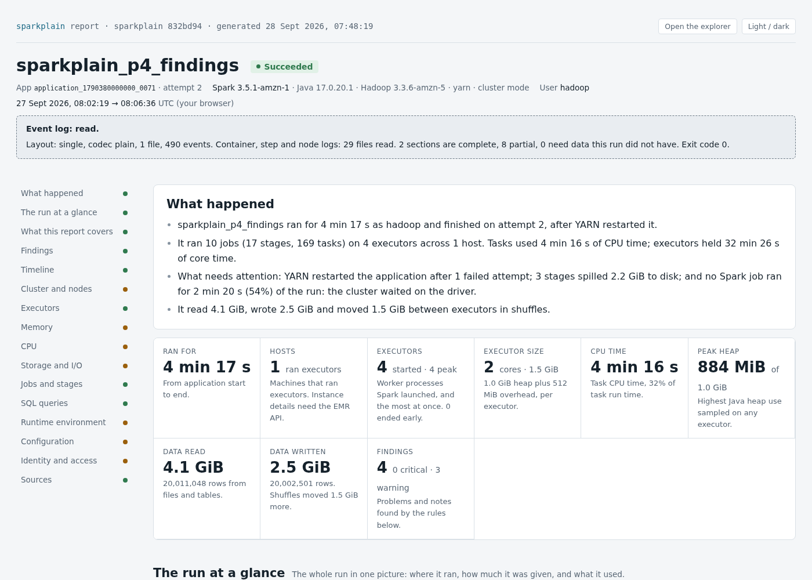
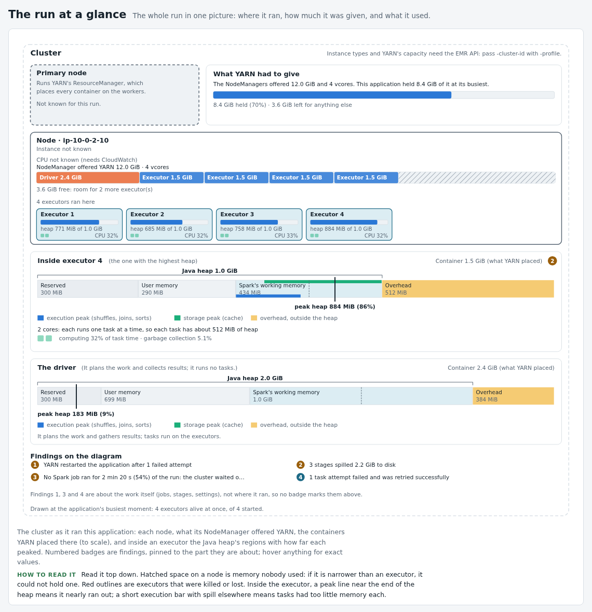
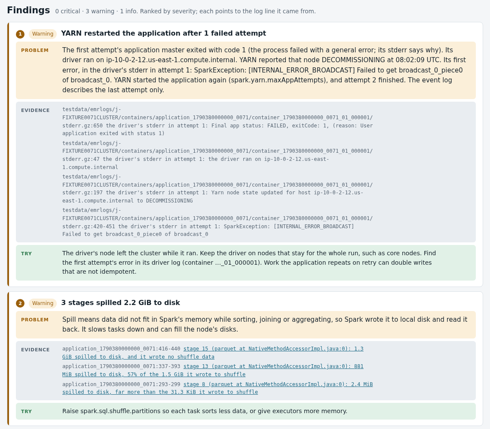
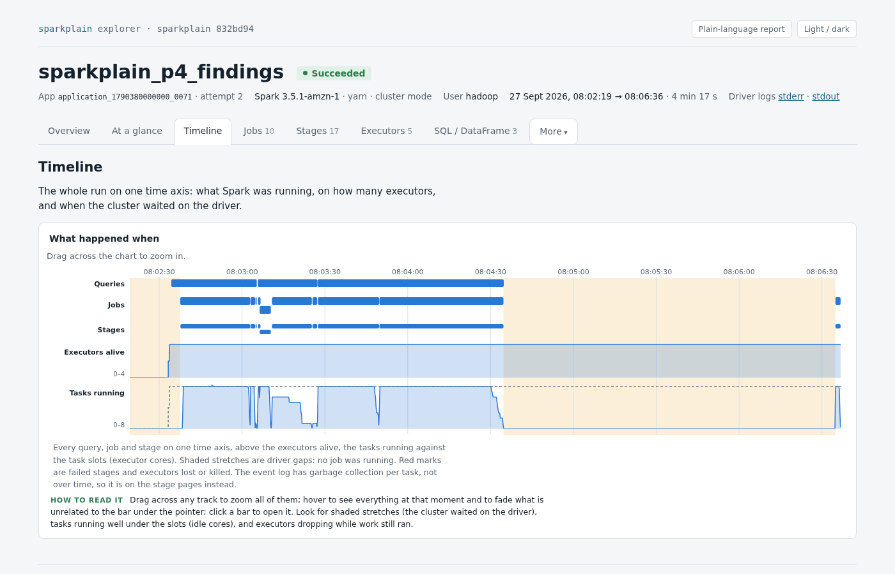

# sparkplain

sparkplain turns one Spark application's logs into a plain-language report. The report shows what ran, on which nodes, and how much CPU, memory and storage it used. It says what went wrong, and every finding points at the log line behind it. It is built for Amazon EMR on EC2 7.3.0+ (Spark 3.5.1+). It also works on any Spark 3.5 event log, including one from a laptop.

One command gives you three files:

- **`<app-id>-report.html`**: the plain-language report. It opens with a short "What happened" summary. It explains every number and lists findings, each with a suggested fix.
- **`<app-id>-explorer.html`**: an interactive view of the run, like a richer Spark History Server for this one application. It has jobs, stages, executors, SQL plans, storage, environment and your code.
- **`<app-id>-report.json`**: the same content as the report, for other tools.

Both pages are single self-contained files. They make no network calls, so they work offline and you can attach them to a ticket or an email.



<sub>Screenshots come from the synthetic fixture in `testdata/` (see [Try it in a minute](#try-it-in-a-minute)); no real cluster data.</sub>

## Contents

- [What the report shows](#what-the-report-shows)
- [Try it in a minute](#try-it-in-a-minute)
- [Install](#install)
- [Run it on your own application](#run-it-on-your-own-application)
- [Get more out of your runs](#get-more-out-of-your-runs)
- [AWS permissions](#aws-permissions)
- [Configuration file](#configuration-file)
- [More options](#more-options)
- [Exit codes and troubleshooting](#exit-codes-and-troubleshooting)
- [Supported](#supported)
- [Develop](#develop)
- [License](#license)

## What the report shows

**The run at a glance.** One diagram shows each node, what YARN offered on it, the driver and executor containers placed there (to scale), and inside an executor how far each part of the Java heap peaked. Numbered badges pin findings to the part they are about. Hatched space on a node is memory nobody used; when it is narrower than an executor, no executor could use it.



**Findings.** Each finding has a severity (critical, warning or info), the problem in plain words, the evidence, and something to try. Evidence is a `file:line` in the event log or in a container, step or node log, or an AWS API call. Links jump to the stage, job or executor in the explorer.



The rules look for:

| Area | Findings |
| --- | --- |
| Failures | failed jobs and steps, the first error in the logs, stage retries, retried task attempts, YARN restarting the application, tasks still running when the log ended, failed bootstrap actions |
| Memory | out-of-memory errors and memory kills (exit 137), spill to disk, GC pressure, heap near its limit, memory given but never used |
| Executors and nodes | lost, decommissioned or excluded executors, spot interruptions, executors too big to fit the nodes, idle worker nodes, slow executor start-up, waiting for cluster capacity, clusters shared with other applications |
| Time and CPU | task skew, low CPU use, idle executor cores, long gaps where only the driver worked, scheduler delay, poor data locality, speculation, host CPU or memory saturated (CloudWatch) |
| Settings and access | `AccessDenied` (CloudTrail and logs), static AWS keys in the Spark configuration, unlimited `spark.driver.maxResultSize`, dynamic allocation without a shuffle service, AQE turned off, results large enough to hurt the driver, classes missing at run time (with the jar that needed them) |
| HBase | a missing table, an unreachable ZooKeeper (and the port tried), region servers not answering, calls that ran out of retries, expired scanner leases, writes refused for a full memstore, regions moved or split during the run, a region server lost or paused, slow calls, HBase stages taking most of the run while their tasks waited, a ZooKeeper connection per task, one region server holding most of a table's regions, regions read from another node |

The report also covers the timeline, cluster and nodes, executors, memory, CPU, storage and I/O, jobs and stages, SQL queries, the runtime environment and configuration, identity and access (user, queue, instance profile, EMR roles, security configuration, Hive and HBase connections), and a Sources panel. Every section says whether its data is complete or partial and what is missing.

**HBase.** For applications that read or write HBase, Storage and I/O adds an HBase block: the tables read and written and how (the hbase-spark connector, `TableInputFormat`, `TableOutputFormat`), the regions each scan read on each region server, the ZooKeeper quorum and how many connections the run opened, the client and connector versions, the stages that used HBase with their time, CPU share and the retries logged while they ran, and what HBase's own Master and region servers logged during the run. HBase trouble mostly shows as a slower job rather than a failure, and its client often logs nothing when a region server is lost or a region moves, so those come from the servers' logs, which EMR keeps beside the YARN logs when HBase runs on the cluster. The event log names only the connector's tables; everything else comes from the container and node logs.

**HBase scans.** Each `TableInputFormat` scan (`sc.newAPIHadoopRDD(...)` with `TableInputFormat`, from Scala, Java or PySpark) gets its own block, and a panel on its stage's page in the explorer:
- **The key range read:** taken from the executors' split lines, one per region.
- **Region servers:** which ones served the scan, with the regions, rows, estimated size and task time on each.
- **Every region:** its key range, region server, rows, time, executor and task, each with the file:line it came from.

TableInputFormat makes its splits in key order and Spark's partition *n* reads split *n*, so each region is tied to the task that read it. That tie is checked against the executor that logged each split. When it can't be checked, rows and time per region are left out rather than guessed, and the report says why. A scan where one region held the stage up gets an `hbase-scan-skew` finding naming that region and its server.

The scan's filters and columns are not in any log. To see them in the report, a non-production run can print the scan string the job passes as `hbase.mapreduce.scan`:

```python
print("sparkplain-scan " + json.dumps({"table": conf["hbase.mapreduce.inputtable"], "scan": conf["hbase.mapreduce.scan"]}))
```

sparkplain decodes that line as it reads it and keeps only the decoded scan, never the string. Where printing isn't allowed, `-decode-scan` (below) decodes a scan string on your machine.

**The explorer** is for digging in. It has a zoomable timeline of queries, jobs, stages, executors and running tasks. It has stage pages with task-time percentiles, histograms and task scatter plots, executor tables, SQL plan graphs with each operator's metrics, and your source code next to the stages that ran it.



## Try it in a minute

You need [Go](https://go.dev/dl/) (the release in `go.mod`, currently 1.27.1) on Linux or macOS.

```sh
git clone https://github.com/ryandam9/sparkplain.git
cd sparkplain
make build

# A scrubbed EMR run: event log plus container, step and node logs, no AWS needed
./bin/sparkplain -app-id application_1790380000000_0071 \
  -eventlog testdata/eventlog/application_1790380000000_0071 \
  -from testdata/emrlogs/j-FIXTURE0071CLUSTER \
  -source testdata/emrscripts/p4 \
  -out out/demo
```

It checks what it can read, reads it, prints a summary like this and writes the three files to `out/demo/`. On a terminal the marks are coloured ✓, ✗, ! and ○ and findings are coloured dots; piped, as here, they are plain letters:

```text
◆ sparkplain 0.1.0-dev · application_1790380000000_0071

  As       offline: local files only, no AWS calls
  Logs     testdata/emrlogs/j-FIXTURE0071CLUSTER/

▸ Access check
  ? AWS                    EMR API, CloudWatch and CloudTrail: not asked for.
                           Pass -profile and -cluster-id to read from AWS.
  Y Container logs         containers/application_1790380000000_0071/
  Y Step logs              steps/
  Y Node logs              node/
  - HBase server logs      node/*/applications/hbase/
                           None in this copy: the cluster runs no HBase, or its
                           node/ folder was not copied.
  Y Spark event log        testdata/eventlog/application_1790380000000_0071
  Y Source code            testdata/emrscripts/p4
  Y Output folder          out/demo  Will be created

▸ Read
  Y Spark event log        490 events, 1.6 MiB
                           from testdata/eventlog/application_1790380000000_0071
  Y Container logs         22 files from 12 containers
  Y Step logs              step s-FIXTURESTEP0001 submitted it
  Y Node logs              5 files from 4 nodes

▸ What happened
  sparkplain_p4_findings ran for 4 min 17 s as hadoop and finished on attempt 2,
  after YARN restarted it.
  ...

▸ Findings  3 warnings · 1 note
  ! YARN restarted the application after 1 failed attempt
  ! 3 stages spilled 2.2 GiB to disk
  ! No Spark job ran for 2 min 20 s (54%) of the run: the cluster waited on the
    driver
  - 1 task attempt failed and was retried successfully

▸ Written  out/demo/
  application_1790380000000_0071-report.html ·
  application_1790380000000_0071-explorer.html ·
  application_1790380000000_0071-report.json
  Open it xdg-open out/demo/application_1790380000000_0071-report.html

Done in 0.2 s · complete (exit 0)
```

Open the report with `xdg-open` (Linux) or `open` (macOS). Its "Open the explorer" button leads to the explorer.

## Install

```sh
make install   # builds bin/sparkplain and copies it to ~/.local/bin (if on $PATH) or /usr/local/bin
make install PREFIX=~/bin   # or somewhere else
```

Without make, `go build -o sparkplain ./cmd/sparkplain` works too. Run `sparkplain -version` to check the build.

## Run it on your own application

You need the **application ID**, for example `application_1700000000000_0042`. Look for it in:

- the step's `stderr` in the EMR console, or the YARN ResourceManager UI;
- the Spark History Server's application list;
- your code: `spark.sparkContext.applicationId`.

Then pick one of three ways to run it. They can be combined.

### 1. From an event log file

The Spark event log holds most of the detail: jobs, stages, tasks, executors, memory peaks, SQL plans and configuration. It is enough for a useful report.

```sh
# A single log (plain, .lz4, .zstd, .snappy or .inprogress)
sparkplain -app-id application_1700000000000_0042 -eventlog ./application_1700000000000_0042.lz4

# A rolling eventlog_v2_* folder, a folder holding many logs, or the History Server's Download zip
sparkplain -app-id application_1700000000000_0042 -eventlog ./eventlog_v2_application_1700000000000_0042/
sparkplain -app-id application_1700000000000_0042 -eventlog /var/log/spark/apps/
sparkplain -app-id application_1700000000000_0042 -eventlog ./application_1700000000000_0042.zip

# Straight from S3 (read-only; -profile default uses the default credential chain)
sparkplain -profile default -app-id application_1700000000000_0042 -eventlog s3://my-logs/spark-events/
```

The run ends with exit code 3 (partial) because the cluster's logs were not read. The report still covers everything the event log holds.

**Where to find the event log on EMR.** EMR writes it to HDFS on the cluster by default (`spark.eventLog.dir` = `hdfs:///var/log/spark/apps`). Anything kept only in HDFS is lost when the cluster terminates. To keep a copy, do one of these:

| How | Notes |
| --- | --- |
| **Download it from the persistent Spark History Server.** In the EMR console, open the cluster's *Applications* tab and open the *Spark History Server* under *Persistent application UIs*. Then use the *Download* link in the application's *Event Log* column. | Works after the cluster has terminated, for as long as EMR keeps the UI. It gives a zip, which `-eventlog` reads as-is. |
| **Copy it to S3 before the cluster ends**, for example as a last step: `hdfs dfs -get /var/log/spark/apps /tmp/apps && aws s3 cp --recursive /tmp/apps s3://my-logs/spark-events/` | Keeps HDFS as the event log folder, so the persistent History Server still works. |
| **Point `spark.eventLog.dir` at S3** in `spark-defaults`. | sparkplain finds the log by itself from the cluster (next section). AWS documents that the persistent application UIs need the event log in HDFS, so they stop showing these runs. |
| **Copy it from the primary node** while the cluster runs: `hdfs dfs -get /var/log/spark/apps/application_1700000000000_0042* .` | Useful when you are debugging on the cluster itself. |

### 2. Online, from the EMR cluster

Given a cluster ID and credentials, sparkplain reads the cluster's container, step and node logs from its S3 log URI. It also calls the EMR, EC2, CloudWatch and CloudTrail APIs. This adds instance types, spot or on-demand, YARN capacity, host CPU, the step that submitted the application, driver and executor errors, and AWS calls and `AccessDenied` errors. It works for running and terminated clusters, as long as the cluster had a log URI.

Every AWS call is read-only (List, Get, Describe, Head and Lookup).

```sh
# The event log is found from the cluster's spark.eventLog.dir when that is on S3
sparkplain -profile default -cluster-id j-1ABCDEF -app-id application_1700000000000_0042

# Otherwise say where it is: S3, or a file you downloaded
sparkplain -profile default -cluster-id j-1ABCDEF -app-id application_1700000000000_0042 -eventlog s3://my-logs/spark-events/
sparkplain -profile default -cluster-id j-1ABCDEF -app-id application_1700000000000_0042 -eventlog ./application_1700000000000_0042.zip

# By cluster name instead of ID, in another region
sparkplain -profile prod-emr -region us-east-1 -cluster-name nightly-etl -app-id application_1700000000000_0042

# Spark and HBase on separate EMR clusters, by name
sparkplain -profile default -cluster-name nightly-etl -hbase-cluster-name hbase-prod \
  -app-id application_1700000000000_0042 -eventlog s3://my-logs/spark-events/

# With the names and the profile in the config file (below), only the application
sparkplain -app-id application_1700000000000_0042

# With an environment per set of clusters in the config file: the application and which one
sparkplain -app-id application_1700000000000_0042 -env prod

# The same, with an event log downloaded from the Spark History Server ("Download" gives a zip)
sparkplain -app-id application_1700000000000_0042 -env prod -eventlog ~/Downloads/eventLogs-application_1700000000000_0042.zip

# Or point at the folder: sparkplain finds eventLogs-<app-id>.zip there (the newest, if you saved it twice).
# Set eventlog-prefix: ~/Downloads in the config file to never type it.
sparkplain -app-id application_1700000000000_0042 -env prod -eventlog ~/Downloads
```

**Clusters by name.** EMR often has several clusters with one name, such as yesterday's (terminated) and today's. `-cluster-name` picks the one that ran the application: the one up when its YARN started, which is the time in the application's ID (`application_<ms>_<n>`), whether it is still running or has ended. `-hbase-cluster-name` picks the HBase cluster of that name up then, or else the one running now. When two could be the one, or none fits, the run lists them with their IDs, states and times, and you pass the ID instead. The access check prints which cluster a name found and why. Only `ListClusters` is added, which is read-only.

If HBase runs on a different EMR cluster, pass its name with `-hbase-cluster-name` (or its ID with `-hbase-cluster-id`). sparkplain continues to read YARN, step, node, CloudWatch and CloudTrail data from the Spark cluster, but reads HBase Master and region-server logs from the HBase cluster's S3 log URI. The HBase cluster currently uses the same `-profile` and `-region` as the Spark cluster.

**Access check.** Every run starts by checking what it can read, with small read-only calls, and prints a line for each source before it reads anything. It checks every access the run will need: each EMR call, listing *and* reading each log folder (a one-byte read, since a bucket policy or KMS key can allow the one and refuse the other), the event log and the job's script wherever they are, CloudWatch metrics, EC2, CloudTrail, the output folder and `-source` paths. A source it cannot read says why, what permission or file it needs, and an `aws` command that repeats the call. Add `-check` to stop there, which is a quick way to try a new profile or cluster: it exits 0 when everything is readable and 3 when something is not.

```
◆ sparkplain 0.1.0-dev · application_1700000000000_0042

  Cluster  j-1ABCDEF · nightly-etl · emr-7.3.0 · terminated
  As       assumed-role/analyst/me · profile default · ap-southeast-2
  Logs     s3://my-emr-logs/j-1ABCDEF/

▸ Access check
  ✓ EMR API                cluster, steps, instances, groups
  ✓ Container logs         containers/application_1700000000000_0042/  list, read
  ✓ Step logs              steps/  list, read
  ✓ Node logs              node/  list, read
  ✓ HBase server logs      node/*/applications/hbase/
                           Checked on the primary node, i-0abc123def4567890 · list, read
  ? Spark event log        The cluster keeps the event log on HDFS (EMR's default,
                           hdfs:///var/log/spark/apps), which sparkplain cannot read.
                           Supply it with -eventlog: the Spark History Server's
                           "Download", or a copy in S3.
  ✓ Job scripts            s3://my-code/jobs/etl.py  The newest step's script · read
  ✓ CloudWatch             14 cluster metrics · list, read
  ✓ EC2 instance types     m5.xlarge
  ✗ CloudTrail             Access denied: needs cloudtrail:LookupEvents (optional;
                           without it the report marks what it would add as missing).
                           try: aws cloudtrail lookup-events --max-results 1 --profile default --region ap-southeast-2
  ✓ Output folder          ~/sparkplain/2026-09-29/application_1700000000000_0042  Will be created
```

On a terminal the marks are coloured dots: green ● (readable), red ● (refused or failed), amber ◐ (empty), pink ● (needed for a full report but not given to this run, such as AWS on an offline run, or an event log kept on HDFS) and ○ (turned off, or not needed); piped or with `NO_COLOR` they are Y, N, !, ? and -. A colour terminal also animates the run: what is being read spins with a running clock, each mark settles into its dot, and sections arrive a beat apart, which adds a few seconds. Set `SPARKPLAIN_NO_ANIMATION=1` (or run under `CI`) for a still console; the text is the same. Offline runs check the local paths instead. The rows are also in the JSON report, as `accessCheck`.

Use `-no-cloudwatch` or `-no-cloudtrail` to skip those calls when you lack the permissions, and `-no-step-logs`, `-no-node-logs` or `-no-hbase-logs` to skip those logs. Only their sections are affected, and the run is not marked partial for them. To skip a source every time, or only in one environment, set it to `no` under `read:` in the config file (below).

### 3. Offline, from a copy of the cluster's logs

No AWS access from where you run sparkplain? Copy the cluster's log folder (or just this application's part of it) and use `-from`. It makes no AWS calls.

```sh
# The whole log folder of the cluster...
aws s3 cp --recursive s3://my-emr-logs/j-1ABCDEF/ ./logs/j-1ABCDEF/
# ...or only this application's containers, plus steps/ and node/ if you have them
aws s3 cp --recursive s3://my-emr-logs/j-1ABCDEF/containers/application_1700000000000_0042/ \
  ./logs/j-1ABCDEF/containers/application_1700000000000_0042/

sparkplain -from ./logs/j-1ABCDEF -app-id application_1700000000000_0042 \
  -eventlog ./application_1700000000000_0042.zip
```

`-from` accepts a cluster's log folder (`containers/`, `steps/`, `node/`), a folder holding several of those (the one with the application wins), or one application's `container_*` folders. For HBase, copy `node/` too: HBase's own logs are under `node/<instance>/applications/hbase/`, and only the hours the application ran are read.

## Get more out of your runs

A few Spark settings make the report richer. They are cheap to turn on in `spark-defaults` (an EMR configuration classification) or with `--conf`:

| Setting | What it adds |
| --- | --- |
| `spark.eventLog.logStageExecutorMetrics=true` | Peak memory per executor per stage (heap, off-heap, execution and storage memory) |
| `spark.executor.processTreeMetrics.enabled=true` | Process memory (RSS), including Python workers, not just the JVM heap |
| `spark.eventLog.logBlockUpdates.enabled=true` | Sizes of cached RDDs and DataFrames on the Storage tab. It makes the event log larger. |
| A log URI on the cluster (`--log-uri s3://...`) | Container, step and node logs: the first error, memory kills and exit codes, and which step submitted the application |

Pass your code with `-source` to see it beside the jobs and stages that ran it (repeatable; it is redacted like everything else):

```sh
sparkplain -app-id application_1700000000000_0042 -eventlog ./application_1700000000000_0042.lz4 -source ./jobs
```

PySpark records a code location for some actions only (`collect()`, not `count()`, `show()` or `write`). When it recorded none, a stage is tied to the line that set its job's description with `sc.setJobDescription("...")`, so describing your jobs also places them in your code. The script spark-submit ran is shown in the explorer's Code tab either way. The explorer says where no line could be found.

## AWS permissions

Online runs need read-only access. This policy covers everything. The last statement is optional: without it, only the sections that need it are marked missing.

```json
{
  "Version": "2012-10-17",
  "Statement": [
    {
      "Sid": "EmrLogsAndEventLogs",
      "Effect": "Allow",
      "Action": ["s3:ListBucket", "s3:GetObject"],
      "Resource": ["arn:aws:s3:::my-emr-logs", "arn:aws:s3:::my-emr-logs/*"]
    },
    {
      "Sid": "EmrMetadata",
      "Effect": "Allow",
      "Action": [
        "elasticmapreduce:ListClusters",
        "elasticmapreduce:DescribeCluster",
        "elasticmapreduce:ListInstances",
        "elasticmapreduce:ListInstanceGroups",
        "elasticmapreduce:ListInstanceFleets",
        "elasticmapreduce:ListSteps"
      ],
      "Resource": "*"
    },
    {
      "Sid": "Optional",
      "Effect": "Allow",
      "Action": [
        "elasticmapreduce:DescribeStep",
        "elasticmapreduce:DescribeSecurityConfiguration",
        "ec2:DescribeInstanceTypes",
        "cloudwatch:ListMetrics",
        "cloudwatch:GetMetricData",
        "cloudtrail:LookupEvents"
      ],
      "Resource": "*"
    }
  ]
}
```

Add `kms:Decrypt` on the key if the log bucket uses SSE-KMS. A refused permission is never fatal. sparkplain names the permission it needed, marks the affected sections, and exits 3.

## Configuration file

Defaults can live in `~/.config/sparkplain/config.yaml` (or pass `-config`). That is the path on macOS and Linux alike (`$XDG_CONFIG_HOME/sparkplain/config.yaml` when that is set); on Windows it is `%AppData%\sparkplain\config.yaml`. Command-line flags win, and unknown keys are rejected. Every key is optional.

The quickest start is to let sparkplain write one for you, with every key explained:

```sh
sparkplain -init-config          # writes ~/.config/sparkplain/config.yaml, never over an existing file
```

Then fill in the `prod` and `nonprod` blocks and check it with `sparkplain -app-id <id> -env prod -check`. The same file is in the repository as [`cmd/sparkplain/config.example.yaml`](cmd/sparkplain/config.example.yaml). In short:

```yaml
cluster-name: nightly-etl                     # the Spark cluster, found by name (see "Clusters by name")
hbase-cluster-name: hbase-prod                # HBase on a separate cluster, if so
profile: prod-emr                             # the AWS profile, and region, for online runs
region: us-east-1
eventlog-prefix: s3://my-logs/spark-events/   # used when -eventlog is not given
environments:          # named sets picked with -env; their keys override the ones above
  prod:
    cluster-name: nightly-etl
    hbase-cluster-name: hbase-prod
    profile: prod-emr
    region: us-east-1
    eventlog-prefix: s3://prod-logs/spark-events/
  nonprod:
    cluster-name: nightly-etl-dev
    profile: dev-emr
    read:              # this environment's role may not call CloudTrail
      cloudtrail: no
timezone: Australia/Sydney                    # for times in the report (default: this machine's zone)
out: ~/reports                                # default ~/sparkplain/<yyyy-mm-dd>/<app-id>/
format: html,json,explorer
read:                  # what to read, each yes or no (default yes); also per environment
  step-logs: yes
  node-logs: yes
  hbase-logs: yes
  cloudwatch: yes
  cloudtrail: yes
thresholds:            # tune when findings fire
  skew-ratio: 5        # slowest task over 5x the stage median
  spill-share: 0.10    # disk spill over 10% of shuffle write
  gc-share: 0.10       # GC over 10% of executor run time
  low-cpu-share: 0.30
  memory-used-share: 0.40
  driver-gap-share: 0.25
  hbase-time-share: 0.50  # stages using HBase over half the run
```

[SPEC §6](docs/SPEC.md#6-outputs-and-cli) lists every key and threshold.

## More options

- **`-format`** picks the outputs: `html`, `json`, `explorer`, comma-separated (default all three; `both` means `html,json`).
- **`-out`** sets the output folder. Files are named after the application, so reports of different applications can share a folder.
- **`-check`** runs only the access check and exits (0 all readable, 3 not).
- **`-show file:line`** prints, redacted, the event behind any value the pages cite, then exits:

  ```sh
  sparkplain -app-id application_1700000000000_0042 -eventlog ./application_1700000000000_0042.lz4 \
    -show application_1700000000000_0042.lz4:1234
  ```

- **`-decode-scan <base64>`** prints an HBase scan string (the `hbase.mapreduce.scan` a `TableInputFormat` job passes, as `binascii.b2a_base64` or Java writes it) decoded: the key range, columns, time range, caching, and the filters as a tree with their operators and values. It reads nothing else and calls nothing. Pass `-` to read the string from stdin, which keeps it out of your shell history:

  ```sh
  pbpaste | sparkplain -decode-scan -
  ```
  ```
  HBase scan
    Rows               [2026-08-15, 2026-10-10)
    Columns            d:status, d:amount
    Caching            500 rows per call to the region server
    Filters
      FilterList  MUST_PASS_ALL
      ├─ SingleColumnValueFilter  d:status EQUAL Binary "SHIPPED" (rows without the column are left out)
      └─ PrefixFilter  "2026-09"
  ```
  A filter or comparator it does not know is named and marked "not decoded", never guessed. The value tested on a column named like a password, secret, token, key or credential is redacted.

- **Limits:** `-max-size` (stored size per file, default 10 GiB), `-max-unpacked` (unpacked size per compressed file, default 50 GiB), `-workers` (files read at once, 1 to 256, default 16), `-overall-timeout` (default 30m) and `-window-pad` (padding around the run for CloudWatch and CloudTrail, default 5m). A file cut short by a limit is marked partial, never passed off as complete.

Run `sparkplain -h` for every flag.

**Privacy.** Passwords, secrets, tokens, keys and credentials are redacted from configuration and log lines before anything is written. The reports still hold user names, host names, cluster IDs and log lines, so they are written private to you (files 0600, new folders 0700). `chmod` them when you mean to share them. Nothing is uploaded anywhere.

**Big logs.** Everything is streamed. A 1 GB event log takes under a minute and under 1 GB of memory.

## Exit codes and troubleshooting

| Code | Meaning |
| --- | --- |
| 0 | Complete: every source was read |
| 2 | Fatal: a usage mistake, a cluster or file that does not exist, an `-app-id` that doesn't match the event log, or output that can't be written |
| 3 | Partial: a report was written, but a source was missing, unreadable or refused. The report's Sources panel says which and why |
| 130 | Interrupted |

Common cases:

- **Exit 3 when you only passed `-eventlog`.** This is expected: the cluster's logs were not asked for. Add `-cluster-id` (online) or `-from` (offline) to fill in the rest.
- **"No event log was given" in the Sources panel.** The cluster's `spark.eventLog.dir` is on HDFS, so sparkplain can't reach it. Get the log one of the [ways above](#1-from-an-event-log-file) and pass `-eventlog`.
- **"AWS access needs -profile".** Online runs need a profile. `-profile default` uses the default credential chain (environment, SSO, instance role and so on).
- **No container logs.** EMR uploads them to the log URI every few minutes and at the end, so a cluster without a log URI, or a very recent run, has none yet.
- **A still-running application.** Its `.inprogress` log gives a report up to the last event, marked incomplete (exit 3).
- **Times look off.** Times are shown in the `timezone` from the config file. When the page opens, your browser relabels them in its own zone and names the zone.

## Supported

- **Platforms:** Linux and macOS. Windows is not supported: output files are replaced with a rename that assumes POSIX semantics.
- **Spark and EMR:** Spark 3.5 event logs, tested on PySpark 3.5.1 fixtures and on EMR 7.3.0 clusters. EMR on EC2 only (EMR Serverless and EMR on EKS lay out their logs differently).
- **Event logs:** plain, `.lz4`, `.zstd`, `.snappy` and `.inprogress` single files, rolling `eventlog_v2_*` folders (including compacted ones), and History Server zips (local only). `.lzf` is not supported.

## Develop

The design is in [docs/SPEC.md](docs/SPEC.md), and what each phase built, and why, in [docs/HISTORY.md](docs/HISTORY.md). [docs/sample-report.html](docs/sample-report.html) is the design reference for the report.

```sh
make check     # gofmt check, go vet, tests, build and govulncheck: run before calling a task done
make run       # builds, then writes a report for a committed fixture to out/ (ARGS="..." to override)
make help      # lists every target
```

`make check` runs the same four commands as:

```sh
gofmt -l . && go vet ./...
go test -race ./...
go build ./cmd/sparkplain
govulncheck ./...
```

- Fixtures in `testdata/eventlog` come from real PySpark 3.5.1 runs, scrubbed. Regenerate them with `make fixtures` (runs `scripts/fixtures/generate.sh`; needs Java 17+, `pyspark==3.5.1` and `SP_SCRATCH`; see the script header). `testdata/emrlogs` holds scrubbed EMR cluster logs.
- `make bench-log` writes a synthetic 1 GB log to `out/big.log`. `make bench` checks the time and memory budget in SPEC §4.
- The screenshots in `docs/images` come from the fixture command in [Try it in a minute](#try-it-in-a-minute), rendered in headless Chrome at 1400 px wide with `TZ=UTC`.

## License

MIT, see [LICENSE](LICENSE). The explorer page embeds [D3](https://d3js.org) 7.9.0, which is under the ISC licence ([its notice](internal/sparkplain/report/assets/vendor/d3-LICENSE)).
