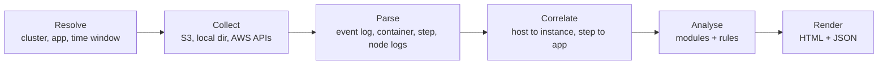

# sparkplain — Delivery history

How sparkplain was built: each phase's plan as approved, what each step built, what the live checks on real EMR clusters showed, and the decisions made on the way, with their dates. It is kept for the reasons behind the design. Section numbers (§5, §6) refer to the spec as it was when each entry was written.

The current design is [SPEC.md](SPEC.md). New plans, step notes and decisions are added here; the spec is updated to match what was built.

## Phases

Five phases, each shippable on its own. Phase 1 delivers most of the value from the event log alone and needs no AWS calls.

| Phase | Scope | Done when |
| --- | --- | --- |
| 1. Event log core | `eventlog` decoder, model, modules 1–8 from the event log, offline `-eventlog` input, HTML and JSON output | A real EMR event log renders a full report; a 1 GB log parses in under 60 s using under 1 GB RAM |
| 1c. Full event coverage | Every field of every Spark 3.5 event is used or set aside with a reason, enforced by a field-inventory test; the new data reaches the explorer, the report and new findings; code shown beside jobs and stages with `-source` (plan below) | The inventory test passes on every fixture and the real EMR log; each new view renders with no script errors; the 1 GB budget and the 25 MB page budget still hold; planted secrets never appear |
| 2. S3 fetching and online mode | S3 fetch layer and online mode; optional event log fetch from an S3 prefix; container and step log classifiers; memory OOM evidence; identity from logs; first failure analysis | `-cluster-id` + `-app-id` produces the report with no manual downloads |
| 3. AWS enrichment | EMR instance mapping, CloudWatch host metrics, CloudTrail access events, security configuration | Nodes table shows instance type and market; Identity section lists roles and `AccessDenied` events |
| 1b. Explorer | Explorer data collection in the parser (task sample, per-stage quartiles and histograms, stage × executor totals, running-task buckets, SQL operator metrics); `explorer.html` with the tabs in §6; `-format explorer` | The fixtures and a real EMR event log render every tab; with Google Charts blocked, the tables still work; a 1 GB log still parses in under 60 s using under 1 GB RAM; planted secrets never appear in `explorer.html` |
| 1d. Offline explorer | The explorer's charts drawn with the embedded D3 (a shared chart kit in `explorer.js`) instead of Google Charts, one chart family per step; the Google Charts loader removed (plan below) | Every tab renders every chart with the network blocked, in light and dark, at desktop and phone widths; `explorer.html` references nothing outside itself |
| 1e. Diagnostic views | Where stage time went; stage × executor heatmap; driver gaps (finding and shading); a unified run timeline; task scatter axis choices (plan below) | A reader can tell from the pages alone why a stage was slow, whether one executor differed, whether the cluster waited on the driver, and what else ran at the same moment |
| 1f. Explorer curation | The second design review (`docs/SAMPLE_EXPLORER_REVIEW_2026-09-28.md`): findings before the charts over time, the heatmap first on Executors, primary tabs and a More menu; one Stages chart at a time with a Stage Health Map; a cross-stage skew chart; a real critical path drawn as a DAG; a resource utilisation panel; more task scatter choices (plan below) | From the Overview alone a reader can name the main findings, the stages worth investigating, the chain that held up completion, whether resources were constrained, and when things happened |
| 4. Findings and polish | Full rules engine with tunable thresholds, Sources panel, redaction tests, fixture logs from EMR 7.3.0 onward | All findings rules covered by tests; CI benchmark and `govulncheck` pass |
| 5. HBase | HBase problems that are not about authentication, told apart and explained from the container logs, the event log and HBase's own server logs; how much of the run HBase took and why it was slow; the tables, regions and region servers a run used; real fixtures from a live HBase cluster (plan below) | A report on each HBase fixture names the table and the cause of its failure or slowness, with the log line as evidence |

Testing: stub S3 and AWS clients, race detector on, fuzz targets for the event decoder and log classifiers.

**Phase 1 status (built).** Offline mode only: `-eventlog` accepts a local file, rolling folder, folder holding logs (the highest attempt wins, preferring finished logs) or History Server zip. The online flags (`-profile`, `-cluster-id`, `-cluster-name`, `-from`) and `s3://` locations exit 2 and name the phase that adds them. Notes from building it:

- Fixtures come from real PySpark 3.5.1 runs in `local-cluster` mode (`scripts/fixtures/`), scrubbed to EMR-like hosts, paths and IDs. Compressed variants are written with Spark's own `CompressionCodec`, so the lz4 and snappy readers are tested against the Java stream formats. The History Server zip is laid out as Spark's `zipEventLogFiles` writes it, but built by the script rather than downloaded.
- Spark 3.5 does not log the driver's exit code (`ApplicationEnd` has only a timestamp), so the final status comes from the end event and the last job, and the report says so. A log without an end event is "incomplete".
- Cached data sizes are logged only when `spark.eventLog.logBlockUpdates.enabled=true`; process RSS only when `spark.executor.processTreeMetrics.enabled=true`. The report says which is missing.
- The runtime environment table is the driver's view only: the event log records no executor JVM or OS details. Library versions (Hadoop, Hive, EMRFS, AWS SDKs, Iceberg, Hudi, Delta, HBase, Py4J) come from jar names on the driver's classpath, since the log does not state them; Spark home is the folder holding `jars/spark-core_*.jar`. The EMR release and the Python version are not in the event log and show as "not recorded".
- Key settings are compared with Spark 3.5 defaults. Comparing with EMR's own defaults needs the EMR API (phase 3).
- The report uses system fonts. The sample's Google Fonts link would break the no-network rule.
- Decision (2026-09-26, superseded by phase 1d on 2026-09-27: the charts now use the embedded D3): a per-application explorer page, a richer take on the History Server's tabs, will use Google Charts. Google Charts cannot be self-hosted, so `explorer.html` loads it from `www.gstatic.com` and needs internet access when opened; `report.html` stays fully offline. Only browser-rendered chart types are used, so report data never leaves the machine. Its design is in §6 (Explorer page) and it is built as phase 1b, before phases 2 and 3, in four steps, each tested and shippable: (1) data collection and its tests and benchmark; (2) the page shell: embedded data, tabs, tables, offline banner, themes, links with `report.html`; (3) the charts; (4) the stage DAG and SQL plan graphs.
- Phase 1b step 1 (built): `eventlog.Options.Explorer` turns on collection into `EventLog.Explorer` (never serialised into `report.json`). On the 1 GB benchmark log (245K tasks, 490 stages, 200 executors) parsing takes 4.5 s either way; live heap is 76 MiB with explorer data against 1 MiB without, and peak RSS 218 MB. The sample budget halved twice, leaving 134,750 sampled tasks and 98,000 stage × executor cells. As plain JSON those are 42 MiB and 78 MiB, mostly repeated field names, so step 2 embeds them in a compact column format to stay under 25 MB.
- Phase 1b step 2: a worst-case test page (490 stages × 200 executors, every value large) came to 30.7 MB with those limits, so the default sample budget is now 100,000 tasks and the stage × executor rows carry only the 13 columns the page shows. Apps under about 100,000 tasks still keep every stage's full sample.
- Phase 1b step 3: charts use Google Charts release 52 (a frozen version; `current` changes under the page), loaded only when a view has a chart. Charts: running tasks against task slots, and job, executor and query timelines; per stage a duration histogram (every task) and a task scatter (the sample plus the slowest); per executor peak heap by stage. Colour follows the dataviz method and was run through its validator for both themes: one series colour (categorical slot 1), the status red for failures, and neutral grey for everything else. Red, amber and green together failed the colour-vision checks, so timelines use blue, red and grey, and every colour is also named in a caption or tooltip. With the network blocked, a banner says the charts need www.gstatic.com and the rest of the page works.
- Phase 1b step 4: graphs are laid out in Go (`report/layout.go`: layers by longest path, barycentre ordering to cut crossings, every edge pointing down) and drawn by the page as SVG. Job and stage pages show the job's stage DAG, with the current stage, failed and skipped stages marked; query pages show the final plan as a graph with rows and time per operator, above the full operator table. Graphs over 300 nodes are left to the tables.
- Phase 1b status (built): the fixtures and a real EMR 7.3.0 log render every tab with no script errors (checked in headless Chrome, 64 route renders across four logs, including a failed and an in-progress one); tables work with Google Charts blocked; the 1 GB log still runs in 4.6 s at 275 MB peak RSS and gives an 11 MB page; planted secrets never reach `explorer.html`.
- Checked against the real EMR log: task launch and finish times are stamped by the driver, and a slot is reused before the driver records the previous task's finish, so a 2-core executor showed up to 4 overlapping tasks. The Spark UI's timeline has the same overlap. The running-tasks chart will say its values are driver-side times and can briefly exceed the task slots.
- Performance, measured with `scripts/benchlog` on 4 cores: a 1 GB log (245K tasks, real task-event layout) in 5.6 s at 30 MB peak RSS for the whole CLI; 1M tasks (2.4 GB) in 14.7 s at 68 MB.
- Still open for the "done when" check: a real EMR 7.3.0+ event log, which cannot be generated here.

**Phase 1c plan (proposed).** Goal: nothing in the event log is dropped silently, because the detail that explains a problem is often one nobody thought to show. Each step is tested before the next.

1. **Field inventory.** A table in `eventlog` lists every event and nested field Spark 3.5 writes (and EMR's additions), each marked *used* (with where it is shown) or *set aside* with a reason (for example, `Task Info.Accumulables` entries that repeat task metrics already read, or internal properties such as `__fetch_continuous_blocks_in_batch_enabled`). A test walks every line of every fixture and the real EMR log and fails on any field not in the table. At run time, unlisted fields and events are counted and shown in the Sources panel and the explorer, so a newer Spark's additions are visible rather than lost.
2. **Tasks.** Keep locality, task type, partition ID, result size, result serialization time, getting-result time and the scheduler delay Spark's UI derives from them, deserialize CPU time, shuffle write time, local and remote blocks fetched, remote bytes read to disk, push-based shuffle metrics, GC counts and times (minor and major), unified and virtual memory, cache writes (`Updated Blocks`), and the full stack trace of each distinct failure (redacted, capped per reason). Stage summaries gain these as quartiles; the task sample gains the columns the page shows. Per-task SQL metric updates become per-operator distributions (min, median, max and the task that hit the max, as Spark's SQL tab shows).
3. **Executors and nodes.** Read executor and node exclusions at stage and application level, and exclusions being lifted (Spark 3.5 writes each twice, under the new *Excluded* and the old *Blacklisted* names, so they are merged); block manager removals; `TaskStart` for tasks still running when an in-progress log ends; executor log URLs, request and registration time (so startup delay), attributes and resources (such as GPUs); driver log URLs and attributes; resource profiles. Memory: each executor's per-stage peaks (`StageExecutorMetrics`), and the driver's heartbeat samples (`ExecutorMetricsUpdate`), which feed only the driver's overall peak because they always carry stage -1. Checked against Spark 3.5.1's `EventLoggingListener`: it has no handler for `SpeculativeTaskSubmitted`, `UnschedulableTaskSetAdded`/`Removed` or `MiscellaneousProcessAdded`, so they never reach an event log, and it writes heartbeat updates only for the driver and only when `spark.eventLog.logStageExecutorMetrics` is on. Speculation therefore shows through each task's `Speculative` flag and the reason its twin was killed.
4. **Stages and jobs.** Each stage's `RDD Info` (operation, scope, call site, parent RDDs, partitions, storage level) becomes a per-stage operation graph like the Spark UI's, drawn with the existing layout. Keep the long call site (`Details`), resource profile and shuffle-push settings. Job and stage properties are compared with the application's settings, and only local overrides (scheduler pool, job group, per-job settings) are shown, redacted like all configuration.
5. **SQL.** Keep `details`, `modifiedConfigs` (redacted), `rootExecutionId` (sub-queries shown under their parent), `jobTags`, AQE metric updates, and EMR's `SparkListenerQueryExecutionMetrics` (optimizer time per rule). Catalog events (databases and tables created, dropped or altered) join the explorer.
6. **Explorer, report and findings.** Show all of the above where it belongs: new stage-summary rows, task columns, executor facts and timeline marks, a memory-over-time chart, per-stage operation graphs, operator metric distributions, query settings and sub-queries, and a "Log events" view listing counts per event type, including unknown ones. Items only in `report.html` so far (CPU time, catalog events, resource profiles, critical path, driver memory) move into the explorer too. New findings: executors or nodes excluded, high scheduler delay, poor data locality, large task results (driver memory risk), slow executor startup, speculation, tasks waiting for resources, and tasks still running at the end of an in-progress log. For investigation, `sparkplain -show <file:line>` prints the redacted event behind any value the pages cite.

7. **Code beside jobs and stages.** The event log records where in the code work ran, not the code. Call sites come from a job's `callSite.short`, each stage's name and `Details` stack, each RDD's `Callsite` and each query's `details`; for Scala and Java jobs, user frames are the stack frames outside Spark, Scala, Java and py4j packages. Checked on the real EMR PySpark log: only 5 of 19 jobs carry a Python file and line (`collect()` does; `count()` and `write` show only `NativeMethodAccessorImpl.java:0`), because PySpark passes its Python call site for some actions only. So:
   - Every job, stage and query shows the code location Spark recorded, or says none was recorded and how to add one (`sc.setJobDescription(...)` or setting `callSite.short` with `sc.setLocalProperty`). Jobs without a location also show the nearest recorded locations before and after them in time, as context rather than a guess.
   - `-source <file or folder>` (opt-in, repeatable) embeds the matching source files in the explorer, matched by path suffix and then file name, at most 5,000 lines per file and 4 MB in all. A Code tab shows each file with every recorded line marked by the jobs, stages and queries that ran there (count, time, status, findings); selecting a line lists them beside the code. Job, stage and query pages show the code around their line, side by side on wide screens.
   - Code is redacted before it is embedded, with a code-aware pass on top of the usual one: on any line that names a sensitive key, every string literal except the key itself is hidden, so `.config("spark.db.password", "…")` loses its value. Tests plant secrets in a source fixture (the fixture workload script already has them) and assert none reach the page.
   - Phase 2 adds fetching the script automatically when it lives on S3 (a read-only `GetObject`, found from the step's `spark-submit` arguments).

Fixtures (added, not regenerated, so existing expectations hold): `0046` exercises exclusions and their lifting, cache block updates, per-query settings with a planted secret, job groups and scheduler pools, a call-site override, large task results, catalog create, alter, rename and drop, and a sub-query; `0047` is an in-progress copy taken with three tasks still running; `0048` is a job aborted because its only node was excluded; `0049` is the real EMR 7.3.0 log, scrubbed (`scripts/fixtures/scrub_emr.py`). A local cluster cannot show a speculative copy (Spark never runs one on the host of the original, and all local executors share one host), nor push-based shuffle (YARN only) or GPUs, so a second EMR run checks speculation and push-based shuffle; GPU fields stay "not seen in a fixture". Budgets stay as they are, and the tests that enforce them keep running: if the extra task columns push the page past 25 MB, the sample budget comes down again.

- Phase 1c step 1 (built): `eventlog/inventory.txt` lists 537 fields of 48 event types (321 used, 33 set aside with a reason, the rest planned for steps 2 to 5). `TestFieldInventory` walks every distinct fixture and fails on an unlisted field, or on a listed one no fixture holds unless it says "not seen in a fixture"; every set-aside reason that claims something about Spark (empty at task start, duplicated elsewhere) was checked against the fixtures. At run time, top-level fields are checked on every event and nested fields on the first 100 events of each type, and unlisted ones are counted as unknown. The inventory replaced the hand-kept lists of known fields and ignored events, which had missed that Spark writes exclusion events under their full class names (`org.apache.spark.scheduler.SparkListenerExecutorExcluded`), so those had been counted as unknown.
- Second EMR 7.3.0 run (1 primary, 2 core nodes; fixture `0050`, scrubbed): a speculative copy ran on another host, and the other attempt ended `TaskKilled` with "Stage finished". Push-based shuffle did not switch on with `spark.shuffle.push.enabled=true`, the YARN `RemoteBlockPushResolver` and a one-merger minimum (every stage logged `Shuffle Push Enabled: false`); why was not investigated further, so its metrics are read but only ever seen as zero. The first attempt at this run failed because Spark refuses an S3 `spark.eventLog.dir` with no objects under it; an empty `spark-events/` marker object fixed it.
- Phase 1c step 7 (built): jobs, stages and queries carry their code locations. A new Java fixture (`0051`, `scripts/fixtures/java/ClaimsJob.java`, built with `javac --release 11` against Spark's jars) confirmed that a JVM application's stage names and call stacks hold its own frames (`writeTotals` at line 29 called from `main` at line 20); its six jobs all have a location, against 5 of 19 in the real EMR PySpark log, where only `collect()` records one. `NativeMethodAccessorImpl.java:0` and `<stdin>` count as no location, and a job without its own takes its last stage's. `-source` matches each logged file to a local one by the longest shared path tail, embeds the matched files (up to 5,000 lines each, 4 MB in all) redacted with `redact.Code`, which keeps a config call's key and hides every other string on a line that names a secret, even when the secret itself contains a word like PASSWORD. The explorer's Code tab lists every location with what ran there and shows each source file beside that activity; job, stage and query pages show their frames, the code around them, or why none was recorded with the nearest recorded jobs before and after.
- Phase 1c status (built): every one of the 552 fields in the inventory is used or set aside with a reason, and the inventory test fails if one is left planned. `make check` passes; the fixtures and the real EMR logs render every tab with no script errors.
- Phase 1c step 6 (built): new findings `executors-excluded` (warning for application or node exclusions, info for stage-only), `scheduler-delay` (warning over `sched-delay-share` of task time), `poor-locality` (info when a stage's input tasks ran away from their data over `locality-any-share`), `large-results` (warning when a result stage returned over `result-share` of `spark.driver.maxResultSize`), `slow-executor-startup` (info over `slow-startup`), `speculation` (info, with how many copies finished first) and `tasks-running-at-end` (warning; worded for an in-progress log or, when the log did end, for tasks a job abort cut off, as in `0048`). Every finding's evidence links to its stage or executor. The explorer gains CPU share for stages and executors, tables and paths, resource profiles (including extra resources such as GPUs, which the parser had dropped), the critical path, and an Event log tab with files, events by type and anything not recognised. `sparkplain -show <file:line>` prints the redacted event behind any value the pages cite; a miss lists the log's file names.
- Phase 1c step 5 (built): queries keep their parent (`rootExecutionId`; commands such as CTAS run inner queries), job tags, long call site and the session settings in force (`modifiedConfigs`, redacted; the fixture's session token appears in every later query's), the metrics adaptive execution adds after planning (the log names no operator for them, so they are listed per query and resolved like plan metrics), and EMR's optimizer report (`SparkListenerQueryExecutionMetrics`: about 230 rules per query with time and runs, and which changed the plan; the model keeps up to 300 rules, the page the slowest 30).
- Phase 1c step 4 (built): each stage keeps the RDDs it computes (operation scope, call site, parents, partitions, cached partitions, storage level, barrier, determinism; capped at 200), its long call site, resource profile and push-based shuffle settings. Jobs keep the local properties that differ from the application's settings (scheduler pool, job group, session settings such as a changed `spark.sql.shuffle.partitions`), redacted by key; the fixture's session token set with `spark.conf.set` reached every later job's properties, so redaction matters here. Stages keep properties only where they differ from their job's (the EMR log shows `resource.executor.cores` set per stage). The explorer draws each stage's operation graph like the Spark UI's stage graph, shows the call stack, and lists each job's own settings.
- Phase 1c step 3 (built): exclusions (executor and node, stage and application, with when each lifted; Spark's two names for each merged), tasks still running at the end of a log (capped at 100,000), executor log links, container attributes (redacted by key), resources and startup delay (registration less request time), when each block manager left, the driver's log links and attributes, where each cached RDD's blocks were per executor with their storage level, and block-manager activity per kind of block. The explorer shows them on the overview, executors, executor, stage and storage pages, with excluded periods on the executor timeline. The driver's heartbeat samples carry stage -1 in every fixture, so the planned per-stage driver memory was dropped.
- Phase 1c step 2 (built): tasks now yield locality, task type, partition, result size, result serialization and fetch time, and scheduler delay (as the Spark UI computes it: duration less run, deserialize, serialize and fetch time, where "Getting Result Time" is the timestamp the fetch began), deserialize CPU, shuffle write time, local and remote blocks, remote bytes fetched to disk, fetch request time, push-based shuffle merges, cache writes, GC counts and times, unified and virtual memory, the first full stack trace of each distinct failure and whether Spark blamed the app for a lost executor, and the stack trace of a failed job. Per-task SQL metric updates give each operator's min, median and max and the task that hit the max; Spark stores "average" metrics per task as ten times the value (a real EMR log showed 320 over 32 tasks for an average of 1.0). A failed attempt's `Accumulator Updates` repeat its Task Metrics, so they are set aside. The explorer shows all of it on stage, job, executor and query pages; the worst-case page is 18.3 MB. `0046` now returns incompressible 3 MB results so the driver fetches them separately (Spark compresses results, so a repeated string never crossed the 1 MB direct-result limit).

**Phase 1d plan (approved 2026-09-27).** Decision: the explorer's charts move from Google Charts to D3, reversing the 2026-09-26 decision above. Google Charts cannot be bundled, so the explorer needed internet access; EMR users often open it on jump boxes and in private subnets without that. D3 v7.9.0 is already embedded (pinned by hash) for the anatomy diagram, so the page grows by nothing. D3 is a toolkit, not a chart catalogue: each chart is built from a small shared kit (frame, unit-aware axes, tooltip, legend, keyboard links), and the views proposed next (stage × executor heatmap, a shared-time-axis timeline, linked highlighting) need that control. Each step keeps every chart's title, guide text, colours, caps and links, and is checked in headless Chromium with the network blocked, in both themes and at phone width.

1. Record the decision; build the kit; move the horizontal bars (longest stages, data per stage, spill, executor time, peak heap per executor, YARN per node).
2. Charts over time: running tasks against task slots, data over time, cluster containers, node CPU.
3. Stage and executor detail: task-duration histogram, task scatter, peak heap by stage.
4. Timelines (jobs, executors, queries); remove the Google Charts loader and banner; the explorer gets the report's "loads nothing external" test; CLAUDE.md, the README and §4 and §6 say the explorer works offline.

- Step 1 (built): the kit draws charts as SVG sized to their box and redrawn on resize. Colours are CSS variables, so a theme switch needs no redraw. Axes tick on round numbers of the unit that suits the data (200 MiB, 5 min) and end at the largest value, so a full heap fills its row. Each bar shows its total at its end; linked rows are focusable and open with Enter. Charts not yet moved still load Google Charts; after a failed load, later views now say the chart is unavailable instead of waiting.
- Step 2 (built): the four charts over time share one time chart: lines, areas or steps on a time axis in the viewer's zone (seconds shown only for spans under 10 minutes), a y axis in round units (count, %, bytes), and a cursor that snaps to the nearest sample and lists every series there. Tick labels at the ends lean inward so none leaves the chart.
- Step 3 (built): a column chart (task-duration histogram, peak heap by stage with the configured heap dashed across) and a scatter chart (task start against duration, failures as red triangles). Count axes tick on whole numbers; a few columns stay column-width instead of filling the chart. Columns of peak heap by stage now open that stage.
- Step 4 (built): job, executor and query timelines are one lane per row with the time axis above the scrolling rows, so it stays in view (600 rows at most, as before); bars are labelled inside when they fit. The Google Charts loader, its banner and its helpers are gone, and `TestExplorerLoadsNothingExternal` replaces the loader test: no URL but the SVG namespace, and no script loading or sending anything. Checked in headless Chromium with the network blocked: every tab, job, stage, executor and query page of six apps (four fixtures, two from the recorded AWS cluster) in light, dark and at 390 px: zero requests, no script errors, no chart failures, no label outside its chart.
- Phase 1d status (built): the explorer works offline.

**Phase 1e plan (approved 2026-09-27).** Goal: answer the diagnostic questions from a design review (`docs/REPORT_EXPLORER_IMPROVEMENTS.md`) without new collection: why a stage was slow, whether one executor or node behaved differently, whether the cluster waited on the driver, and what else happened at the same moment. Built on the phase 1d chart kit, one step per pull request, each checked like phase 1d. Left for later: the stage "health map" bubble chart (it repeats existing charts, and adding input, shuffle and output double-counts shuffle), a SQL → job → stage graph, explorer-wide filters and breadcrumbs, a utilisation scorecard (CPU needs CloudWatch), and a separate executor churn view (the timeline covers it). The review's "critical path graph" is replaced by driver gaps: `JobsSection.CriticalPath` is the longest job's slowest chain, not what held up completion, and for most applications the time between jobs is the better answer.

1. Where stage time went: `model.TaskTotals.TimeSplit` divides task time into scheduler delay, deserializing, computing, GC, shuffle fetch wait, shuffle write, result handling and other, adding up exactly to task time. Report: top 10 stages in the CPU section. Explorer: top 20 on the Stages tab and one bar on each stage page.
2. Stage × executor heatmap (explorer): a metric picker, as measured or against the stage's median executor, top 30 stages and top 50 executors by default, a notice when collection capped the cells; a cell opens the stage with that executor's row highlighted.
3. Driver gaps: the periods with no job running between start and end; a finding above a tunable threshold, with the longest gaps, the jobs either side and their code as evidence; shaded on the report's job timeline.
4. Unified run timeline (explorer, a new Timeline tab): queries, jobs, stages, executors alive, tasks running against slots, driver gaps, executor and stage failures, and CloudWatch node CPU and waiting containers when present, on one time axis with drag-to-zoom and one cursor; a job highlights its stages and query. GC over time is not in the event log (it is per task), and the page says so.
5. Task scatter axis choices: start time, input, rows or shuffle read against duration, GC, fetch wait, scheduler delay or spill.

- Step 1 (built): Spark reports task duration as scheduler delay + deserializing + run time + result serialization + getting the result, and measures CPU, GC, shuffle fetch wait and shuffle write time inside run time. Those four can overlap a little, so when they exceed run time they are scaled to fit, and what they leave is "other" (file I/O, Python workers, locks). Charts group the parts into six colours (starting, computing, GC, shuffle, sending the result, other); tooltips name the parts. The explorer's stage rows carry the split computed in Go (`split`), so the page does no arithmetic of its own.
- Step 2 (built): on the Executors tab, "Which executor behaved differently?": rows are executors, columns stages, squares only where tasks ran (the driver has heap samples for every stage but usually runs no tasks). Metrics: task time, GC share, input, shuffle read and write, disk spill, peak heap, failed tasks, tasks. The relative view divides each square by the stage's median executor, shaded up to 3×, instead of the planned "% of the stage": with 50 executors every share is about 2%, while "3× the median" stands out. Squares shade on a square-root scale in one colour (red for failures) and each names its value, multiple and tasks on hover; row and column labels open the executor or stage from the keyboard. Top 30 stages and 50 executors by task time unless the whole grid is at most 5,000 squares (then a button shows all). A square opens its stage with that executor's row marked in "By executor". Checked on a synthetic 120 × 120 app: 1,500 squares, redrawn in about 0.1 s.
- Step 3 (built): `analyze.driverGaps` walks the union of every job's submit-to-finish span (a job still running when the log ends runs to the end) from application start to end; `JobsSection.DriverGaps` lists the gaps of a second or more, longest first (up to 200), with the jobs either side, and `DriverGapMs` totals all of them. The `driver-gaps` finding (warning) fires when that total exceeds `driver-gap-share` (0.25) of the run and `driver-gap-min` (1 minute); its evidence is the three longest gaps, each citing the job that ended it. The report shades the gaps behind the job timeline, with the total in its legend. No fixture reaches a minute of gaps (0062 idles 45 s of its 78 s), so the finding is pinned by a unit test.
- Step 4 (built): a Timeline tab, "What happened when": queries, jobs and stages as lanes (4, 6 and 10 at most; bars that overlap more are counted and the caption says so), executors alive, tasks running against task slots, and node CPU and waiting containers when CloudWatch was read, all on one time axis whose span covers the application and everything in it. Driver gaps (`gaps` in the page data) are shaded behind every track; failed stages and lost or killed executors are marked in red. One overlay does all the pointer work: hovering moves a cursor across every track and lists the moment (jobs and stages running or the driver gap, executors and task slots, tasks running, CPU, waiting containers) and fades bars unrelated to the one under the pointer (a query's jobs and their stages, a job's query and stages, a stage's jobs and query); dragging zooms every track, with a button back to the whole run; a click opens the bar under the pointer. Track titles shorten when the label column is narrow. The synthetic benchmark log stamps its application start after its tasks, so its tasks-running track is empty; real logs start first.
- Step 5 (built): the task scatter on each stage page has two pickers. Across: when the task started (the default), input read, rows read or shuffle read. Up: duration (the default), garbage collection, waiting for shuffle data, scheduler delay or spill. The title, axis titles, tooltip and reading guide follow the choice (for example "marks that climb from left to right mean input explains the duration"), the choice stays while the page is open, and the sampling note is unchanged.
- Phase 1e status (built).

**Phase 1f plan (approved 2026-09-28).** Goal: curation and correlation, not more charts, from a second design review (`docs/SAMPLE_EXPLORER_REVIEW_2026-09-28.md`) of a real generated explorer. The review missed that the task scatter's axes are already selectable (phase 1e step 5); its other points are taken as below. Decided with the user: the Overview keeps its three charts over time (they sit after the findings, not removed), and At a glance stays a tab of its own (the report links to it, and it is the explorer's most distinctive view). The earlier objection to a Stage Health Map is dropped: adding input, shuffle and output double-counts only when stages are summed, and one stage's bubble honestly shows the data that stage handled. The review's critical path wording ("the dependency chain constraining application completion") is not true of `JobsSection.CriticalPath` (the longest job's slowest chain), so step 4 computes a real one before drawing it. One step per pull request, checked like phases 1d and 1e.

1. Layout: findings (and tasks still running at the end) before the charts over time on the Overview; the stage × executor heatmap first on Executors; the tabs a diagnosis starts from stay in the row, and Storage, Code, Environment, Event log and Logs move under a More menu.
2. Stages: one chart at a time behind a view picker (Health, Duration, Data, Time, Spill, then Skew in step 3), Health by default; the Stage Health Map plots wall time against data handled on log scales, bubbles sized by tasks, with outlines and markers (not colour alone) for failed, skewed, spilled and critical-path stages; a compact version on the Overview.
3. Cross-stage skew: p95 task time joins the explorer's stage data; one row per stage from min through p25, median, p75 and p95 to max, sorted by p95 over median.
4. Critical path: traced backwards from the application's end through the job that finished last, its stage that finished last, the parent that finished last before that stage started, and across jobs through driver gaps; drawn with the stage DAG renderer on the Overview, bounded for large applications.
5. Resource utilisation on the Overview: task slots busy, JVM CPU share, peak heap against the heap given, YARN memory held, time containers waited, executors lost, disk spill, as compact bars with a line of explanation each; no combined score.
6. Task scatter: partition index across; rows and result size up; colour by status, executor or locality.

- Step 1 (built): the More menu is a native disclosure (`<details>`), so it opens from the keyboard and closes with Escape, a click outside or a choice; while one of its tabs is open the menu reads "More: Storage". Checked in Chromium: the Overview reads What happened, Findings, Over time, Critical path, Longest stages; Executors opens on the heatmap; every page of six apps renders offline in both themes and at 390 px.
- Step 2 (built): the Stages page shows one chart at a time behind a picker (Health, Duration, Data, Time, and Spill when any stage spilled), the choice kept while the page is open; the stage table stays below. The Stage Health Map ("Which stages deserve attention?") is on log scales with round ticks (1 s, 10 s, 1 min; 1 KiB, 32 KiB, 1 MiB), finer steps when the range is narrow, and a range under 16× widened around its middle so gridlines always show; stages that handled no data sit on a "none" line. Bubbles are sized by tasks; a red outline marks a failed stage, a thick outline one on the critical path (`JobsSection.CriticalPath` until step 4), ▲ a slowest task over 5× the median (and at least a second), and ■ disk spill. At most 200 bubbles (the longest, plus every failed and critical-path stage) on Stages and 30 on the Overview, which shows it after the findings as "Stages worth a look". Each bubble is focusable, named in full for screen readers ("Stage 13.0 (parquet), 5.2 s, 1.2 GiB handled, 16 tasks, spilled 312 MiB to disk"), and opens its stage.
- Step 3 (built): "Which stages have straggler tasks?" is the Skew view on Stages. Each row is a stage with three or more successful tasks, drawn as multiples of its own median task on a log scale (so short and long stages compare): the line from fastest to slowest, the box from p25 to p75 (from the explorer's per-stage quartiles, when collected), a tick at the median and a dot at p95, coloured and named mild (2×), strong (3×) or severe (5×) as a guide. Sorted by p95 over median; the 40 most skewed by default, all (up to 300) on request. The stage data gains `durMin`, `p95` and `durN` from `Stage.TaskDuration`. Every successful task counts, not the sample.
- Step 4 (built): `JobsSection.RunPath` (`analyze.runPath`) traces what held up completion backwards from the application's end: the stage attempt that finished last; then the parent that finished last before it started (50 ms of slack for driver clocks) or, with no parent that ran, whatever stage finished last before it started, usually the previous job. Time between links is a `driver` step when no job was running and `scheduling` when one was. The steps cover the whole run, so they add up to its wall time (39.1 s of 39.1 s, 31.9 of 31.9, 78.0 of 78.0 on the fixtures); `CriticalPath` stays in the JSON for existing readers. The Overview's "What held up completion" section gives totals by kind and draws the chain with the stage DAG renderer, laid out in Go (`pathLayout`): steps down the left, other parents of chain stages beside the step they feed (muted, or dashed "skipped (output reused)"), for chains of up to 40 steps. Gaps under a second or 1% of the run are left out of the drawing but not the totals; chains over 300 steps are listed instead of drawn. The Stage Health Map's thick outline now marks stages on this chain.
- Step 5 (built): "What the run used" on the Overview, after the chain and before the charts over time: task slots busy (task run time of the core time executors held), JVM CPU share, peak heap of the heap given, YARN memory held of what YARN offered (from the anatomy, so only when YARN's offer is known), containers waiting (CloudWatch), executors lost of started, and disk spill against the shuffle written. Computed in Go (`resourceUse`) from what the analysis already found; no combined score. Redrawn as cards after the user found the one-line list hard to read (2026-09-28): three groups (CPU, Memory, Stability) side by side, stacking on a phone; each card has the figure large, what it is out of beneath, a bar with the healthy range shaded green where there is one (task slots 50–100%, JVM CPU share 30–100%, peak heap 40–90%), a verdict in words ("Healthy", "Idle cores", "Mostly waiting", "Oversized", "Near the limit", "Spilled", "Lost", "Waited", "None"), coloured by tone, and one sentence on what it means. A low JVM share is normal for PySpark: its sentence says Python time is not counted. Containers waiting leads with the count, with how long beneath.
- Step 6 (built): the task scatter gains partition index across; rows read and result size up; and a colour choice: status (the default), executor (the five with the most tasks in the stage, the rest grey) or locality (only the levels present). Failed tasks stay triangles whatever the colour. Each sampled task also carries its peak execution memory (`TaskSample.PeakExec`, from the task end's "Peak Execution Memory"): the most memory it held at once for sorts, joins and aggregations. It is a column in the task tables and a choice both up and across the scatter, so tasks that held the most can be matched against spill, garbage collection or duration.
- Follow-up from a 31-second run on a fresh EMR 7.3.0 cluster (2026-09-28). EMR's cluster series (`ContainerPending`, `YARNMemoryAvailablePercentage`, `AppsRunning`) came back with no point while it ran, and the Cluster tab showed "0 at most", "100% at the lowest" and "0 at most", which read as measured. A series with no point in the run's window now gives no fact, and the "Not in CloudWatch" list names what CloudWatch returned nothing for. A node that ran only the driver says why when size is the reason, in the report's and the explorer's Nodes tables: "No room for an executor: 9.6 GiB left beside the driver, and one needs 11.0 GiB." (`Host.NoRoomBesideDriver`, from the sizes `executor-fit` already works out).
- Phase 1f status (built).

**Phase 2 plan (proposed).** Goal (from the table above): `-cluster-id` + `-app-id` produces the report with no manual downloads, and container, step and node logs join the event log as evidence. Every AWS call stays read-only (List, Get, Describe, Head), and tests use stubs behind interfaces, never real AWS. Each step is tested before the next.

1. **Fetching layer (`source`).** One interface for listing and opening objects, with an S3 implementation (`aws-sdk-go-v2`, an approved dependency: explicit `-profile`, region from the profile or `-region`, bucket region found with `HeadBucket`) and a local-folder one for `-from` and for tests. It carries the §2 rules: listing scoped to the application's prefixes, a worker pool (`-workers`), per-object size cap and timeouts, `If-Match` on the listed ETag, unrestored Glacier objects skipped and reported, streaming `.gz`, `.bz2` and bounded `.zip`, and the error classes shown in the Sources panel.
2. **Cluster and application.** `-cluster-id` (or `-cluster-name` through `ListClusters`) → `DescribeCluster` for `LogUri`, release, applications and the Spark configuration; `ListSteps` and each step's `stderr` to find the step that ran the application (its first `application_<ts>_<n>`). Works for terminated clusters while EMR keeps their metadata.
3. **Event log from S3.** `-eventlog s3://…` as an object or prefix, `eventlog-prefix` in the config file, and, when neither is given, the cluster's own `spark.eventLog.dir` if it is on S3. Otherwise the run continues without it and says so (exit 3).
4. **Log classifiers (`yarnlog`).** Container `stderr`/`stdout`: Java exceptions and Python tracebacks (first line, cause chain, redacted), `OutOfMemoryError`, YARN memory kills and exit codes 137 and 143, lost-executor causes, S3 and IAM access errors, Kerberos, Hive metastore and HBase connection lines. Step logs: the `spark-submit` command, its arguments (redacted) and final status. Node logs: NodeManager container kills and bootstrap action failures. Each classified line keeps its file and line.
5. **Joining and findings.** Container logs map to executors through the `CONTAINER_ID` attribute the event log records, and to the driver. New and sharper findings: the first failure across all sources (with the log line that shows it), memory kills with the container's own message, errors hidden in executor logs that the event log only shows as a lost executor, and access errors. The Identity section fills from logs (OS and Hadoop user, queue, Kerberos principal). The report's Sources panel lists every object read or skipped, and why.
6. **Explorer and code.** Executor and driver pages show their classified log lines, with links to the S3 objects; a Logs tab lists every source file with what was found in it. The application's script is fetched from S3 automatically (found in the step's `spark-submit` arguments) and shown as with `-source`.
7. **Fixtures and a live check.** The step, container and node logs of the four test clusters in the test bucket (including a failed run whose driver `stdout` holds a Python traceback), scrubbed like the event logs into `testdata/emrlogs/`, drive the tests through the local-folder implementation. A final read-only check runs `-cluster-id` against the live testbed cluster and one terminated cluster.

- Phase 2 step 1 (built): `internal/sparkplain/source` has the `Store` interface with S3 and local-folder implementations and a bounded fetcher. The S3 store finds the bucket's region itself (checked live: a client made for us-east-1 read the test bucket in ap-southeast-2), lists with restore status so unrestored Glacier and Deep Archive objects are reported instead of read, and opens with `If-Match` on the listed ETag. Tests run against a stubbed client.

- Phase 2 step 2 (built): `internal/sparkplain/awsmeta` reads the cluster (`DescribeCluster`: state, release, applications, log URI, roles, security configuration, EMR configurations flattened and redacted), finds a cluster by name (`ListClusters`, newest wins), lists steps (`ListSteps`, arguments redacted), and finds the application a step submitted in its `stderr`. Checked against the live testbed and a terminated cluster: `LogUri` uses the `s3n://` scheme, and a terminated cluster still describes. Tests use a stubbed client.

- Phase 2 step 3 (built): `-eventlog` takes `s3://` objects and prefixes (`eventlog.ResolveStore`, the same attempt and rolling-folder rules as for local folders, every part read with its listed ETag), then `eventlog-prefix`, then the cluster's own `spark.eventLog.dir` when it is on S3. `-cluster-id` or `-cluster-name` with `-profile` (required, `default` for the default chain) describes the cluster; without an event log an online run carries on and says why (HDFS event logs are gone once the cluster ends), exiting 3. Checked live: the testbed's report came from `-profile default -cluster-id … -app-id …` alone in 2 s, and a terminated cluster whose jobs set the event log dir per job needed `-eventlog s3://…/spark-events/`.

- Phase 2 step 4 (built): `internal/sparkplain/yarnlog` classifies container `stderr`/`stdout` (and `prelaunch.err`), step `controller` and `stderr`, NodeManager and ResourceManager logs and `bootstrap-actions/master.log` in one streaming pass per file (lines over 64 KiB cut), into `model.LogLine`s that keep file and line (and end line for multi-line blocks), are redacted, and fold repeats in a file (the same exception in 7 tasks is one entry, count 7; up to 500 distinct entries per file). Kinds: exceptions with cause chain and the application's own frames, Python tracebacks with the failing line of the user's script (PySpark and py4j frames dropped), out-of-memory, YARN memory kills, container exits with a plain meaning, the application master's final status, lost executors (with whether Spark blamed the task), task errors, signals, access denied (S3, IAM, Glue, Lake Formation, KMS), Kerberos, Hive metastore or Glue catalog, HBase and ZooKeeper, identity (user and queue from YARN, Kerberos principal), the step's redacted command, the application it submitted and the scripts it uploaded from S3, the step's final status, YARN's final report, and the ResourceManager's application summary (user, queue, memory and vcore seconds). NodeManager and ResourceManager lines are kept only for the application's own containers and attempts. Checked against the logs of four EMR 7.3.0 test clusters, and against the strings and constants in Spark 3.5.1's and Hadoop 3.3's classes for what the clusters never produced (memory kills, lost executors, heartbeat timeouts):
  - The application master's exit codes are Spark's own: 13 is `EXIT_SC_NOT_INITED` (SparkContext never started; the failed run's `spark.eventLog.dir` pointed at an empty S3 prefix), 10 uncaught exception, 11 too many executor failures, 15 exception in the user class. Negative codes are YARN's `ContainerExitStatus` (-104 physical memory, -102 preempted), and 50–56 are Spark's executor codes (52 is out of memory).
  - Executors end with 143 (SIGTERM) and log `RECEIVED SIGNAL TERM` at every normal finish, after `Driver commanded a shutdown`; both are info. A killed speculative twin (`TaskKilled (Stage finished)`) is info.
  - The step's `stderr` and the ResourceManager's diagnostics quote the tail of the driver's `stderr`, so those quotes are skipped rather than counted twice; the driver's own log is the evidence.
  - `bootstrap action 1 failed with non-zero exit code` appears in the primary node's `master.log` on every test cluster, although `DescribeCluster` lists no bootstrap actions; it is kept as info until step 5 checks it against the cluster's state reason.
  - Spark's `Changing view acls to: yarn,hadoop` names who may view the UI, not the user, so identity comes from YARN's report and summary.
  - Log times carry no zone and are read as UTC, the EMR default.
- Fixtures (step 7's, made now to drive step 4's tests): `testdata/emrlogs/` holds the classified files of three test clusters, scrubbed by `scripts/fixtures/scrub_emrlogs.py`, which reuses `scrub_emr.py`'s rewriting so hosts match the event-log fixtures: `j-FIXTURE0049CLUSTER` (the `0049` run: a cast failure in 7 tasks, and a step that tried the absent `s3-dist-cp`), `j-FIXTURE0050CLUSTER` (the `0050` speculation run) and `j-FIXTURE0052CLUSTER` (a failed run: a Python traceback in the driver's `stdout`, exit 13 on both attempts). The scrubber had rewritten the timestamp in container and attempt IDs but kept the old application number (`container_…_0001_…` under `application_…_0049`), which no real cluster produces; it now rewrites both, and `0049` and `0050` were regenerated.

- Phase 2 step 5a (built): online runs call `ListSteps` and `ListInstances` (both read-only; `ListInstances` joins the event log's host names to the instance IDs node logs are kept under, and marks the primary node by `DescribeCluster`'s primary DNS name) and read the logs under `<LogUri>/<cluster-id>/` with `yarnlog.Collect`: every file under `containers/<app-id>/`; the `stderr` of the steps that ran while the application started (up to 50; all steps without an event log), keeping the step whose log says it submitted the application and reading its controller log; and the NodeManager, ResourceManager and bootstrap logs of the nodes the event log names plus the primary node (without an event log, every node up to 50), skipping daemon logs last written before the application started. `-from` reads the same layout from a local folder. Each Sources row lists every object read or skipped and why (collapsible in `report.html`, complete in `report.json`). Two statuses join the Sources panel and do not make the run exit 3: `none` (looked, and nothing there is about this application, such as no step for an application started from a notebook) and `not-requested` (a plain `-eventlog` run does not read the cluster's logs). No container logs is `not-supplied` and exits 3: EMR uploads them to the log URI every few minutes and at the end, so their absence means a cluster without a log URI or an upload that has not happened yet.

- Phase 2 step 5b (built): `analyze` joins each container log to its executor through the `CONTAINER_ID` attribute YARN gives Spark (the driver's too), and each node log to its host through `ListInstances`; without an event log, a step command with `--deploy-mode cluster` makes the first container of each attempt the driver, and otherwise it is called the application master. New findings, each citing the log lines by file and line: `log-first-failure` (critical, when the application or its step failed: the earliest critical line across all logs by time, then by kind, with the user's Python line from a traceback in the same container, YARN's attempts and exit code, and the step's status; the fix is specific for a missing event log folder, a missing path, class or module, and SQL analysis errors), `out-of-memory`, `access-denied` (grouped by action and path; the fix names the instance profile), `kerberos-failure`, `metastore-failure`, `hbase-failure`, `step-failed` (Spark succeeded but the step did not), `app-retried` (an attempt failed before one succeeded) and `bootstrap-failed` (only when `DescribeCluster`'s state code is `BOOTSTRAP_FAILURE`). The event log's `executor-memory-kill` gains YARN's own usage message and the NodeManager's lines instead of being repeated, and `executor-lost`, `executor-memory-kill` and `executor-decommissioned` gain the last error in each executor's own log. Without an event log, the application's name, user, queue, status, times and failure reason come from the ResourceManager's summary and YARN's report, "What happened" is written from them, and Identity shows the YARN user and queue; with the EMR API it adds the instance profile, service role and security configuration, and the logs add Kerberos logins and metastore and HBase connections. On the failed test run (no event log, because SparkContext never started) the report now says what happened: the driver's `FileNotFoundException` on the empty `spark-events` prefix, in `emr_job2.py` line 7, twice, exit 13.

- Event log lookup, extended: when neither `-eventlog`, `eventlog-prefix` nor the cluster's `spark-defaults` names one, an online run tries each S3 `spark.eventLog.dir` the cluster's steps set in their own `spark-submit` arguments (from `ListSteps`, newest first), because jobs often set it per job. Checked live, read-only, on three terminated test clusters: `-profile default -cluster-id … -app-id …` alone gave the full report for the speculation run (event log found through its step's `--conf`, all five containers joined to the driver and executors 1–4 on the right hosts) and for the NOAA run, each in about 1–3 s and under 45 MB; the failed run got its first-failure finding and a Sources row saying no event log exists under its step's folder, which is right, since SparkContext never started.

- Phase 2 step 6 (built): the explorer gains a Logs tab (the EMR API and log Sources rows with every object skipped or unreadable and why, the cluster and its nodes, every log read with its process, worst severity and counts, and all errors and warnings across the logs) and a page per log with each recognised line, opening to its cause chain, traceback and fields; S3 objects link to the S3 console, which needs the viewer's own sign-in (the page fetches nothing). Executor and driver pages show the lines from their own container logs; without an event log the driver's page shows its logs alone. Finding evidence that cites a log links to the line. Log data in the page is capped (200 lines per file, 5,000 in all, 500 characters of text each, 2 MB of detail) so the page stays inside its size budget; `report.json` keeps everything. Online runs fetch the application's source files named in its step's `spark-submit` arguments (the primary resource and `--py-files`; not jars) with `GetObject`, up to 4 MB each, and show them in the Code tab as with `-source`, redacted by `redact.Code`; a Sources row says what was fetched. Tracebacks' file names also count as code locations, so a run with no event log can match its script. Checked live on the speculation run: the step's `emr_job2.py` came from S3 and its lines 17, 21 and 24 carry their jobs and stages.

- Phase 2 step 7 (built): `testdata/emrlogs/` (step 4) drives the tests through the local-folder store, including end-to-end CLI runs with `-from` and with `-cluster-id` against a stubbed EMR API and a local "bucket". The live read-only checks ran against three terminated test clusters (the testbed had ended on its idle timeout by then): every call was `DescribeCluster`, `ListSteps`, `ListInstances`, `HeadBucket`, `ListObjectsV2` or `GetObject`.
- Phase 2 status (built): `-profile … -cluster-id … -app-id …` produces the report with no manual downloads, finding the event log through the cluster's or the step's `spark.eventLog.dir` and reading the application's container, step and node logs; a failed run with no event log is explained from the logs alone. Not covered by a real fixture: memory kills, lost executors, access, Kerberos, metastore and HBase errors (the test clusters produced none), which are tested with lines in the exact formats of Spark 3.5.1's and Hadoop 3.3's classes.

**Phase 3 plan (approved).** Goal (from the table above): the Nodes table shows instance type and market, and the Identity section lists roles and `AccessDenied` events. Every call stays read-only, tests use stubs, and each step is tested before the next. Checked first against the test account (read-only): EMR 7.3 publishes cluster metrics every minute in `AWS/ElasticMapReduce` (`ContainerPending`, `ContainerAllocated`, `AppsRunning`, `YARNMemoryAvailablePercentage`, YARN vCPU and memory seconds); EC2 publishes `CPUUtilization`, network and EBS metrics per instance every 5 minutes; no `CWAgent` namespace exists, so host memory and disk need the agent; CloudTrail names an instance-profile session by its instance ID (`Username=i-…`), and S3 object calls are data events that `LookupEvents` never returns; a normally terminated instance reports `INSTANCE_FAILURE: Instance was terminated.`, so a spot interruption must be inferred from the market, when the instance ended and executors lost on it (the phase 4 live check later saw a real reclaim, which EMR does name: `Spot Instance was terminated due to not enough capacity in the Spot Instance pool.`). The NOAA run's idle core node is explained by its logs: 12,288 MB of YARN memory per node, executors of 11,264 MB, and the driver's 2,432 MB container on the other node, so `ContainerPending` stayed at 49 with 56% of the cluster's memory free.

1. **Cluster inventory.** `ListInstanceGroups`/`ListInstanceFleets` (group, market), EC2 `DescribeInstanceTypes` (vCPU, memory), `DescribeSecurityConfiguration` (encryption, Kerberos, Lake Formation, runtime roles) and `DescribeStep` (the step's runtime role). The Nodes table lists every node up during the run with type, size, market, group, lifetime, why it ended and the executors it ran; nodes that ran none are flagged.
2. **YARN capacity and fit.** Log rules for each node's YARN capacity (ResourceManager), the executor size and count Spark requested and cancelled (driver), and the driver's container size. A finding says when executors do not fit on a node, how many fit, and a size that would.
3. **CloudWatch.** `ListMetrics` then `GetMetricData` over the run plus `-window-pad`: cluster metrics, per-node EC2 metrics, and agent memory and disk metrics when present. Explorer charts for pending against allocated containers and CPU per node; findings for waiting on capacity (too small a cluster, or too big an executor), a shared cluster, and busy or idle hosts. Past CloudWatch's retention (1-minute data 15 days, 5-minute data 63 days) the section says why it is empty.
4. **CloudTrail.** `LookupEvents` by user name for each instance the application ran on (and the runtime role when the step had one) in the run's window, throttled to CloudTrail's 2 requests per second and capped. Identity lists the services and actions called and every `AccessDenied`, redacted; they join the access-denied finding. The gap for S3 object calls is stated.
5. **Security posture and settings origin.** Identity facts from the security configuration; the Configuration section marks settings the cluster's configuration set, as against the job (EMR's built-in defaults are not in the API).
6. **Flags, Sources and permissions.** `-no-cloudwatch`, `-no-cloudtrail` and `-window-pad` work; CloudWatch, CloudTrail and EC2 get Sources rows; a missing permission is `accessDenied` there and exits 3. New optional permissions: `ec2:DescribeInstanceTypes`, `elasticmapreduce:DescribeSecurityConfiguration`, `DescribeStep`, `cloudwatch:ListMetrics`.
7. **Fixtures and live check.** Real API responses for the test clusters, scrubbed into `testdata/aws/` and replayed through the stubs; a new throwaway test cluster (tagged, self-terminating) with a spot task node, a job refused an STS call (which, unlike S3, reaches CloudTrail), a job YARN kills for memory, a JVM out-of-memory, and two applications at once; then a read-only live check.

- Phase 3 step 1 (built): online runs call `ListInstanceGroups` (or `ListInstanceFleets` for fleet clusters), `DescribeSecurityConfiguration` when the cluster has one, `DescribeStep` for the application's step, and EC2 `DescribeInstanceTypes` once for all the cluster's instance types. Each node carries its group's role, type, vCPU, memory and market; the Nodes table joins every event-log host to its instance by short host name (so `ip-10-0-2-10.ec2.internal` matches `ip-10-0-2-10.us-east-1.compute.internal`) and adds the nodes that were up during the run but ran nothing for it; its coverage is complete when every host joins. New findings: `idle-nodes` (worker nodes that ran no executors, saying when a node ran only the driver) and `spot-interrupted` (a spot node that ended while the application ran, with the executors removed on it). Identity gains encryption at rest and in transit, EMR Kerberos with its realm, Lake Formation, runtime roles and the step's runtime role; the security configuration's key ARNs, certificate locations and KDC settings are never read into the model. An EC2 API row joins the Sources panel; a call the profile may not make leaves the report whole, marks its row `accessDenied` and exits 3. Checked live on the NOAA test run: three m5.xlarge nodes (4 vCPU, 16 GiB, on-demand), and the core node that ran only the driver is flagged.

- Phase 3 step 2 (built): new log rules for each node's YARN capacity (the ResourceManager's `registered with capability` and the NodeManager's `total resource of`, kept whatever application a run is about, since they are node-wide), every container YARN placed for the application with its size and what was left on the node, the driver's executor requests (the largest `Will request N executor container(s) … each with C core(s) and M MB`, the heap and overhead each executor launched with, and the most executors dynamic allocation asked for; the cancel churn is dropped), and from the step's `stderr` the driver's container size and the cluster's largest container. The Nodes table shows what each node offered YARN. EMR's capacity scheduler places containers by memory alone (it recorded `vCores:1` for executors that asked for 4), so the fit is worked out in memory: executors that fit on each node beside the driver's container. `executor-fit` (warning) fires when Spark wanted more executors than could ever fit, names nodes with room for none, and proposes a size that fits two beside the driver, keeping the run's overhead share (EMR 7's 0.1875). Dynamic allocation's opening request (100 in the `0049` run, cut to 16 within seconds) is not counted as demand; the most it asked for from the task backlog is. On the real runs: `0049` wanted 16 executors of 5.5 GiB and its one core node had room for 1; the NOAA run wanted 42 of 11 GiB and had room for 1, which is why its second core node ran only the driver; the fix proposed for both is 4 GiB executors with 2 cores.

- Phase 3 step 3 (built): `awsmeta.Metrics` reads the cluster's metrics (`ContainerPending`, `ContainerAllocated`, `AppsRunning`, `AppsPending`, `YARNMemoryAvailablePercentage`, `MemoryTotalMB`, `MemoryAllocatedMB`, `MRLostNodes`, `MRUnhealthyNodes`, `S3BytesRead`, `S3BytesWritten`), each node's (`CPUUtilization` average and peak, `NetworkIn`, `NetworkOut`) and, when `ListMetrics` finds them, the CloudWatch agent's `mem_used_percent`, `swap_used_percent` and `disk_used_percent` with all their dimensions, in `GetMetricData` calls of up to 500 queries, over the run (from the event log, else YARN's summary, else the step) padded by `-window-pad`. It asks for 60-second points within 15 days and 300-second points up to 63 days, and past that says CloudWatch no longer keeps them. The Nodes table shows each node's CPU while the application ran, and the section shows containers waiting, YARN memory free and applications running, with a chart of containers allocated and waiting against the run. New findings: `waited-for-capacity` (warning: containers waited 3 minutes or more and at least 20% of the run; "while N% of YARN memory was free" when a quarter or more was free, which means the containers were too big to fit, else "for room on the cluster"), `shared-cluster` (info: other applications ran at the same time, so node figures include theirs), `host-cpu-saturated` (warning: a node averaged 85% CPU or more) and `host-memory-pressure` (warning: the agent saw 95% or more of a node's memory used). `-no-cloudwatch` skips it; the CloudWatch Sources row says what was read. Checked live: the NOAA run's containers waited while 44% of YARN memory was free, and the deadlocked test cluster (two applications, each driver on a different worker node, executors of 11 GiB) had up to 99 containers waiting for 12 minutes with 34% free. An online run whose event log folder holds nothing for the application now says why instead of reporting an error: on S3 a log appears only once Spark closes it, as `.inprogress` when the application then died (the failed test runs), and not at all when it was killed with its cluster (the deadlocked ones). A test guard fails if any AWS client the CLI can make is left un-stubbed.

- Phase 3 step 4 (built): `awsmeta.Calls` looks up CloudTrail (`LookupEvents` by user name) for the instances the application ran on (the event log's hosts; without one, the driver's node from YARN's records and the worker nodes up during the run; the primary node only when the application ran there, since its EMR agents call AWS constantly), over the run padded by `-window-pad`, at most 2 calls a second, up to 2,000 events per node and 10,000 in all. It counts calls per service and action and keeps every refusal (error codes naming access denied, unauthorized, not authorized or forbidden) with its time, role, resources and redacted message; request parameters are never read. Identity shows the counts, the refused calls and a table of every action; the refusals join the access-denied finding as CloudTrail evidence, or make it when the logs showed none. Identity says what is not covered: S3 object calls (data events), and calls under a step's runtime role, whose sessions CloudTrail names after nothing sparkplain can look up. `-no-cloudtrail` skips it; past CloudTrail's 90 days the row says so. Checked live on the second phase 3 test cluster: the access job's driver log showed STS refusing `AssumeRole` for `EMR_EC2_DefaultRole`, which became the first-error and access-denied findings; LookupEvents by the driver node's instance ID returned its management events (an SSM registration). Every `AssumeRole` in the window was EMR's or EC2's own, with no user name; whether the refused call appears once CloudTrail has delivered it is recorded in step 7.

- Phase 3 step 5 (built): the security posture went into Identity in step 1. The Configuration section now marks each setting "set by cluster configuration" when the cluster's EMR configuration (`spark-defaults`, or `core-site`, `hdfs-site`, `yarn-site`, `mapred-site`, `hive-site`, `spark-hive-site` and `emrfs-site` for Hadoop properties) holds the same value, and "set by spark-submit" when the application's step set it (`--conf` or a flag that maps to a property, such as `--executor-memory`); a value the job overrode is credited to the job. EMR's own defaults for the release and instance type (such as the executor size it writes into `spark-defaults`) are not in its API, so unmarked settings came from EMR or from the code, and the section says so.

- Phase 3 step 6 (built): `-no-cloudwatch`, `-no-cloudtrail` and `-window-pad` work (they were accepted and ignored before), EC2, CloudWatch and CloudTrail each have a Sources row, and a permission the profile lacks marks its row `accessDenied` and exits 3 while the report still comes out. The explorer gains a Cluster tab: instance groups (requested, and running while the cluster is up), the security configuration, every node with what it ran, its instance, what it offered YARN and its CPU, CloudWatch's summary with charts of containers allocated against waiting and of each node's CPU, what CloudWatch lacked, the refused AWS calls and every call CloudTrail recorded. From the real runs: an application that failed before any executor started no longer gets an idle-nodes finding (its failure explains the idle nodes), and a traceback that is also an access error leads with the error, not "Traceback (most recent call last):". The second test cluster also caught a mistake in the test jobs themselves: `spark.task.maxFailures=2` clashes with EMR's `excludeOnFailure` default (`maxTaskAttemptsPerNode=2`), so SparkContext refused to start, and sparkplain named that as the first error with the script's line.

- Phase 3 step 7 (built): `scripts/recordaws` records what one cluster's EMR, EC2, CloudWatch and CloudTrail APIs say over its lifetime (read-only calls only), `scripts/fixtures/scrub_emrlogs.py --recording` scrubs it with the cluster's logs and event logs under one mapping (now also account numbers, public DNS names and IPs, subnet, security group, volume and AMI IDs, temporary key and role IDs, key pair names, and a distinct private address per node matching its host name), and `awsmeta/awsfake` answers the CLI's calls from the recording, filtering metric points and CloudTrail events by the window and user each call asks for. Two recordings drive end-to-end tests (`cmd/sparkplain/recorded_test.go`) with the CLI's clock set to the recording's: `j-FIXTURE0056CLUSTER`, the deadlocked cluster (applications `0055` and `0056`, no event logs), and `j-FIXTURE0062CLUSTER`, the second cluster (`0061` to `0066`, event logs `0062` and `0066`, scripts in `testdata/emrscripts/p3/`). A test guard fails if any AWS client is left un-stubbed.
- What the real runs showed, and what changed because of them:
  - EMR sets Spark's executor overhead factor to 0.1875 without it reaching the event log, so the Memory section's 10% default understated the overhead (949 MiB where YARN placed 1,778 MiB on the NOAA run). When the driver's log has the executor launch line or the container request, the overhead and container size now come from it, and the Memory section names that source. Found by the anatomy diagram, whose container sizes did not add up.
  - A heap that runs out ends in exit 137 too: Spark starts executors with `-XX:OnOutOfMemoryError="kill -9 %p"`, HotSpot prints `# java.lang.OutOfMemoryError: …` and `#   Executing /bin/sh -c "kill -9 …"` to the executor's stdout, and YARN reports only "Container killed on request. Exit code is 137". sparkplain had called this a YARN memory kill and suggested more overhead; it now reads HotSpot's banner, does not count those exits as memory kills, and leads with the heap.
  - A Python worker that wrote 3 GiB in a 1.5 GiB container and finished within about 3 seconds was not killed, though the NodeManager logged its physical memory check as on: it samples every 3 seconds. Short spikes pass unseen, and the report does not claim otherwise.
  - The refused `AssumeRole` of a role that does not exist never appeared in CloudTrail's event history (246 STS events in the window, none with an error, checked 3.5 hours later); the driver's log showed it. Identity lists this among what CloudTrail does not cover.
  - `spark.task.maxFailures=2` clashes with EMR's `excludeOnFailure` default (`maxTaskAttemptsPerNode=2`) and stops SparkContext; sparkplain named it as the first error.
  - spark-submit's "Application … finished with failed status" is no longer taken as a cause; lines without a time take the last time in their file; a container's exit gives way to the cause in its own logs; waiting is measured over the application's own time, else its step's (bounded by the cluster's end when the step was cancelled with it), and a short run that spent half or more of its time waiting counts.
- Live read-only check with the final build: the NOAA run (containers waited its whole 2 min 50 s with 44% of YARN memory free; room for 1 of the 42 executors wanted; a core node ran only the driver), the second cluster's access job (refused by STS) and out-of-memory job (8 executors, GC overhead limit), and the deadlocked cluster (12 minutes waiting with 34% free; room for 1 of 16), each in 3–4 s and under 55 MB, every source read.
- Phase 3 status (built): the Nodes table shows each node's instance type, size, market and group, and Identity lists the roles, security posture, AWS calls and every refusal CloudTrail recorded. Not covered by a real run: a spot interruption (the spot node was never reclaimed; the phase 4 live check later saw one) and the CloudWatch agent's memory and disk metrics (not configured on the test clusters); both are tested with synthetic data. The two test clusters terminated themselves.

- Decision (2026-09-27): more of the screen, and more pictures. `report.html` widens to 1,440 px like the explorer: "What happened" is a full-width bullet list above the KPI grid, in both pages. Charts take a full row each, in both pages: side by side, bar labels squeezed the bars and time axes lost the detail worth seeing. The report's SVG charts are drawn 1,000 units wide so their text shows near its set size, and on phones they scroll sideways rather than shrink it; legends list only the colours a chart uses. Both pages add charts, all drawn from values the report already has, in the dataviz reference palette (`--viz-1` to `--viz-5` in `report.css`, run through its validator for both themes; three light-mode slots are under 3:1 contrast, so every multi-series chart carries a legend or labels):
  - `report.html` (inline SVG, still offline): longest stages; task time spread per stage (median to 95th percentile, whiskers to the fastest and slowest task, since the model keeps no quartiles); data read, shuffled, written and spilled per stage, and read, shuffled and written added up over time; spill per stage; where executor time went (computing, garbage collection, the rest); what YARN placed on each node against what it offered; node CPU; longest queries. Each chart is left out when its data is.
  - `explorer.html` (D3): the same stage times, data and spill on the Stages tab, data over time on the Overview, executor time and peak heap against the heap on the Executors tab, and node memory on the Cluster tab. Bars link to their stage or executor.
  - Node memory counts executor containers at the most alive at once (`PeakExecutors`), because dynamic allocation can start and stop more executors on a node than ever fit on it together. The driver's container is the application master's.
  - Timeline axes now show clock times, and a drawn timeline is only as tall as its rows.
  - Every chart and graph, in both pages, has a title, a line on what it shows and a "How to read it" line: which way is good (shorter, smaller, level, zero) and which pattern to look for (a long tail, a gap below the task slots, waiting while memory is free). A test fails if a chart is added without them.
  - A finding reads in three tinted, labelled bands: what went wrong ("Error" for critical, "Problem" for warning, "Note" for info, tinted red, amber or blue), the evidence (grey, all its lines under one label) and what to try (green). The tints are the theme's soft status colours, so dark mode has its own.
  - Every table, in both pages, scrolls inside its own box at most 75% of the screen tall (so the page can still be scrolled past it), with its header row pinned and, on screens 900 px or wider, its first column pinned when scrolling sideways. Printing shows every row. Production runs can have hundreds of executors and stages; the explorer still draws 200 rows at a time behind "Show more".
- Decision (2026-09-27): "The run at a glance", an anatomy diagram of the whole run, in both pages (the report's second section, and the explorer's "At a glance" tab). It nests the parts the way they really nest: the EMR cluster; the primary node with YARN's ResourceManager and what YARN had to give (offered against held at the application's busiest, containers waiting, applications at once); each worker node with its instance, a CPU sparkline, what its NodeManager offered YARN and the containers placed there, to scale, with the free space hatched and marked when it is too small for another executor; each executor's peak heap, cores shaded by CPU share and how it ended (killed or lost outlined red); then one executor (one killed for memory, else the highest heap) and the driver drawn region by region: 300 MiB reserved, user memory, Spark's working memory with execution and storage peaks and the storageFraction line, overhead, off-heap and Python memory, and a peak-heap line. Findings are numbered in both pages and pinned as badges on the part they are about (by executor reference, by the host its evidence names, cluster-wide rules on the ResourceManager, memory and CPU rules on the executor drawn in full); findings about the work itself are listed as such. It is a snapshot of the busiest moment. Past four nodes, look-alike nodes (same role, type, YARN size and executors, and nothing wrong) collapse into one stacked card ("and 24 more like it"); past 24 cards the rest fold into one line. Missing sources are drawn as dashed boxes that say what they need. When other applications shared the cluster, their containers are not drawn, so a node's unused space is labelled "not used by this application" and the diagram makes no claim that more executors would have fitted; space too small for one is still marked. It is drawn in Go as SVG, so the report stays offline; the explorer adds D3 (7.9.0, embedded, integrity-checked against npm, pinned by SHA-256 in a test, its data loaders never called) for drag to pan, ctrl+wheel and buttons to zoom, double-click to zoom to a node or panel (not animated when the viewer asks for reduced motion) and hover that lights every badge of a finding. Approved dependency: D3, embedded in the explorer only.
  - Fix (2026-09-29): a finding pins to a node when its evidence refers to one (`node:<host>`, matched by short host name), as it already did to an executor (`executor:<id>`). The HBase findings about where things ran now say so, so the diagram marks them instead of listing them as "about the work itself": regions read from another node on each executor that read them, a lost or paused region server, one holding most regions, and one refusing writes on its node. Before, the `0084` run's only finding, 2 of 5 regions read from another node, showed in the diagram's key with no badge above. In both pages a node reference links to the explorer's cluster view.

**Phase 4 plan (approved 2026-09-27).** Goal (from the table above): every findings rule covered by tests, and the performance budget checked in CI. Already in place from earlier phases: tunable thresholds (config file, `thresholds:`), the Sources panel, the redaction tests with planted secrets, and `govulncheck` in CI.

1. Test every rule: tests for the two rules that had none (`poor-locality`, `stage-retried`), and a test that fails when a rule is named in `analyze` but in no test file.
2. Benchmark in CI: fix the synthetic log generator (`scripts/benchlog`) so its application starts before its tasks, then a CI job that generates a scaled log and fails when parsing time or peak memory goes over a proportional share of the budget.
3. Real EMR 7.3.0+ fixture logs: the phase 4 live check's cluster, recorded once it had ended (step 3 below).

- Step 1 (built): `TestEveryRuleHasATest` collects every `Rule: "…"` in the analyze package and fails when one is not named in any test file in the module; checked by adding a throwaway rule, which it reported. All 38 rules are covered: `poor-locality` (fires over `locality-any-share` of input tasks away from their data; ignores shuffle-only and tiny stages) and `stage-retried` (names the previous attempt's error; one finding per retried attempt) gained their own tests.
- Step 2 (built): `make bench`, run in CI after the build, generates a 150,000-task log (about 0.6 GB, past the explorer's 100,000-task sample) and runs the whole CLI on it with every output on under `scripts/benchcheck`, which fails over 60 s or 1 GB of peak memory (the child's maximum resident set size) per GB of log. Measured here: 5.7 s against 34 s, 319 MB against 584 MB; most of the memory is the explorer's sample (JSON alone peaks at 46 MB), which does not shrink with the log, so small logs sit nearer their scaled budget. `scripts/benchlog` now stamps the application start just before its synthetic run instead of copying the fixture's, so the generated log's running-task data is no longer empty.
- Test time (2026-09-28): `go test -race ./...` had grown to about 3 minutes, mostly the race detector (13–18× slower on the event log parser) over tests that each parse every fixture. `make test`, which CI runs, now runs every test without it and then `-race` on `RACE_PKG` in the Makefile, the only packages that start goroutines (`source` and `yarnlog`); `TestRaceDetectorCoversGoroutines` fails when a `go` statement appears in any other package. Tests in `eventlog`, `report`, `analyze` and `yarnlog` run in parallel, and the fixture sweeps run one subtest per fixture. 14 s here, from about 3 minutes.
- Live check (2026-09-27): a throwaway EMR 7.3.0 cluster (tagged, self-terminating; one primary, one on-demand core and one spot task node, m5.xlarge) ran a workload built to trip the rules (cache, a skewed join, spill on 1 GiB executors, a task that fails once, a 2-minute idle driver), then NOAA and a second copy at once. Online runs took 2–4 s and about 50 MB, every page rendered with no script errors, and spot-interrupted, memory-spill, driver-gaps, task-retries, waited-for-capacity, shared-cluster and executor-fit fired on real data. AQE merged the skewed join into 6 tasks, so its heavy task took only 1.4× the median and stage-skew rightly stayed silent. What the run found, and what changed:
  - A real spot reclaim. AWS took back the task node 80 s into the first application; it ran attempt 1's driver, whose executors then failed on `INTERNAL_ERROR_BROADCAST`, and YARN's attempt 2 finished. The report said only "finished": `app-retried` read failed attempts from the ResourceManager's log alone, which was not in S3 yet. Container logs now yield each attempt's driver host (its block manager line) and YARN's `DECOMMISSIONING` notices, the rule also reads the attempt's own `Final app status` line and the event log's attempt number, and the summary names the attempt that finished. Earlier attempts' containers are marked (`earlierAttempt`) so their lines do not link to the last attempt's executors, and the node an earlier driver ran on has its logs read.
  - EMR names a spot reclaim in the instance's state reason, so spot-interrupted quotes it instead of saying it was inferred.
  - idle-nodes named a node reclaimed mid-run, one that joined 36 s before the end, and on the shared runs, nodes busy with the other application; the recorded `0062` test had the same mistake (its "idle" node became ready after the run). See the rule in §5; `Instance.Ready` now comes from `ReadyDateTime`.
  - While a cluster runs, EMR copies its daemon logs to S3 only from time to time: the ResourceManager's current log arrived about 15 minutes after the run, and a NodeManager's had not arrived half an hour after the node started. The diagram says so instead of asking for `-cluster-id`, which was given. Nodes that went away or joined part-way say when, as time into the run, make no room claim and are left out of what YARN offered.
  - EC2 without detailed monitoring has only 5-minute CPU points, which CloudWatch returns when asked for 60-second ones, and a point is stamped with the start of its period. Points are now counted for the period they cover (their series' spacing, or the same metric's on other nodes when a node has one point), so the point covering most of a short run is no longer dropped.
  - Once the cluster had ended, every daemon log was in S3, the current NodeManager logs included.
  - Not fixed: the attempt-1 event log was missing from S3 although its driver logged the rename, and the Sources panel does not say so; attempt 2's container `stdout`/`stderr` took several minutes to reach S3, during which the run exits 3 and says why.
- Step 3 (built): the live check's cluster is a fixture, `j-FIXTURE0071CLUSTER`: its AWS answers recorded with `scripts/recordaws` after it ended, and its logs, the recording and three event logs scrubbed together by `scrub_emrlogs.py`: `0071` (the retried application, attempt 2's log), `0072` (NOAA, zstd-compressed from 8.1 MB to 233 KiB to stay under the 5 MB fixture limit) and `0073` (the copy that shared the cluster), with the job scripts in `testdata/emrscripts/p4/`. `TestRecordedPhase4` replays all three through the CLI: the spot reclaim, the retried attempt and its cause, spill, the driver gap, waiting for capacity, executor fit and the shared cluster, with no idle-node finding, and every worker's YARN capacity and CPU known.


**Phase 5 plan (approved 2026-09-29).** Goal (from the table above): most production Spark applications read or write HBase, on the same (Kerberized) EMR cluster. Kerberos and authentication errors are out of scope, because once set up they rarely fail; this phase is about everything else that goes wrong with HBase. Each step is tested before the next.

Checked first against a throwaway EMR 7.3.0 cluster with HBase 2.4.17 (`testdata/emrscripts/hbase/`: the hbase-spark connector 1.0.1, `TableInputFormat` and `TableOutputFormat`, a missing table, a wrong ZooKeeper port, and two runs that failed on the classpath):

- Every HBase exception is one finding today, "HBase could not be reached". A missing table (`TableNotFoundException`, 6,040 lines in one run) is told the same story as a ZooKeeper port nothing listens on, though the fixes differ.
- A run that failed with `NoClassDefFoundError: com/google/protobuf/RpcChannel` (HBase 2.4's client needs protobuf 2.5, which Spark 3.5 does not ship) had no finding at all; nor did one missing `org/slf4j/impl/StaticLoggerBinder` (the connector's slf4j 1 call).
- The SQL plan reader turns the connector's `HBaseRelation(Map(hbase.table -> sp_totals, …))` into a table named `-> sp_totals, hbase.columns.mapping -> …`, and misses the connector's writes (`SaveIntoDataSourceCommand …hbase.spark.DefaultSource…, Map(hbase.table -> …)`).
- The event log names tables only for the connector. The RDD API leaves just the `newAPIHadoopRDD` call site; its table, row ranges and region servers are in the container logs (`TableInputFormatBase`/`NewHadoopRDD` split lines, `TableOutputFormat: Created table instance for …`, `RegionSizeCalculator`).
- The connector opened 215 ZooKeeper sessions in one run, about one per task.
- The HBase quorum usually comes from an `hbase-site.xml` shipped with `--files`, so it is not in the Spark configuration; only the ZooKeeper client's `connectString` line shows it.

1. **Fixtures.** The test cluster's runs (above, and step 6's), container, step and event logs scrubbed into `testdata/emrlogs/`, and the scripts that made them in `testdata/emrscripts/hbase/`.
2. **HBase failures told apart.** Each its own kind, finding, plain explanation and fix, with the table, host and port where the line names them: table missing; ZooKeeper unreachable (the quorum and port tried); classpath or version clash (`NoClassDefFoundError`, `ClassNotFoundException`, `NoSuchMethodError` in HBase, the connector or their dependencies; the missing class and the jar that usually provides it); region server unreachable or slow (retries exhausted, "servers with issues", call timeouts); scanner lease expired; regions moved or split (usually retried, so a warning unless retries ran out); HBase pushing back (`RegionTooBusyException`, `CallQueueTooBigException`, over the memstore limit). An HBase `AccessDeniedException` stays an access error but is named as HBase, not AWS.
3. **HBase use in the report.** Tables read and written and by which API (connector, `TableInputFormat`, `TableOutputFormat`), from SQL plans and container logs; regions scanned per region server; the ZooKeeper quorum and how many sessions the run opened; client and connector versions (from jar names in stack frames and YARN's localized resources). The Identity section's HBase facts come from the logs when the configuration lacks them.
4. **New findings.** Many ZooKeeper sessions (one connection per task instead of per executor); one region server taking most regions, writes or failures (a hotspot); scans whose task ran away from its region's server.
   **Slowness (added 2026-09-29).** HBase trouble mostly shows as a slower job, not a failure, so the report also says how much of the run HBase took and why:
   - *HBase time share.* Stages that read or write HBase are marked (the connector's relation and write command in SQL plans, its `HBaseTableScanRDD`, and `newAPIHadoopRDD`/`saveAsNewAPIHadoopDataset` call sites whose executors logged `TableInputFormat` or `TableOutputFormat` lines), and the report gives their share of the run.
   - *Waiting on HBase.* CPU time against task time in those stages: a stage whose tasks spent most of their time off the CPU was waiting on HBase.
   - *Retries tied to stages and servers.* Recovered HBase errors and retries (scanner leases, `RegionTooBusyException`, `AsyncRequestFutureImpl` attempts) joined to the stage running on that executor at that time, and to the region server they name.
   - *Why one task was slow.* A scan task's split line names its region and region server, so the slowest tasks of an HBase stage are traced to a large region or a busy server.
5. **SQL plans.** Parse the connector's relation and write command into table, column mapping and access, and never produce a table name from a plan's punctuation. (Done in step 3. The column mapping is not shown: it repeats the job's own code.)
6. **Live check.** The same cluster, not Kerberized (out of scope): a scan slower than the scanner lease, regions moved and split while a job writes and scans, one small region taking every write, and a region server stopped mid-job; the logs of each become step 1 fixtures.
7. **HBase server logs (added 2026-09-29).** The client logs nothing when a region moves or a region server stops (step 6), but HBase's own logs do, and they also show slowness the client cannot see. When HBase runs on the cluster, read each node's RegionServer and Master logs for the application's time window (streamed, redacted, one pass per file, like the other node logs): `responseTooSlow` and `responseTooLarge`, blocked updates and "too many store files", memstore flushes and compactions that held writes, JVM pauses, region moves, splits and reassignments, and a region server stopping or aborting. Each joins the HBase stages running at the time, so a slow stage can say, for example, that a region server paused 8 s for garbage collection or that its regions moved twice. First checked against the test cluster's server logs, and scrubbed into the step 1 fixture.
   - Checked (2026-09-29) on the test cluster, whose Master and RegionServer logs EMR had copied to `node/<instance>/applications/hbase/hbase-hbase-{master,regionserver}-<host>.log[.<yyyy-mm-dd-hh>].gz`, rolled hourly in UTC, while the cluster still ran. Everything the client left out is there: the stopped region server as `ServerCrashProcedure … for <server> (carryingMeta=true) …/CRASHED/regionCount=8`; each move as `TransitRegionStateProcedure table=sp_orders, region=…, REOPEN/MOVE`, after `HMaster: Client=hadoop//<ip> move hri=…` naming who asked; `SplitTableRegionProcedure table=sp_hot` when HBase split the hot region itself; 291 `Region is too busy due to exceeding memstore size limit` warnings and a flush and compaction storm on `sp_hot` against the client's 4 retry lines; and `Scanner lease … expired clientIPAndPort=<executor ip>:<port>, userName=hadoop, regionInfo=sp_events,…`, which names the table and the executor's host. HBase 2.4 writes an empty `ERROR master.ServerManager:` line with every move that names no destination; empty lines are not errors.

- Live check (2026-09-29, `testdata/emrscripts/hbase/scenario.sh`): every disturbed run succeeded, because HBase 2.4's client retries. What reaches the logs:
  - Scanner lease expired: `UnknownScannerException … Scanner lease expired because of long wait between consecutive client checkins`, 6 times; the client reopened the scanner and the scan took 9 minutes.
  - One small region taking every write: `AsyncRequestFutureImpl: id=…, table=sp_hot, attempt=n/16, failureCount=…, last exception=…RegionTooBusyException: Over memstore limit=2.0 M, regionName=…, server=…`, at INFO, then `succeeded on <server>`.
  - Regions moved and split (5 to 10) while the moves scenario ran, and a region server stopped mid-job: the client logged nothing. The only trace is time (one job took 30 s instead of 20 s). Correction from step 7: the moves (05:57 to 06:00 UTC) all happened while the scenario's job was still waiting in YARN's queue behind the slow scan (it started at 06:02), so this run says nothing about what the client logs when regions move under it; the region server stop did happen mid-job (stage 3), and HBase's server logs show both.
  - A connector run that waited 4½ minutes looked like HBase trouble but was waiting for executors (`Initial job has not accepted any resources`) while another application held the cluster, which the existing waiting-for-capacity rule covers.
  - `TableInputFormat` gave no splits for a table whose rows were all still in the memstore (never flushed), so a scan of 20,000 rows read none and succeeded; the scenario flushes first.
- Step 1 (built): `testdata/emrlogs/j-FIXTURE0083CLUSTER` holds nine runs' container and step logs, scrubbed by `scrub_emrlogs.py`, and `testdata/eventlog/` their event logs (the last attempt of a failed run, named `<app>_<attempt>`; the connector's zstd-compressed): `0081` and `0082` classpath clashes, `0083` connector, `0084` `TableInputFormat`/`TableOutputFormat`, `0085` missing table, `0086` wrong ZooKeeper port, `0088` scanner leases, `0090` `RegionTooBusyException`, `0092` a region server stopped (silent). `TestHBaseFixtures` runs each through the CLI. Today the report gets `0081` no finding, `0082` only "job failed", `0085` and `0086` the same "HBase could not be reached", `0088` (which succeeded) a critical "could not be reached", and `0090` nothing; step 2 changes these.
- Step 2 (built): `yarnlog` names each HBase client error by its problem (`hbase` field: `table-missing`, `zookeeper`, `scanner`, `busy`, `moved`, `server`, `retries`, `other`) with the table, region server, ZooKeeper address, memstore limit and retry attempt the line gives, and reads the client's INFO retry lines (`AsyncRequestFutureImpl … attempt=n/m … last exception=…`) and the ZooKeeper client's give-up warning (`… to <host>:<port> failed for get of …, code = CONNECTIONLOSS`), which were dropped before. Expired scanners, busy regions and moved regions are warnings, because the client retries them; the rest are critical. A missing or wrong-version class (`NoClassDefFoundError`, `ClassNotFoundException`, `NoSuchMethodError` and the like) is a new `classpath` kind with the class and the jar of the first stack frame that names one (the code that needed it); a WARN line's miss stays a warning, since libraries probe for optional classes. `hbase-failure` is replaced by `hbase-table-missing`, `hbase-zookeeper` (which says when the port is not 2181), `hbase-server`, `hbase-retries`, `hbase-error`, `hbase-busy`, `hbase-scanner-expired`, `hbase-region-moved` and `hbase-access-denied` (HBase's own refusal, no longer reported as AWS's); a table's "retries exhausted" lines join its missing-table finding. `classpath-clash` names each missing class, the jar that needed it, and where EMR 7.3 keeps the usual provider (protobuf 2.5 at `/usr/lib/hadoop/lib/protobuf-java-2.5.0.jar`; an SLF4J 1.7 binding at `/usr/lib/hadoop/lib/slf4j-reload4j-1.7.36.jar`; the hbase-spark connector, which EMR 7 does not ship). A failed run whose logs hold no critical line now takes its first error from the earliest warning-level exception. On the fixtures: `0081` and `0082` get `classpath-clash`, `0085` `hbase-table-missing`, `0086` `hbase-zookeeper` at port 2182, `0088` `hbase-scanner-expired` (a warning; it succeeded), `0090` `hbase-busy` on `sp_hot`, and the healthy and silent runs none. Region moves, a stopped server, call timeouts and HBase's access refusal are tested with HBase 2.4's own messages, since the test cluster's client never logged them.
- Step 3 (built, with step 5, which it needed): the report's Storage and I/O section has an HBase block, and the JSON an `hbase` section, whenever the event log or the logs show the run used HBase. Tables come from the connector's plans (`hbaseRefs` reads `HBaseRelation(Map(hbase.table -> …` and the connector's `SaveIntoDataSourceCommand … Map(hbase.table -> …` in the physical plan's text, since the write command's node prints no arguments and a read under a write appears only there) and from new log kinds: `hbase-use` (the driver's `RegionSizeCalculator` before a `TableInputFormat` scan, each task's `Input split: Split(tablename=…, regionLocation=…)`, kept as one entry per table and region server whose count is the regions read there, and `TableOutputFormat: Created table instance for …`) and `localized` (the files YARN localized, as the application master lists them). A scan node printed with its options (`Scan HBaseRelation(Map(…))`) no longer gives a table named after its punctuation. The block shows each table read or written and how, regions read per region server, the ZooKeeper quorum, how many ZooKeeper connections the run opened and the most one process opened (the connector run: 216, 215 in one executor), and the HBase client and connector versions: from the event log, which now also reads jars shipped with `--jars` (`spark.jars`, `spark.yarn.dist.jars`, `spark.yarn.secondary.jars`; the runtime table gains "HBase Spark connector"), else from the localized jars, so a run that failed before its event log was useful still names them. The ZooKeeper connection line is kept up to its quorum, so a process's connections fold into one entry instead of hundreds that crowded the 500-line cap per file. Not shown: regions the connector read (it logs none; step 7's server logs will), and a connector table the run never planned, such as the wrong-port run's, which failed while opening its relation.
- Step 4 (built): the HBase section lists the stages that read or wrote HBase: a stage with the connector's `HBaseTableScanRDD` reads its query's HBase tables, the result stage of the last job of a query that wrote HBase writes its tables (earlier jobs of the query only prepare input), and a stage with a `newAPIHadoopRDD` `NewHadoopRDD` reads the tables of the split lines logged while it ran, as a stage writes the tables of `TableOutputFormat` lines logged while it ran. Log times have whole seconds, so a line goes to the stage that started last of those running then. Each stage shows its time, CPU share of task time, the HBase retries and errors logged while it ran with the servers they named, and its slowest task against the median; the section adds the wall-clock time in HBase stages and how many `TableInputFormat` regions an executor read on the region server's own node. New findings, with thresholds in the config file: `hbase-time` (HBase stages over `hbase-time-share`, 0.50, of a run of at least `min-run-time`; a warning when their CPU share is under `low-cpu-share`, naming what the clients retried and the longest stage's slowest task), `hbase-zk-connections` (one process over `hbase-connections`, 50: a connection per task, and each new connection starts with an empty cache of region locations), `hbase-hotspot` (one region server holding over `hbase-hotspot-share`, 0.75, of at least 4 regions of a table read, when the run touched at least two region servers), and `hbase-remote-regions` (info: regions read from another node over `locality-any-share`). The busy, scanner and moved-region findings now name the stage they happened in. On the fixtures: both connector runs get `hbase-zk-connections` (215 in one executor), `0084` `hbase-remote-regions` (2 of 5), and the slow-scan and hot-region runs `hbase-time` (99% and 93% of the run, CPU 0.1% and 5.2%). Not done: tracing the slowest task to the region it read. The split line names no task and an executor runs several at once, so the report gives the slowest task's host and time, not its region; a hotspot among failures (rather than regions) waits for the server logs of step 7, since the client names a server only for busy regions.
- Step 7 (built): `yarnlog` reads HBase's Master and region server logs (`node/<instance>/applications/hbase/hbase-hbase-{master,regionserver}-<host>.log[.<yyyy-mm-dd-hh>].gz`, HBase's own header, `… INFO  [thread] logger: …`) as `hbase-server` lines, kept to the application's time (from the event log, or else from the first and last times in its container logs) and folded to one entry per event, server and table: the Master finishing a region move (`TransitRegionStateProcedure … REOPEN/MOVE`) or split, and scheduling a lost region server's recovery (`ServerCrashProcedure … (carryingMeta=…) …/regionCount=n`); a region server refusing writes (`Region is too busy due to exceeding memstore size limit`), dropping a scan's lease (with the table and the client's address), flushing, compacting, and stopping (`STOPPED: <reason>`). Aborts, JVM pauses (`JvmPauseMonitor`), slow or large calls (`(responseTooSlow)`) and flushes held back by too many store files use HBase 2.4's own messages; the test cluster had none. Everything else those daemons log, including the empty `ERROR master.ServerManager:` with each move, is left out. The Sources panel gains an "HBase logs" row, listed only when the cluster has them. Because the logs are the whole cluster's, an event counts as the run's only when it names one of its tables (a scanner lease: a table it read, from one of its executors' hosts), a region server the clients saw refuse writes, or a whole region server (lost, stopped, paused); the rest appear in the report as context. The run's events go to the HBase stage running then. New findings: `hbase-server-lost`, `hbase-regions-changed`, `hbase-server-pause` and `hbase-slow-calls`; the busy and scanner findings gain the server's side (291 refusals, 162 flushes and 74 compactions on one server for the hot-region run). The fixture now holds the three nodes' HBase logs (the hours before the runs included, to test that they are skipped) and the region-server-stop run's event log: `0092` gets `hbase-server-lost` (the region server that held `hbase:meta` and 8 regions, stopped by an admin client while stage 3 ran), and `0090` `hbase-regions-changed` (HBase split `sp_hot` while the run wrote it). Not covered by a real run: region moves under a running job, pauses, slow calls and aborts.
- Phase 5 status (built): a report on each HBase fixture names the table and the cause of its failure or slowness, with the log line as evidence: a missing class and the jar that needed it (`0081`, `0082`), a missing table (`0085`), the ZooKeeper port tried (`0086`), expired scanner leases (`0088`), writes refused for a full memstore with the region server's own count (`0090`), and a region server stopped mid-job, which only HBase's logs show (`0092`); the HBase block says which tables each run used and how, which stages used HBase and how long they took, and what HBase's servers logged meanwhile. Not covered by a real run: region moves under a running job, region server timeouts, pauses, slow calls and aborts, and HBase's own access refusals (Kerberos and authorization are out of scope); each is tested with HBase 2.4's own messages. The HBase test cluster terminated itself.

**Console, access check and HBase node listing (approved 2026-09-29).** From running the online command on the HBase test cluster: the console listed the sources twice (the access check, then Read), named the cluster twice, repeated the log bucket's prefix on every line (the longest paths wrapped onto lines of their own), used different name widths in its two lists, and printed jargon ("Called DescribeCluster, ListSteps, …", "single, 1 file(s), 1.8 MiB unpacked to 1.8 MiB"). And the access check proved only that each source could be listed.

1. Console: the cluster, principal and log folder once at the top, locations relative to it, one name width, short "Read" lines (`SourceStatus.Brief`), and colour with small single-width symbols (✓ ✗ ! ○, ● for findings, ▸ for sections) rather than emoji, which terminals draw two cells wide and at uneven widths; plain Y, N, ! and - when piped.
2. Access check: every access the run needs, not just listing: a one-byte read of each log folder's object and of the event log (s3:GetObject and KMS), `ListInstanceGroups`/`ListInstanceFleets` and `DescribeStep`, `GetMetricData` as well as `ListMetrics`, the job's script in its own bucket (read with `GetObject` alone, as the run does), an event log folder a step set, `-source` paths and the output folder.
3. HBase logs only from nodes up during the run: `ListInstances` names every instance a cluster ever had, so a long-lived autoscaling cluster meant a listing call for each.

- Built (2026-09-29): as planned. The one-byte ranged read made the AWS SDK log "Response has no supported checksum" to the terminal; the read turns that log off. On the offline quick-start run the check first showed a leading slash on every path (the `-from` folder had no trailing slash) and marked a cluster without HBase as missing HBase logs (now "not in this copy", which does not make `-check` exit 3), and "Not asked for" under Read repeated the check; all three were fixed. Tests cover each new check (a store that lists but refuses reads, metrics listed but not readable, refused instance groups and step details, a script readable and refused, a step's event log folder, a missing `-source`, an unwritable output folder) and the nodes listed for HBase.

**HBase scans view (approved 2026-10-02).** From the user's jobs: PySpark reads HBase with `sc.newAPIHadoopRDD` (`TableInputFormat`, `ImmutableBytesWritable`, `Result`, with key and value converters), and the scan is a `binascii.b2a_base64` string of a serialized `Scan` in the conf dict (`hbase.mapreduce.scan`), with nested filters and compare operators. The scan string cannot be printed in production, so the view must stand on what Spark and HBase already log; the scan, when one is available, is extra. Checked first: HBase 2.4.17's `Client.proto` (`Scan`: columns, start and stop row, filter, time range, versions, caching, batch size and the rest by field number), `Filter.proto` (each filter is its Java class name plus its own message; `FilterList` with `MUST_PASS_ALL`/`MUST_PASS_ONE`), `Comparator.proto` and `HBase.proto` (`CompareType` `LESS` … `GREATER`, `NO_OP`); and the `0084` fixture, whose executors log `NewHadoopRDD: Input split: Split(tablename=…, startrow=…, endrow=…, regionLocation=…, regionname=…)` and `TableInputFormatBase: Input split length: 50 M bytes.` per task (no `scan=` in HBase 2.4's split text), and whose event log has each scan task's rows (`Records Read`) but `Bytes Read: 0`. An executor running several tasks interleaves their lines, and EMR's log format has no thread name, so a split is tied to its task only when the order says so unambiguously; totals per table and region server never need the tie.

1. **Splits.** `yarnlog` keeps each split's table, start and end row, region server and encoded region name, and each `Input split length`, with file and line. Today's per-server count stays.
2. **Rows and time per region.** Splits are tied to the tasks of the scan stage (the `Running task … (TID n)` lines before them, when one task started alone on that executor at that time); each tied split gets its task's rows, run time and executor. Per region server and per scan: regions, rows (from the stage's tasks), estimated size. Untied splits are counted and said to be untied, never guessed.
3. **Scan decoder.** A small protobuf reader (standard library only) for `Scan` and the filters and comparators listed in `Filter.proto` and `Comparator.proto`: the key range and whether each end is included, reversed, columns, time ranges, versions, caching, batch size, max result size, cache blocks, read type, and the filter tree with each operator and comparator value; an unknown filter or comparator is shown by class name as not decoded. Base64 with or without `b2a_base64`'s trailing newline. Fuzzed. Used where a scan string appears: a driver line `sparkplain-scan {"table": …, "scan": …}` (non-production runs), a `hbase.mapreduce.scan` Spark property, and a new `-decode-scan <base64>` that prints the decoded scan and exits, reading nothing else.
4. **Report and explorer.** Each `TableInputFormat` scan stage gets an HBase scan block: the table; the key range (from the splits, or the scan); the scan's settings and filters when known; regions read; region servers, how many and each with its regions, rows and estimated size; rows and time per region where tied, the biggest and slowest marked; the stage's call site, linked to the line in the job's script (the Code tab) where `newAPIHadoopRDD` was called. New finding `hbase-scan-skew`: one region or region server holding most of a scan's rows or time, with the split line and the task as evidence and the fixes (split the region, salt the key, narrow the scan).
5. **Provenance.** Every value above links to its file and line. The report's HBase stage cell also links each count of server events and retries to the first line behind it, which it did not before.
6. **Tests.** The `0084` fixture (splits, sizes, per-server rows, the untied case); synthetic scan strings encoded in the tests from the `.proto` field numbers, covering nested filter lists and each operator; a planted secret in a driver line. Then the user's own sample scan string (fake values), when available, to check the decoder against their encoding.
- Step 3, the decoder (built 2026-10-02): `analyze.DecodeScan` and `-decode-scan` (a string, or `-` for stdin), from the four `.proto` files above. Tested on scans encoded in the tests from their field numbers (nested filter lists, every compare operator, each comparator HBase 2.4 ships, the filters with their own fields, an unknown filter, a value on a column named like a token), and fuzzed. A filter nested past 32 levels is shown as unreadable, not recursed into. Reading the scan from a driver line or a Spark property comes with step 4.
- Steps 1, 2, 4 and 5 (built 2026-10-02):
  - **Splits.** The classifier keeps each split with its key range, region server, region and source line, and each `Input split length` when its group of interleaved lines can be told apart. A group is the run from a split with none open until none is open again; its sizes are assigned only when it holds one split, or when every size in it is equal. On the `0084` executor log, the first pair of tasks logged 50 M and 50 M, so both are tied; the second logged 57 M and 50 M, so neither is.
  - **Scan tasks.** The event log parser keeps each successful task of a `newAPIHadoopRDD` stage, one per partition, capped at 20,000 per stage.
  - **Ordering, checked rather than assumed.** On `0084`, the five splits sorted by start row are partitions 0–4, and each was logged by the executor that ran that partition. So a stage's regions are tied by key order only when splits and tasks match one for one and every split's executor agrees. Otherwise the scan says why and ties none.
  - **Printed scans.** A `sparkplain-scan` line is decoded as it is read, and the string is never kept; a test plants a value and the string, and checks that neither reaches the JSON, report or explorer. The submitting step's stdout is now read, since in client mode the driver's prints go there.
  - **Output.**
    - The report's HBase block has a scan block per stage.
    - The explorer's stage page has an "HBase regions read" panel.
    - New finding: `hbase-scan-skew`.
    - The HBase stage cell names a line behind each of its counts.
  - **Decoder location.** The decoder moved to `yarnlog`, since the classifier needs it.

**Read switches (approved and built 2026-10-02).** The user wanted to choose, in the config file, which sources a run reads. A `read:` block (top level, and per environment, which overrides it) sets `step-logs`, `node-logs`, `hbase-logs`, `cloudwatch` and `cloudtrail` to yes or no; new flags `-no-step-logs`, `-no-node-logs` and `-no-hbase-logs` join `-no-cloudwatch` and `-no-cloudtrail`, and a flag turns a source off whatever the file says. HBase's server logs, though under `node/`, have their own key: they are often wanted when YARN's node logs are not. YAML 1.2 (yaml.v3) takes a bare `yes` as text, so the values are a small type that accepts yes, no, true, false, on and off and rejects anything else. A source turned off is not checked or read; the access check marks it ○ with the flag or config key that turned it off, its Sources row is `not-requested` with the same reason, and it does not make the run partial. Container logs, the EMR API and the event log are always read.

**Run window without the event log (2026-10-02).** On the user's cluster (no event log available: it stays on HDFS and they have no access to it), HBase's server logs were not read: the window came only from the times of container log lines sparkplain recognised, and a healthy run had none. Each log file now records the first and last times its lines start with, recognised or not (`yyyy-MM-dd HH:mm:ss,SSS`, its ISO form, or Spark's `yy/MM/dd HH:mm:ss`), and the window is, in order: the event log; YARN's application summary (exact start and finish); the container logs' first and last times; the step's start and end. CloudWatch, CloudTrail, the node list and HBase's logs use the same order, and the HBase row names the window and its source. The user's container logs use `yyyy-MM-dd HH:mm:ss,SSS`; the rest of their log4j pattern is not yet known, and if it differs from `<time> <LEVEL> <logger>: <message>` the lines' contents (splits, errors) are not read, only their times.

**Thread-first log layout and splits tied by task (2026-10-02).** The user's executor lines read `2026-10-02 09:17:17,589 [Executor task launch worker for task 41.0 in stage 172.0 (TID 6429)] INFO  org.apache.spark.rdd.NewHadoopRDD  - Input split: Split(…)` (log4j `%d [%t] %-5p %c - %m`), which no header pattern matched, so their contents were not read. That layout is now read like the others (every rule works on it), and HBase's daemon layout keeps its thread too. Spark names an executor's task thread after the task it runs, so a split line and its size line in this layout name their task: the size is tied to its split by TID whatever else interleaves, the split goes to the stage the thread names, and a scan whose every split names its task ties each region to that task exactly (`tiedBy: "task"`), without the key-order and executor checks; otherwise the key-order tie is used as before (`tiedBy: "key order"`). The report and the explorer say which tie was used.

**HBase scans without the event log (approved 2026-10-02).** The user asked what the hundreds of split lines could show; of five proposals (scans without the event log, region server load over time, slow regions against the servers' logs, new findings, locality), step 1 was approved first, since the user has no event log and the scans view needed one. Spark 3.5's executor logs `Running task <p>.<a> in stage <s>.<sa> (TID <t>)` and `Finished task …` on the task's own thread, and `Starting executor ID <n> on host <host>` as it starts (checked on the `0084` fixture), so with the thread-first layout each split's task, its time and its executor come from the executors' logs alone. Rows per region are only in the event log and are marked so. The first three proposals that remain (load over time, links to the servers' logs, new findings) wait for the user.

**HBase tasks table (approved 2026-10-02).** The user asked for one table of every stage's HBase tasks from the container logs, in order, with each task's stage, row keys, table, region, region server and executor. Approved: one row per task attempt; the explorer (new HBase tasks view under More) and the JSON with every row, and the report capped at 500 rows (the user's choice), with a per-stage summary above it. With the event log, rows, time and executor come from it where it records the attempt; without, times come from the Running and Finished lines.

**HBase follow-ups (approved 2026-10-02).** The user asked to finish the three remaining proposals in order, one PR each: region server load over time, slow regions linked to the HBase server logs, and new findings. Two of the proposed findings already existed (`hbase-hotspot` for regions held, `hbase-remote-regions` for locality), so the third PR adds the others.
- Load over time (built 2026-10-02): concurrent scan tasks per region server from the tasks table, in the report and the explorer, with `hbase-server-load` (one server serving at least `hbase-hotspot-share` of the running scan tasks, and at least 4, for `hbase-load-min`). With the event log, a task's start is its launch time, now kept for scan tasks.
- Slow regions and the server logs (built 2026-10-02): checked first on the `0083` cluster's HBase logs that the servers name regions by the same encoded name as the split lines, in flushes, compactions, closes and opens, the Master's moves and splits, and refused writes (202 flushes, 103 compactions, 101 closes, 126 opens, 85 moves, 5 splits and 291 refused writes between 04:00 and 07:00). Slow calls did not happen there, so their region comes from HBase's documented `region= …` parameter. Events are tied to the tasks reading their region at the time, slow tasks are marked, and `hbase-region-events` reports slow tasks whose region had such work on its server.
- New findings (built 2026-10-02), from the tasks table and the scans: `hbase-repeated-scan` (stages sharing 80% of the smaller one's regions of a table; a stage's attempts count as one read), `hbase-full-scan` (no start or stop row over 10 regions or 10 GiB; a decoded scan with a start or stop row is not reported), `hbase-tiny-regions` (a median estimated size under 32 MiB over 20 or more sized regions) and `hbase-retried-regions` (a partition read again after a failed attempt, naming what the region's server logged meanwhile). Locality and regions held per server were already `hbase-remote-regions` and `hbase-hotspot`.

**First real run's observations (2026-10-02).** The user ran sparkplain on a real application (09:12–09:17 local time) and found: the console's HBase line said "09:12 UTC" though the cluster writes AEST; the report and explorer showed the HBase scans at 19:12 (the report's zone is Australia/Sydney, so AEST times read as UTC came out 10 hours late); and the console's list of findings was too long. Cause: log times were read as UTC, EMR's default, and the user's cluster is set to Australia/Sydney (AEST, AEDT from 4 October). Decided: a `log-timezone` setting (config file, per environment, or `-log-timezone`; default UTC) for every log time and rolled HBase log hour, a warning when the container logs start a whole zone away from a UTC time, the window labelled in the log zone; and the console keeps only the findings count, the report and explorer listing them. Until now, runs on that cluster without an event log also asked CloudWatch and CloudTrail for the wrong 10 hours. The user also found the explorer's Logs tab counting 1,082 nodes: every instance the long-lived cluster ever had. It now lists the nodes up during the run (about 80, as At a glance counts them) by role, numbered within each, and gives the all-time count beside it. With log-timezone set, the user's next online run still showed the HBase window as 09:12–09:17 UTC: describing the cluster started a new set of cluster logs and dropped the zone, so online runs read log times as UTC. The tests had covered only -from; the online test now runs with -log-timezone too.

**The run's story from the container logs (approved 2026-10-02).** The user, whose event logs stay on HDFS, asked for the whole story of a run from its container logs alone, losing nothing: how the application ran, how many jobs, stages and tasks, how much memory, how much data crossed the network; and to keep every timestamped piece, since the last step replays the run as an animation, executing its tasks virtually. Spark's own log lines (checked against Spark 3.5.1's source and the fixtures) carry most of it. Approved, in this order, one PR each, for cluster mode (the driver in the application master's container, `_000001`):
1. The driver's log rebuilt into the run: jobs, stages, tasks and executors, as a stand-in event log, so every existing section works.
2. Each task's story from the executors' logs (the thread-first layout names the task): broadcasts, shuffle blocks fetched locally and remotely, spills, cached blocks and memory, input, output commits, result sizes, warnings.
3. Network and memory views from those, and their findings.
4. An animated replay of the run in the explorer.

Decided: keep each event with its time and source line, not only per-stage sums, for the replay.
- Step 1 (built 2026-10-02): yarnlog reads the driver's lines from `DAGScheduler` (jobs, final and parent stages, stage submissions with their task counts, stage and job ends and failures), `TaskSetManager` (each task's start with its executor, host, partition and locality, its end with its time in ms, and lost tasks with their reason), the scheduler backend and `BlockManagerMasterEndpoint` (executors and their memory), `YarnAllocator` (containers, executor cores, completed containers), `ExecutorAllocationManager` and `TaskSchedulerImpl` (executors removed or lost), `SparkContext` (version, name, stop) and the application master's `Final app status` (exit code). With no event log, `eventlog.Rebuild` turns them into the listener events an event log would hold, each keeping its driver log line as its source, and folds them as the parser does (layout `container-logs`). On the `0049`, `0050` and `0084` fixtures the rebuilt run matches the real event log: jobs and their status, every stage that ran with its name, task counts, status and time to the millisecond (from "finished in X s" and each task's "in N ms"), failures with their reasons, and executors with their hosts, cores and task counts. A stage a job skipped is not in the driver's log. Task metrics (rows, bytes, CPU and GC time, spill, memory), SQL plans and Spark's configuration are only in the event log: the CPU, memory, I/O and configuration sections say so, the rules that need them (`cpu-low`, `memory-*`, `scheduler-delay`, `large-results`, the data side of `stage-skew`) do not run, and HBase scans tie their regions to the rebuilt tasks with rows marked as needing the event log. The CLI rebuilds from the log file with the most driver lines in the latest attempt, and only when it shows a job started: a driver that failed before any job is better told by the logs-only report. A "Driver log rebuild" row joins the Sources.
- Step 2 (built 2026-10-02): each task's story from its executor's log. The fixtures' executors use Spark's default layout, which prints no thread, so a line goes to a task by its thread's name (the user's layout), else by the TID it names (Running, Finished, Exception, killed, and EMR's FileScanRDD lines), else by being the executor's only running task; the rest are counted per executor, so nothing is dropped. On 0049 about a quarter of the lines that name no task could be tied that way; in the thread-first layout all are. Checked on the four fixtures with event logs: every task has a story with the event log's outcome and result size, and shuffle blocks add up exactly, while shuffle bytes run a few percent over the event log's, since the "Getting N blocks" sizes are the map outputs' compressed estimates; the report says so. Each story keeps up to 40 timestamped steps with their lines, for the replay. New: the report's "What each task did" section, the explorer's Task stories view and task pages, and `taskStories` in the JSON.
- Step 3 (approved and built 2026-10-02): data moved and memory over time, from the stories: shuffle read on the task's own node and over the network, spill and cache per step; each executor's storage memory left; broadcast variables; spills by stage; and five findings with config thresholds (`shuffle-network`, `cache-evicted`, `broadcast-large`, `task-spill`, `commit-slow`; sizes such as `1GiB`). Lines that could not be tied to a task now keep their timed steps too (up to 20,000 per executor log), so the charts count them: in the fixtures' layout most shuffle reads are such lines. Shuffle steps keep their network bytes and memory steps the storage memory free. On 0050, 74% of shuffle reads crossed the network, which the chart and `shuffle-network` (with `network-min` lowered) show; no fixture dropped cached blocks, spilled or committed slowly, so those findings are tested on synthetic stories. `task-spill` runs only without the event log, whose `memory-spill` has exact bytes.
- Step 4 (built 2026-10-02): the Replay tab in the explorer. Each executor's slots fill with its tasks, coloured by stage, while the driver's panel shows the jobs and stages running with their progress, each executor its network reads and storage memory left, and a ticker the events in words; play, pause, speed, next event and a scrubber. It is drawn from data the page already carried (the task stories, flows, stages, jobs and executors). A first cut gave a 2-core executor 11 slots: tasks within one logged second had been stretched to 400 ms before slots were assigned, so they collided; slots now use the logged times and the stretch is for drawing only. The plan's four steps are built.

**Real-cluster findings, 1: At a glance on a shared cluster (2026-10-02).** The user ran sparkplain on their real cluster (82 nodes, shared with other teams, the application given a few executors) and found the reports good, with findings to fix one by one. First: At a glance drew a card per node, folding look-alikes. Decided with the user: the primary node as before; a card for each node that ran the application, never folded; the other worker nodes as one box counted by role and type (with what they offered YARN, and how many came or went); and, whatever the read switches say, everything needed for the application's own nodes: their NodeManager logs (what YARN offered) and their CloudWatch metrics, with the EMR and EC2 APIs always read. Without the event log the node logs had been read for every node up during the run (up to 50), because nothing said which ran the application; the container logs name them (YarnAllocator's launches, the executors' and driver's hosts), so once they are read only those nodes and the primary are.

**Real-cluster findings, 2: every executor drawn in full (2026-10-02).** The user asked whether At a glance draws all nine of their executors region by region. It draws one, the one killed for memory or else the one with the highest heap, and the others as cards. Decided: in the explorer, clicking an executor's card (anywhere on it) opens At a glance with that executor drawn in full above the diagram, linking on to its page; the report stays as it is.

**Real-cluster findings, 3: your code at each stage (2026-10-02).** The user's stages table showed their scripts beside Spark's own files (`PythonRDD.scala`, `SerDeUtil.scala`), and they asked to see their own code at each stage, from a local copy of the repo, 20 lines either side. `-source` already matched scripts by name and showed 6 lines. Decided: `source:` and `source-context:` (default 20) in the config file, also per environment, with `-source-context` beside `-source`; each stage's line of the user's code in a new "Your code" column (report and explorer) and on its page, from its own call site, else its job's action, else the nearest line Spark recorded before it, labelled; the tables and files each stage read and wrote follow in their own PR.

**Real-cluster findings, 3, second half: what each stage read and wrote (2026-10-02).** A "Reads / writes" column in both stages tables and a "What it read and wrote" section on each stage page, from the executors' logs, the SQL plans and the HBase section (SPEC §6 "Reads / writes (stages)"). Checked against the fixtures: on `0049` the bytes EMRFS logged uploading for stage 27 (2,110,707,723 over 11 files) are exactly the event log's output bytes for that stage, and stage 29 read the same folder back in 23 file splits, with or without the event log; on `0072` the partitioned write lands on the table's folder, not each year's. The stages' RDD scopes name the plan's scan nodes (`Scan parquet spark_catalog.claims.provider_dim`) and `WriteFiles` in Spark 3.5, which is what places a plan's tables on stages; the hbase-spark connector's stages carry no Scan scope, so the HBase section places its tables. Found on the way: a partitioned write's format was read as its partition columns (`[year#386]`), since `InsertIntoHadoopFsRelationCommand` lists them before the format; fixed. Hadoop's `FileOutputCommitter` "Saved output of task" line (HDFS writes) is not in any fixture and is not read; no RDD name in the fixtures carries a path (`sc.textFile`), so RDD names are not read either.

**Real-cluster findings, 4: the Replay tab (2026-10-02).** The user found the replay hard to read on their run: the "What happened" list a wall of long task lines, executor boxes the page's full width with half of each empty, and colours (blue, green, pink) with nothing saying what they mean. Decided: a numbered list with a time column and a tag per line, tasks of one stage that did the same in the same second on one line that opens to list them, and a picker to show jobs and stages only or every step; the running stages numbered, at most 8; executor cards side by side with their slots filling the card; a legend naming each colour's stage, and the network and memory bars grey so colour means only the stage.

**Real-cluster findings, 5: At a glance order and colours (2026-10-03).** The user asked for the nodes laid out in executor order (the node of executor 1 first, then 2, and so on, as far as nodes allow), and found the colours muddled: executor cards were the page's teal accent beside green core squares, while the key said executor containers are blue. Decided: nodes sorted by their lowest executor ID (a node with only the driver first, nodes that ran nothing last; nodes with findings no longer jump ahead, their badges mark them); executor cards a pale blue edged in the executor blue; cores grey to black by how busy, a shade no other part of the diagram uses. On seeing it, the user asked for pink cores instead: cores are now the palette's pink, faint to solid by how busy, and off-heap and Python memory, which had used pink, take overhead's amber at other strengths (all three are memory outside the heap, and each is labelled), so pink still means only cores.

**Real-cluster findings, 6: icons for node CPU and memory (2026-10-03).** The user asked whether icons would help show a node's CPU and memory. Agreed, as labels and not in place of amounts: each node card's CPU and memory rows start with a grey icon (a chip with pins, a memory stick), drawn as SVG symbols in the page so it stays one file that works offline. The CPU row adds a small bar filled to the average with a tick at the peak (named in the key); the memory row says what this application held of what YARN was offered, above the containers bar that draws it to scale. The icons are grey so colour keeps its one meaning per part.

**Real-cluster findings, 7: "Which stages deserve attention?" (2026-10-03).** The user found the Stage Health Map too hard to read. On their run every stage recorded no data handled, so all the bubbles sat on the "none" line, piled on each other and on the time labels, and the chart needed a key of sizes, outlines and marks before it said anything. Decided: the default view (Stages tab, and the Overview's "Stages worth a look") is a ranked list, failed, then critical path, then flagged (stragglers over 5× the median, disk spill, a retry), then the rest, longest first within each, with one duration bar per row on a shared scale and its reasons in words; when most stages are on the critical path (a run whose stages ran one after another) that reason says nothing and is left out, and the note says the list is ranked by duration. Rows name the stage by its action and the line of the user's code where known. The scatter stays as "Time vs data", offered only when at least two stages handled data, with smaller bubbles, the "none" row lifted off the time labels and bubbles nudged apart. On the way, FutureTask.java (the JVM thread pool behind Spark's broadcast exchanges, seen in fixture 0072) was being taken for the user's code; it, ThreadPoolExecutor.java and Thread.java are now known as not the application's.

**Real-cluster findings, 8: the node chart (2026-10-03).** On "What YARN placed on each node" every executor container was one blue block, so the user could not count them. Decided: one piece per executor container held at once, each in its own colour (cycling the palette's blue, green, amber and pink, never the driver's orange), labelled inside with the executor and its vCPUs, shortened to fit; each row ends with memory and vCPUs taken of what the node offered; and the chart is now titled "CPU and memory the executors took on each node". When more executors ran on a node than at once (some replaced others), which ran together is not known, so the pieces give the vCPUs but no executor number. The axis steps in whole GiBs (1 GiB, 2 GiB), as the user asked, not halves.

**Real-cluster findings, 9: "What YARN had to give" (2026-10-03).** The user asked for better wording on At a glance's capacity card, and for it to show how its numbers come about. It is now "Cluster capacity used": the bar, then one plain fact per bullet, such as "The cluster had 12.0 GiB of memory and 8 vCPUs: 2 worker nodes × 6.0 GiB and 4 vCPUs each.", then the settings that set each node's share (yarn.nodemanager.resource.memory-mb, yarn.nodemanager.resource.cpu-vcores), what the application used and what was left, how many containers waited and for how long, and whether other applications shared the cluster. The user asked whether "gave applications" should be "gave this application": no, the totals are what every application on the cluster shares, which the wording now says. The waiting line no longer says the memory was full: the finding tells full memory apart from free memory in pieces too small, and the card's badge links to it.

**Real-cluster findings, 10: PySpark code with no call sites (2026-10-03).** On the HBase lab cluster (EMR 7.3.0, a PySpark job that writes with the hbase-spark connector and scans with TableInputFormat) the user set `source:` in the config file and saw no code in the report. The event log named only Spark's own frames: `runJob at SparkHadoopWriter.scala:83` for the connector's writes, `take at SerDeUtil.scala:173` for `newAPIHadoopRDD`'s one-row probe, and `NativeMethodAccessorImpl.java:0` for `count`, `show` and `write.parquet`; with no line of the script anywhere, the nearest-line rule had nothing to point at and the script was not even loaded. Decided with the user, without a plan: the driver's command line (`sun.java.command`) names the script (`--primary-py-file orders_hbase.py` on the YARN application master), which is now `application.script` and always loaded from the source folders; and a stage whose job set a description (every job in that script did, with `sc.setJobDescription(f"…")`) is tied to the line that set it, labelled so, before the nearest-line rule. Checked on that run (application 0004): every stage now names a line of `orders_hbase.py`. A second run, whose job printed its totals with `collect()` (`collect at orders_hbase.py:121`, the one PySpark action here that records its line), found a bug: a job with no call site of its own took the last stage Spark listed, but Spark lists a job's stages unsorted (`[9, 10, 11, 8]`), and the later write jobs listed last a skipped parent named after that `collect()`, so they were placed at line 121. A job now takes its final stage's (its highest stage ID, as its name does) or none, and those writes take line 125, which set their description. The same run showed the HBase tasks table untied to tasks (partition and TID unknown): the probe's split line makes nine for the scan stage's eight tasks, so the key-order tie gives up, though each split line follows its task's `Running task` line on a one-core executor. Fixed the same day at the user's request: in a layout that prints no thread, a split line (and its size line) logged while its executor was running only one task belongs to that task, as task stories already tie lines; on that run all nine splits are tied (the probe's to stage 1, the scan's eight by task), with rows and time per region. Executors running several tasks at once still interleave, and stay untied unless the key order ties them. Tying the probe exposed a false `hbase-repeated-scan` (stage 1 had read the first region again), so the probe's stage, `take at SerDeUtil.scala`, no longer counts as a read of the table.

**Real-cluster findings, 11: the report becomes a summary (2026-10-03).** The user asked whether the report page is needed at all, since the explorer has every detail. Decided with the user: keep it as a short summary someone can read in a minute or forward, and make the explorer the place for everything else. The report keeps What happened, The run at a glance, Findings (with evidence and fixes), What this report covers and Sources; Timeline, Cluster and nodes, Executors, Memory, CPU, Storage and I/O, Jobs and stages, What each task did, SQL queries, Configuration, and Identity and access left it. Each kept section, and each coverage row, opens the matching explorer tab ("Open in the explorer →"), and the menu lists the explorer's detail under "More in the explorer". The JSON is unchanged. Before removing anything, each dropped section was checked against the explorer: everything was there except Identity and access, which now opens the explorer's Environment tab. The report's charts drawn in Go (Gantt, stage, executor, memory, node and flow charts) went with their sections; At a glance stays. Its node and executor links had pointed at report sections that no longer exist, so they now open the explorer, or link nowhere without one, and a test checks that every link in the report has a target.

## Appendix: the spec before it was simplified (2026-09-29)

On 2026-09-29 the spec was rewritten to describe sparkplain as it is, and this history moved out of it. Its other sections as they stood then are kept here word for word, since they spell out details the rewrite summarises (for example exactly when each findings rule fires). Where they differ from the spec, the spec wins.

### 1. Overview

**sparkplain** is a Go CLI that turns one Spark application's logs (on EMR on EC2 first) into a single report explaining what ran, on which nodes, with how much CPU, memory and storage, and under which identity.

**Problem.** The Spark History Server shows raw lists per tab (jobs, stages, executors, storage, environment). It gives no cross-cutting view: which node hosted which executors, how memory moved over time, what identity touched Hive, HBase or S3, or why the run failed. Answering those today means reading container logs by hand.

**Goals**

- One command, one application ID, one self-contained HTML report plus a JSON export.
- Cover nodes, executors, memory, storage and I/O, CPU, jobs and stages, configuration, identity and access, and failures.
- Support EMR on EC2 7.3.0 and later (Spark 3.5.1 and newer), for running or terminated clusters, from logs in S3 or on local disk.
- Fetch logs itself from S3 and AWS APIs as a standalone module, with no external tool dependencies.
- Flag problems (skew, spill, OOM, lost nodes, access denials) with evidence pointing to the exact log file and line.

**Non-goals for v1**

- Live monitoring or alerting on running applications.
- EMR Serverless and EMR on EKS (their log layouts differ; revisit after v1).
- Changing clusters or jobs automatically.
- Cost reporting in dollars.

### 2. Log fetching

sparkplain fetches logs itself, scoped tightly to one application, with bounded resources and explicit error reporting.

**Fetching rules**

| Pattern | sparkplain implementation |
| --- | --- |
| Explicit AWS profile | `-profile` required; region from the profile unless `-region`; bucket region auto-detected with `HeadBucket` |
| Cluster to log root | `ListClusters` for name lookup, `DescribeCluster` for `LogUri`; log root is `<LogUri>/<cluster-id>/`; works for terminated clusters |
| Server-side scoping by prefix | List only `containers/<app-id>/`, the app's `steps/<step-id>/`, and `node/<instance-id>/` for nodes that hosted executors; never the whole cluster. The exception is `node/<instance-id>/applications/hbase/` on every node, since a region server can serve the application from a node that ran none of its executors; its hourly logs outside the application's time are skipped, and the rest are kept to that time |
| Streaming decompression | `.gz`, `.bz2`, plain and size-bounded `.zip` for YARN logs; adds `.zstd`, `.lz4` and `.snappy` for event logs |
| Bounded concurrency | Worker pool (default 16), per-object size cap, per-object and overall timeouts |
| Size limits | Separate caps, each failing the object as `tooLarge` (so its source is partial) instead of stopping quietly: stored size per object (`-max-size`, 10 GiB); unpacked size per compressed object, event log part or zip entry (`-max-unpacked`, 50 GiB); zips read into memory (256 MiB each, 1 GiB across all workers at once); unpacked size per zip entry (1 GiB, checked against the header and again while reading, since headers can understate); entries per zip (1000; the rest are counted and the zip is marked partial); event log lines (256 MiB, longer lines skipped and counted) |
| LIST/GET consistency | `GetObject` with `If-Match` on the listed ETag; changed objects counted and skipped |
| Error classes | `accessDenied`, `notFound`, `throttled`, `timeout`, `archivedUnavailable`, `corrupt`, shown in the report's Sources panel |
| Archive awareness | Unrestored Glacier objects skipped at listing time and reported |
| Step-to-app attribution | Scan step `stderr` for the first `application_<ts>_<n>` ID |
| Output sanitisation | Strip control and deceptive Unicode characters before log lines reach the HTML |

Only the files the parsers need are downloaded, and each one streams straight into its parser without temporary files.

**Input modes**

1. Online: `-cluster-id` + `-app-id`, everything fetched from S3 and AWS APIs.
2. Offline: `-from <dir>`, a local copy of the cluster's log folder (`containers/`, `steps/`, `node/`, as `aws s3 cp --recursive <LogUri>/<cluster-id>/` makes it), a folder holding such copies (`j-…/containers/…`; the one holding the application wins), or one application's container folders (`container_*/stderr.gz`), plus an optional event log file. No AWS calls.

### 3. Data sources

No single source answers every question, so sparkplain joins seven sources on cluster ID, application ID, host name and time window. The Spark event log carries most of the detail, but it is an optional input: on EMR on EC2 it defaults to HDFS on the cluster, so sparkplain never requires cluster changes to get it.

| Source | Location | Provides | Does not provide |
| --- | --- | --- | --- |
| Spark event log | `spark.eventLog.dir` (HDFS default; S3 if configured) | App start/end and user; executors added/removed with host, cores and reason; jobs, stages, tasks with CPU time, GC, spill, shuffle and I/O metrics; peak executor memory metrics; block manager and cached RDD storage; SQL plans; full effective configuration | Host OS CPU, AWS API calls, Kerberos or HBase auth outcomes |
| YARN container logs | `<LogUri>/<cluster>/containers/<app>/` | Driver and executor stdout/stderr: exceptions, OOM, container exit codes (137, 143), Hive metastore, HBase and Kerberos connection lines | Aggregate metrics |
| Step logs | `<LogUri>/<cluster>/steps/<step-id>/` | The `spark-submit` command, arguments and final step status | Anything inside Spark |
| Node logs | `<LogUri>/<cluster>/node/<instance-id>/` | NodeManager daemons, bootstrap actions, instance-state snapshots (processes, memory, disk) | Per-application attribution on shared nodes |
| EMR API | `DescribeCluster`, `ListInstances`, `ListInstanceGroups`/`Fleets`, `ListSteps` | Release label, applications, instance types, market (spot/on-demand), group, launch and end times, roles, security configuration, Kerberos attributes | Anything after cluster termination beyond retained metadata |
| CloudWatch | `AWS/ElasticMapReduce` namespace; CloudWatch agent metrics on EMR 7.0+ | YARN memory and container counts over time; host CPU, memory and disk if the agent is configured | Per-executor metrics |
| CloudTrail | `LookupEvents` for the instance profile or runtime role, in the app's time window | AWS API calls (Glue, STS, KMS, S3 management) and `AccessDenied` errors | S3 object reads/writes unless a trail records data events |

**Event log input (optional).** One flag, `-eventlog`, accepts an S3 location or a manually downloaded file; sparkplain detects which from the value.

| Input | Example | Handling |
| --- | --- | --- |
| S3 prefix | `s3://bucket/sparklogs/` | Lists only `<prefix>/<app-id>*` and `<prefix>/eventlog_v2_<app-id>*`, never the whole prefix, and fetches the matching file or rolling folder |
| S3 object | `s3://bucket/sparklogs/application_…_0042.lz4` | Reads that one object. A location without a trailing `/` is first checked as an exact key (a one-key listing); if there is none it is treated as a prefix |
| Local file | `./application_…_0042.zstd` | Plain, `.lz4`, `.zstd` or `.snappy` |
| Local folder | `./eventlog_v2_application_…_0042/` | Rolling event log; parts read in sequence order |
| History Server zip | `./application_…_0042.zip` | The zip from the History Server's Download button; unpacked in memory within size limits |

Resolution order:

1. `-eventlog` on the command line.
2. `eventlog-prefix` in the config file (an S3 location, once found), combined with `-app-id`.
3. Neither: the run continues on container logs and AWS APIs. Sections that need the event log show "No event log supplied", and the run exits 3 (partial).

Optional later: Lake Formation and Ranger audit logs and HiveServer2 logs, for data-level permission decisions. HBase's own server logs (RegionServer and Master, under each node's `applications/hbase/` in the cluster's log folder, when HBase runs on the same cluster) are read from phase 5, for the application's time window only.

### 4. Architecture

sparkplain runs a six-stage pipeline: resolve, collect, parse, correlate, analyse, render. Each stage has one package and a narrow interface, so sources and analysers can be added without touching the rest.



**Packages** (standalone Go module)

| Package | Responsibility |
| --- | --- |
| `cmd/sparkplain` | CLI flags, config file, exit codes |
| `internal/sparkplain/source` | `Source` interface with S3 and local-directory implementations; owns listing, filtering, concurrency and streaming decompression |
| `internal/sparkplain/eventlog` | Streaming decoder: plain, `.zstd`, `.lz4`, `.snappy`, `.inprogress` and rolling `eventlog_v2_*` directories; dispatch on the `Event` field; unknown events skipped and counted |
| `internal/sparkplain/yarnlog` | Line classifiers for container, step and node logs (OOM, exit codes, Kerberos, metastore, HBase, exceptions) |
| `internal/sparkplain/awsmeta` | EMR, CloudWatch and CloudTrail clients on AWS SDK for Go v2 |
| `internal/sparkplain/model` | Canonical types: `Application`, `Node`, `Executor`, `Job`, `Stage`, `TaskStats`, `MemorySample`, `ConfigEntry`, `Identity`, `AccessEvent`, `Finding` |
| `internal/sparkplain/analyze` | One `Analyzer` per report section, each returning section data plus findings |
| `internal/sparkplain/report` | `html/template` with embedded CSS and script (`go:embed`); report charts are inline SVG built in Go, so `report.html` needs no chart library; the explorer page draws its charts with the embedded D3 (see §6); JSON writer |
| `internal/sparkplain/redact` | Secret redaction and text sanitising, applied by parsers before values enter the model |

**Key design rules**

- **Stream, never load whole logs.** Event logs reach several GB. Task events are folded into per-stage aggregates (count, sum, min, max, p50, p95 via a fixed histogram) and then discarded.
- **Bounded memory.** Target under 1 GB RAM for a 1 GB event log with one million tasks.
- **Correlation keys.** Executor host name (for example `ip-10-0-1-23.ec2.internal`) joins to `ListInstances` private DNS, giving instance ID, type, market and group. Step logs join to the app through the application ID found in step stderr. AWS queries use the app window padded by 5 minutes.
- **Provenance on everything.** Every model value records its source file and line, so findings link to evidence.
- **Graceful degradation.** A missing source removes its sections and is listed in the report's Sources panel; the run exits 3 (partial).

### 5. Features

The report has ten analysis modules. Each answers a fixed set of questions and emits findings with severity (info, warning, critical) and evidence links.

| # | Module | Questions answered | Main sources | Phase |
| --- | --- | --- | --- | --- |
| 1 | Application summary | Name, ID, Spark and EMR versions, submitting user, queue, step, start, end, duration, final status | Event log, step logs, EMR API | 1 |
| 2 | Cluster and nodes | How many nodes ran executors, of how many in the cluster; instance type, vCPU, memory, spot or on-demand, core or task group; nodes lost or decommissioned mid-run | Event log hosts, EMR API, node logs | 1 (hosts), 3 (instances) |
| 3 | Executors | Executor count over time; cores and memory each; executors per host; lifetime; removal reason (idle, lost, killed); failed tasks per executor | Event log | 1 |
| 4 | Memory | Configured memory plus overhead versus peak JVM heap, off-heap and process RSS per executor; storage memory used; spill to memory and disk; GC time share; OOM and exit 137/143 events | Event log, container logs | 1, 2 |
| 5 | Storage and I/O | Input and output bytes and records per stage; shuffle read and write; disk spill; cached RDDs and their size; S3 paths and tables read or written (from SQL plans) | Event log | 1 |
| 6 | CPU | Executor CPU time versus run time (utilisation %) per stage and executor; host CPU over time where available | Event log, CloudWatch, node logs | 1, 3 |
| 7 | Jobs, stages, tasks | Timeline of jobs and stages; critical path; skew (max versus median task time, confirmed by rows or bytes read); retries, speculation, failed stages and reasons | Event log | 1 |
| 8 | Configuration | Runtime environment table (versions of Spark, Scala, Java, Hadoop and notable libraries; master, deploy mode, OS, time zone, default filesystem; Java and Spark home, working, event log, warehouse and scratch directories); full effective config grouped (Spark, Hadoop, Hive, HBase, JVM); dynamic allocation settings; values that differ from EMR defaults; risky settings flagged | Event log environment, EMR API | 1 |
| 9 | Identity and access | See below | Event log, container logs, EMR API, CloudTrail | 2, 3 |
| 10 | Failures and findings | Root failure, first exception, and rule-based findings ranked by severity | All | 2, 4 |

**Identity and access (module 9) in detail**

- **Who ran it.** OS user, Hadoop user, YARN queue, Kerberos principal and realm if Kerberos is enabled.
- **AWS identity.** EC2 instance profile, EMR service role, and runtime role if the step used one.
- **Cluster security posture.** EMR security configuration: encryption at rest and in transit, Kerberos, Lake Formation integration.
- **Hive.** Catalog type (AWS Glue Data Catalog or Hive metastore URI) and whether connections succeeded.
- **HBase.** ZooKeeper quorum, authentication mode, connection errors.
- **AWS calls.** Services and actions called by the job's role in its time window, plus every `AccessDenied`, from CloudTrail.

**Secret handling.** Spark redacts matching config values in the event log, but sparkplain re-applies its own redaction regex (password, secret, token, key, credential) to config and log lines. The report shows that a credential is configured and where, never its value. In free text (exception messages, plans, JVM options) it hides `key=value` pairs whose key matches, URL passwords and AWS access key IDs; plan column lists such as `keys=[region#12]` are left alone. Because "key" is in the regex, some harmless Hadoop settings (for example key-provider cache sizes) are hidden too; that is deliberate.

**Findings rules (initial set)**

- Task skew: slowest task over 5× the stage median (`skew-ratio`), only for stages with at least 5 successful tasks (`skew-min-tasks`) whose slowest task took at least 1 s (`skew-min-task`), so tiny stages do not raise noise. The slowest task must also have read more than `skew-ratio` × the median task's rows (input plus shuffle), shuffle bytes or input bytes: a slow task that read the usual amount, such as the first task on a warming-up executor, is not skew and is not reported. The explanation leads with rows read against the median.
- Spill: disk spill over 10% of shuffle write in any stage (`spill-share`). Stages that spill but write no shuffle data (a sort before a file write) are flagged too. All spilling stages are grouped into one finding.
- GC pressure: GC time over 10% of executor run time (`gc-share`).
- Low CPU use: executor CPU time under 30% of run time (`low-cpu-share`). Spark counts only JVM CPU time, so for PySpark jobs the finding says that Python UDF work shows up as waiting. A companion info rule flags executor cores busy under the same share of the core time they held.
- Over-provisioned memory: peak heap under 40% of configured executor memory (`memory-used-share`); a warning when peak heap passes 90%.
- Lost executors or nodes, spot interruptions, container OOM kills. From the event log alone this means the removal reason: exit 137 (SIGKILL, usually a memory kill), heartbeat loss or lost node, decommissioning. A spot node that went away says what it took (executors and their shuffle data, an earlier attempt's driver, or nothing, which makes it info) and quotes EMR's reason when it names spot.
- Idle nodes: worker nodes that ran no executors, counting only nodes EMR had ready for at least half the run and still up at its end. When CloudWatch shows other applications running, these nodes are listed in the shared-cluster finding instead, since they may have been busy with the others.
- The application's status: Spark closes its event log normally even when the application's own code failed outside any Spark job (checked on a 5-node test cluster, where a Parquet read was refused before any job ran, on both attempts), so when the event log's own attempt logged `Final app status: FAILED` or `KILLED`, or YARN's summary says so, the application failed, whatever the event log's ending suggests.
- An application YARN restarted (`app-retried`): a failed attempt in the ResourceManager's log or in that attempt's own driver log, or an event log from attempt 2 or later, when a later attempt finished. It names the failed attempt's first error, the host its driver ran on, and YARN's notice and EMR's reason when that node went away.
- `AccessDenied` in CloudTrail or permission errors in container logs.
- Also from the event log: failed jobs (critical when the last job failed and the app ended), stage retries, task attempts that failed and were retried, static AWS keys in the Spark configuration, and risky settings (unlimited `spark.driver.maxResultSize`, dynamic allocation without shuffle service or tracking, AQE off).

The CPU, GC and over-provisioning rules skip runs with less than 1 minute of task time (`min-run-time`). Thresholds live in the config file so teams can tune them.

### 6. Report output and CLI

Each run writes `<app-id>-report.html`, `<app-id>-report.json` and `<app-id>-explorer.html` (such as `application_1700000000000_0042-report.html`) to `~/sparkplain/<yyyy-mm-dd>/<app-id>/` unless `-out` is given; naming them after the application keeps reports of different applications apart when they share an output folder. sparkplain runs on Linux and macOS; Windows is not supported (outputs are replaced with a POSIX rename). The outputs are private to the user who ran sparkplain: files are written with mode 0600 and any folders sparkplain creates get 0700, because reports carry user names, hosts, cluster IDs and log lines. Share them deliberately with `chmod`. Elsewhere this spec calls them `report.html`, `report.json` and `explorer.html` for short.

**Usage**

```sh
# Event log from an S3 prefix
sparkplain -profile prod-emr -cluster-id j-1ABC2DEF3GHI4 -app-id application_1700000000000_0042 \
        -eventlog s3://bucket/sparklogs/

# Event log downloaded from the History Server
sparkplain -profile prod-emr -cluster-id j-1ABC2DEF3GHI4 -app-id application_1700000000000_0042 \
        -eventlog ./application_1700000000000_0042.zip

# Fully offline: local log folder plus downloaded event log
sparkplain -from ./logs/application_1700000000000_0042 \
        -eventlog ./application_1700000000000_0042.zip
```

**Flags**

| Flag | Purpose |
| --- | --- |
| `-profile`, `-region`, `-config` | Named AWS profile (required online), region override, YAML defaults file at `~/.config/sparkplain/config.yaml` |
| `-cluster-id`, `-cluster-name`, `-app-id` | Scope the run; `-app-id` required |
| `-eventlog` | Optional. S3 prefix or object, local file, rolling folder, or History Server zip; falls back to `eventlog-prefix` in the config file |
| `-from` | Offline copy of the cluster's logs (see §2); not with `-cluster-id` |
| `-out` | Output directory override |
| `-format` | Comma-separated outputs: `html`, `json`, `explorer` (default all three; `both` still means `html,json`) |
| `-workers`, `-max-size`, `-max-unpacked`, `-overall-timeout` | Fetch budgets: concurrency (1 to 256), stored size per object, unpacked size per compressed object or entry, run deadline |
| `-no-cloudwatch`, `-no-cloudtrail` | Skip enrichment (fewer permissions needed) |
| `-window-pad` | Padding on the AWS query window (default 5m) |
| `-show` | Print the event at a `file:line` the pages cite, redacted, and exit |
| `-check` | Run only the access check (below) and exit: 0 when every source the run would read is readable, 3 when one is not |
| `-source` | The application's source file or folder (repeatable); the explorer shows it beside the jobs and stages that ran each line, redacted |

**Access check** (approved 2026-09-29). Every run starts by checking what it can read, before reading anything, and prints one line per source, so a missing permission or an empty log folder shows up front rather than as a partial report at the end. Each check is one small read-only call, made in parallel with a short timeout; the run then reads every source as before and degrades as it always did. Online: who the credentials are (`sts:GetCallerIdentity`, which needs no permission); the EMR API (`DescribeCluster`, `ListSteps`, `ListInstances`, and `DescribeSecurityConfiguration` when the cluster has one); a one-object `ListObjectsV2` on the container, step, node and (when the cluster runs HBase) HBase log prefixes, which tells "denied" from "nothing there yet" (EMR copies logs to S3 every few minutes); where the event log will come from (`-eventlog`, `eventlog-prefix` or the cluster's `spark.eventLog.dir`, an HDFS one marked as unreadable with how to supply the log); CloudWatch `ListMetrics`, EC2 `DescribeInstanceTypes` and CloudTrail `LookupEvents` for one result, unless turned off. Offline, it checks the local paths instead. A line that fails gives the error class, the permission or file it needs, and the `aws` command that reproduces it. Marks are ✓, ✗ and –, and Y, N and - when the output is piped or colour is off. The rows go into the JSON report as `accessCheck`.

- Access check status (built): `cmd/sparkplain/check.go` runs the checks in parallel, each within 15 s, after the options are read and before anything else; the cluster it describes is kept, so the run does not describe it again. Log prefixes are probed with `source.Sample` (one `ListObjectsV2` with `MaxKeys`), the HBase row with the primary node's `applications/hbase/` and only when `DescribeCluster` lists HBase. A readable prefix with nothing in it is `empty`, told apart from `denied`. `-check` writes no files. The CLI now starts goroutines, so it runs under the race detector (`RACE_PKG`); the test fakes stub the new STS client, and the recorded replays now fail, as `fakeAWS` does, if any AWS client is left unstubbed.

**HTML report layout** (single self-contained file, works offline, light and dark themes)

1. Header cards: status, duration, nodes, peak executors, total CPU hours, peak memory, data read and written, finding counts.
2. Timeline: jobs and stages as a Gantt chart, executor count overlaid.
3. Nodes: table of instances with executors hosted and CPU and memory charts per node.
4. Executors: table plus peak-memory-versus-configured chart.
5. Memory, CPU, I/O: charts per stage.
6. Jobs and stages: sortable table with skew and spill columns; stage drill-down.
7. SQL: queries with their physical plans and tables touched.
8. Configuration: a runtime environment table first (versions, runtime settings, locations, each with the property it was read from and its line), then key settings explained, then every setting grouped, searchable, non-defaults highlighted. The header line also shows the Java and Hadoop versions.
9. Identity and access.
10. Findings: ranked, each with evidence links.
11. Sources: every file and API read, what was missing, and why.

**Explorer page** (`explorer.html`, phase 1b): a per-application take on the Spark History Server's tabs, with interactive charts. It is built from the same `-app-id` and `-eventlog` inputs in the same run, written next to `report.html`, and the two pages link to each other (findings link to the stage, executor or query they concern). It is one file with its data embedded as JSON, and like `report.html` it makes no network requests: its charts are drawn by the embedded D3 (v7.9.0, pinned by hash), so it works offline. Rules:

- Charts come from a small kit in `explorer.js` built on D3 (bars, columns, time series, scatter, timelines): each has a title, what it shows and how to read it, uses the page's colour variables in both themes, and opens its stage, job, executor or query on click or Enter. No report data leaves the machine (§8, phase 1d).
- Tables, text and navigation are drawn by the same embedded script; a chart that cannot be drawn says why in its place, and the rest of the page still works.
- Stage DAGs and SQL plan graphs are SVG laid out in Go, as in `report.html`.
- Same redaction, time-zone labelling and light and dark themes as the report. Embedded JSON is escaped so no log value can close the script tag.
- The Code tab highlights Python, Scala, Java, Kotlin, SQL and R (by file extension; other files stay plain) with a small highlighter in `explorer.js`, since no script library but D3 is allowed: keywords, strings (including those spanning lines), comments, numbers, built-ins, decorators and the names `def`, `class` and the like introduce, in colours of at least 4.5:1 contrast in both themes and on highlighted lines. It builds text nodes, never HTML, so code cannot inject markup. Each source file the logs name gets its own box, one after another.

| Tab | Shows |
| --- | --- |
| Overview | Status, duration, headline numbers, findings with links into the other tabs, link to `report.html` |
| Jobs | Zoomable timeline of jobs (lanes by job group), executor count overlaid, failures marked; sortable table; job detail lists its stages |
| Stages | Sortable, filterable table; stage DAG. Stage detail: summary metrics (min, p25, median, p75, max) for duration, GC, rows and bytes read, shuffle read and write, spill; task-duration histogram; task scatter (launch time against duration, one colour per executor); the slowest tasks; totals per executor |
| Executors | Lifetimes on a timeline with removal reasons; running tasks against available task slots over time; table of tasks, failures, time, GC, input, shuffle and peak memory; peak memory per executor per stage (only when `spark.eventLog.logStageExecutorMetrics` was on) |
| SQL / DataFrame | Queries on a timeline with duration and status; query detail: plan graph with each operator's metrics (rows, time, size, spill; totals across tasks), the plan text, the jobs it ran, tables read and written. The final AQE plan is shown |
| Storage | Cached RDDs and DataFrames (sizes only when `spark.eventLog.logBlockUpdates.enabled` was on) |
| Environment | The runtime table and all settings, as in the report |

**Explorer data, collected while streaming** (the no-whole-log rule and the 1 GB budget still hold):

- Per stage: exact quartiles and a log-scale histogram per metric, from the existing `distAcc`.
- Task sample per stage: the 100 slowest tasks (a bounded heap) plus a uniform reservoir of 1,000 (fixed seed, so reruns give the same page). An app-wide budget of 100,000 sampled tasks halves every reservoir by random subsampling when it is exceeded, which keeps each sample uniform. The page labels charts drawn from the sample.
- Totals per stage and executor, capped at 1,000,000 cells app-wide; past the cap, the per-executor table says it is partial.
- Running tasks over time: task start and end folded into time buckets that double in width when they run out, capped at 2,000 buckets.
- SQL operator metrics: the plan tree's metric IDs, resolved from `StageCompleted` accumulables and `SparkListenerDriverAccumUpdates` (checked against a real EMR 7.3.0 log: operator row counts, time, spill and peak memory all resolve this way).
- Limits live in the config file under `explorer:` (`slowest-per-stage`, `sample-per-stage`, `max-sampled-tasks`, `max-stage-executor-cells`). At the defaults, `explorer.html` stays under 25 MB.
- The explorer data lives only in `explorer.html`; `report.json` keeps its current shape, so the sample and buckets don't bloat it.

**JSON export** mirrors the model package, versioned with a `schemaVersion` field, so other tools or dashboards can consume it.

**Times.** The HTML renders times in the config file's `timezone` (default: the local zone of the machine running sparkplain). Each time also carries its UTC instant, and the page's script relabels it in the viewer's browser zone, naming the zone. JSON times are UTC.

**Config file** (`-config`, default `~/.config/sparkplain/config.yaml`; unknown keys are rejected):

```yaml
eventlog-prefix: ./spark-events/   # used when -eventlog is not given
timezone: Australia/Sydney
out: ~/reports
format: both
max-size: 10GiB
max-unpacked: 50GiB
overall-timeout: 30m
thresholds:
  skew-ratio: 5
  skew-min-task: 1s
  skew-min-tasks: 5
  spill-share: 0.10
  gc-share: 0.10
  low-cpu-share: 0.30
  memory-used-share: 0.40
  min-run-time: 1m
  sched-delay-share: 0.20   # scheduler delay over this share of task time
  locality-any-share: 0.30  # input tasks away from their data over this share
  result-share: 0.50        # a stage's results over this share of spark.driver.maxResultSize
  slow-startup: 1m          # executors taking longer than this to register
  driver-gap-share: 0.25    # no job running for over this share of the run
  driver-gap-min: 1m        # and at least this long in all
  hbase-time-share: 0.50    # stages reading or writing HBase over this share of the run
  hbase-connections: 50     # ZooKeeper connections one process opened over this
  hbase-hotspot-share: 0.75 # one region server holding over this share of a table's regions read
explorer:
  slowest-per-stage: 100
  sample-per-stage: 1000
  max-sampled-tasks: 100000
  max-stage-executor-cells: 1000000
```

**Console.** A run ends with a summary on stdout: the sources read (one line each; sources the run was not asked to read are listed together), the report's "What happened" sentences, every finding as one line with its severity marker, the files written, a command to open the report (`xdg-open`, or `open` on macOS) and whether the run was complete, with its exit code. On a terminal (stdout and stderr both), each source is listed on stderr as it is read, with a transient line naming what is being read meanwhile, markers are coloured unless `NO_COLOR` is set or `TERM=dumb`, and the summary leaves the sources out. Piped, nothing is coloured and notes keep their `sparkplain:` prefix on stderr, as does the partial-report line. Lines wrap at `COLUMNS` (default 80, at most 120).

**Exit codes:** 0 complete, 2 fatal (usage mistakes, a cluster that does not exist, output that cannot be written), 3 partial (a source missing or unreadable, including for lack of access), 130 interrupted.

**No access is not fatal.** When a permission is refused or the credentials are missing, expired or wrong (any AWS call, or a local `-from` folder or `-source` path), sparkplain carries on with every other source. Each source it could not read for lack of access is printed on stderr as it finishes ("no access to CloudWatch, so the report does not show each node's CPU, containers waiting and other applications on the cluster (needs cloudwatch:GetMetricData and cloudwatch:ListMetrics)"), listed at the top of `report.html` and the explorer's overview with the permission it needs, recorded in `report.json` (`accessGaps`), and marked `accessDenied` in the Sources panel; the run exits 3. Without `DescribeCluster` an online run still reads an event log given with `-eventlog` or `eventlog-prefix`, but cannot find the cluster's logs, nodes or metrics, and says so. A missing `-profile`, a malformed application ID and a cluster ID that does not exist still stop the run with exit 2: there is nothing to report on.

`-app-id` is required and must match the application ID inside the event log; a mismatch exits 2. A zip holding several event logs, none named after `-app-id`, is "not found" (exit 2) rather than a guess; a zip's only log may have any name, but a log whose name does not match and that has no application start event to confirm its ID is refused (exit 2). Rolling folders in a zip are chosen by their full path. A path that does not exist exits 2. A log that exists but is corrupt, truncated or still `.inprogress` still produces a report that marks what is missing, and exits 3.

**IAM permissions:** `s3:ListBucket` and `s3:GetObject` on the log and event-log prefixes, `kms:Decrypt` for SSE-KMS buckets, `elasticmapreduce:ListClusters`, `DescribeCluster`, `ListInstances`, `ListInstanceGroups`, `ListInstanceFleets`, `ListSteps`, plus optional `elasticmapreduce:DescribeStep`, `DescribeSecurityConfiguration`, `ec2:DescribeInstanceTypes`, `cloudwatch:ListMetrics`, `cloudwatch:GetMetricData` and `cloudtrail:LookupEvents`.

### 7. Limitations and risks

The biggest risk is event log availability; the rest are accuracy limits the report must state plainly rather than hide.

| Risk | Impact | Mitigation |
| --- | --- | --- |
| Event log sits in HDFS and dies with the cluster | Most modules empty | Optional input: read from S3 when a copy is found, or from a manually downloaded file; otherwise run without it and mark affected sections. No cluster changes required |
| Event logs of several GB | Slow runs, high memory | Streaming decode, per-stage aggregation, benchmark in CI |
| Executor memory is sampled (heartbeats and stage peaks), not continuous | Short spikes missed | Label memory charts as peaks; enable `spark.executor.processTreeMetrics.enabled` for RSS |
| Host CPU needs the CloudWatch agent (EMR 7.0+) or instance-state snapshots | CPU module partial | Use Spark task CPU time as the primary measure; show host CPU only when present |
| Shared clusters run several apps at once | Node metrics not attributable to one app | Show concurrent YARN apps in the window; mark node-level figures as cluster-wide |
| CloudTrail `LookupEvents` covers 90 days of management events only | No S3 object-level access history | State the gap; read a data-events trail from S3 if one exists (later phase) |
| Event schema drifts in newer Spark releases (baseline: Spark 3.5.1 on EMR 7.3.0) | Parse gaps | Target the Spark 3.5 schema; ignore unknown fields and events; fixture logs per supported EMR release in tests |
| Secrets in logs or config | Leak through the report | Redaction pass before rendering; tests with planted secrets |
| Clock skew between nodes and AWS services | Misaligned timelines | Use event log timestamps as the reference; pad AWS windows |

### 9. Open questions

- [ ] Where is the S3 copy of the event logs that the History Server reads (`s3a://…/sparklogs`), and can your AWS profile read it?
- [ ] Is EMR on EC2 the only target? (Minimum release settled: EMR 7.3.0.)
- [x] Should the offline `-from` mode accept any folder layout, or only one mirroring the S3 structure? Decided in phase 2: the S3 layout of the cluster's log folder, a folder of such copies, or one application's container folders (§2).
- [ ] Are Lake Formation or Ranger enabled? (Answered 2026-09-29: production HBase runs on the same EMR cluster as Spark, and the clusters are Kerberized.)
- [ ] Does a CloudTrail trail record S3 data events for the log and data buckets?
- [ ] Is the CloudWatch agent configured on your clusters? (Not on the test clusters, so node memory and disk come out as "not recorded" there.)
- [ ] Who reads the reports: just you, or shared with a team?

### Sources

- [Amazon EMR 7.0.0 release notes](https://docs.aws.amazon.com/emr/latest/ReleaseGuide/emr-700-release.html) (CloudWatch agent added, Ganglia removed)
