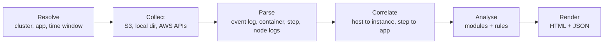

# sparkplain — Design Specification

2026-09-26

## 1. Overview

**sparkplain** is a Go CLI that turns one Spark application's logs (on EMR on EC2 first) into a single report explaining what ran, on which nodes, with how much CPU, memory and storage, and under which identity.

**Problem.** The Spark History Server shows raw lists per tab (jobs, stages, executors, storage, environment). It gives no cross-cutting view: which node hosted which executors, how memory moved over time, what identity touched Hive, HBase or S3, or why the run failed. Answering those today means reading container logs by hand.

**Goals**

- One command, one application ID, one self-contained HTML report plus a JSON export.
- Cover nodes, executors, memory, storage and I/O, CPU, jobs and stages, configuration, identity and access, and failures.
- Support EMR on EC2 7.3.0 and later (Spark 3.5.1 and newer), for running or terminated clusters, from logs in S3 or on local disk.
- Fetch logs itself from S3 and AWS APIs as a standalone module, with no external tool dependencies.
- Flag problems (skew, spill, OOM, lost nodes, access denials) with evidence pointing to the exact log file and line.

**Non-goals for v1**

- Live monitoring or alerting on running applications.
- EMR Serverless and EMR on EKS (their log layouts differ; revisit after v1).
- Changing clusters or jobs automatically.
- Cost reporting in dollars.

## 2. Log fetching

sparkplain fetches logs itself, scoped tightly to one application, with bounded resources and explicit error reporting.

**Fetching rules**

| Pattern | sparkplain implementation |
| --- | --- |
| Explicit AWS profile | `-profile` required; region from the profile unless `-region`; bucket region auto-detected with `HeadBucket` |
| Cluster to log root | `ListClusters` for name lookup, `DescribeCluster` for `LogUri`; log root is `<LogUri>/<cluster-id>/`; works for terminated clusters |
| Server-side scoping by prefix | List only `containers/<app-id>/`, the app's `steps/<step-id>/`, and `node/<instance-id>/` for nodes that hosted executors; never the whole cluster |
| Streaming decompression | `.gz`, `.bz2`, plain and size-bounded `.zip` for YARN logs; adds `.zstd`, `.lz4` and `.snappy` for event logs |
| Bounded concurrency | Worker pool (default 16), per-object size cap, per-object and overall timeouts |
| LIST/GET consistency | `GetObject` with `If-Match` on the listed ETag; changed objects counted and skipped |
| Error classes | `accessDenied`, `notFound`, `throttled`, `timeout`, `archivedUnavailable`, `corrupt`, shown in the report's Sources panel |
| Archive awareness | Unrestored Glacier objects skipped at listing time and reported |
| Step-to-app attribution | Scan step `stderr` for the first `application_<ts>_<n>` ID |
| Output sanitisation | Strip control and deceptive Unicode characters before log lines reach the HTML |

Only the files the parsers need are downloaded, and each one streams straight into its parser without temporary files.

**Input modes**

1. Online: `-cluster-id` + `-app-id`, everything fetched from S3 and AWS APIs.
2. Offline: `-from <dir>`, a local copy of the cluster's log folder (`containers/`, `steps/`, `node/`, as `aws s3 cp --recursive <LogUri>/<cluster-id>/` makes it), a folder holding such copies (`j-…/containers/…`; the one holding the application wins), or one application's container folders (`container_*/stderr.gz`), plus an optional event log file. No AWS calls.

## 3. Data sources

No single source answers every question, so sparkplain joins seven sources on cluster ID, application ID, host name and time window. The Spark event log carries most of the detail, but it is an optional input: on EMR on EC2 it defaults to HDFS on the cluster, so sparkplain never requires cluster changes to get it.

| Source | Location | Provides | Does not provide |
| --- | --- | --- | --- |
| Spark event log | `spark.eventLog.dir` (HDFS default; S3 if configured) | App start/end and user; executors added/removed with host, cores and reason; jobs, stages, tasks with CPU time, GC, spill, shuffle and I/O metrics; peak executor memory metrics; block manager and cached RDD storage; SQL plans; full effective configuration | Host OS CPU, AWS API calls, Kerberos or HBase auth outcomes |
| YARN container logs | `<LogUri>/<cluster>/containers/<app>/` | Driver and executor stdout/stderr: exceptions, OOM, container exit codes (137, 143), Hive metastore, HBase and Kerberos connection lines | Aggregate metrics |
| Step logs | `<LogUri>/<cluster>/steps/<step-id>/` | The `spark-submit` command, arguments and final step status | Anything inside Spark |
| Node logs | `<LogUri>/<cluster>/node/<instance-id>/` | NodeManager daemons, bootstrap actions, instance-state snapshots (processes, memory, disk) | Per-application attribution on shared nodes |
| EMR API | `DescribeCluster`, `ListInstances`, `ListInstanceGroups`/`Fleets`, `ListSteps` | Release label, applications, instance types, market (spot/on-demand), group, launch and end times, roles, security configuration, Kerberos attributes | Anything after cluster termination beyond retained metadata |
| CloudWatch | `AWS/ElasticMapReduce` namespace; CloudWatch agent metrics on EMR 7.0+ | YARN memory and container counts over time; host CPU, memory and disk if the agent is configured | Per-executor metrics |
| CloudTrail | `LookupEvents` for the instance profile or runtime role, in the app's time window | AWS API calls (Glue, STS, KMS, S3 management) and `AccessDenied` errors | S3 object reads/writes unless a trail records data events |

**Event log input (optional).** One flag, `-eventlog`, accepts an S3 location or a manually downloaded file; sparkplain detects which from the value.

| Input | Example | Handling |
| --- | --- | --- |
| S3 prefix | `s3://bucket/sparklogs/` | Lists `<prefix>/<app-id>*` and fetches the matching file or rolling folder |
| S3 object | `s3://bucket/sparklogs/application_…_0042.lz4` | Reads that one object |
| Local file | `./application_…_0042.zstd` | Plain, `.lz4`, `.zstd` or `.snappy` |
| Local folder | `./eventlog_v2_application_…_0042/` | Rolling event log; parts read in sequence order |
| History Server zip | `./application_…_0042.zip` | The zip from the History Server's Download button; unpacked in memory within size limits |

Resolution order:

1. `-eventlog` on the command line.
2. `eventlog-prefix` in the config file (an S3 location, once found), combined with `-app-id`.
3. Neither: the run continues on container logs and AWS APIs. Sections that need the event log show "No event log supplied", and the run exits 3 (partial).

Optional later: Lake Formation and Ranger audit logs, HiveServer2 and HBase server logs, for data-level permission decisions.

## 4. Architecture

sparkplain runs a six-stage pipeline: resolve, collect, parse, correlate, analyse, render. Each stage has one package and a narrow interface, so sources and analysers can be added without touching the rest.



**Packages** (standalone Go module)

| Package | Responsibility |
| --- | --- |
| `cmd/sparkplain` | CLI flags, config file, exit codes |
| `internal/sparkplain/source` | `Source` interface with S3 and local-directory implementations; owns listing, filtering, concurrency and streaming decompression |
| `internal/sparkplain/eventlog` | Streaming decoder: plain, `.zstd`, `.lz4`, `.snappy`, `.inprogress` and rolling `eventlog_v2_*` directories; dispatch on the `Event` field; unknown events skipped and counted |
| `internal/sparkplain/yarnlog` | Line classifiers for container, step and node logs (OOM, exit codes, Kerberos, metastore, HBase, exceptions) |
| `internal/sparkplain/awsmeta` | EMR, CloudWatch and CloudTrail clients on AWS SDK for Go v2 |
| `internal/sparkplain/model` | Canonical types: `Application`, `Node`, `Executor`, `Job`, `Stage`, `TaskStats`, `MemorySample`, `ConfigEntry`, `Identity`, `AccessEvent`, `Finding` |
| `internal/sparkplain/analyze` | One `Analyzer` per report section, each returning section data plus findings |
| `internal/sparkplain/report` | `html/template` with embedded CSS and script (`go:embed`); report charts are inline SVG built in Go, so `report.html` needs no chart library; the explorer page uses Google Charts (see §6); JSON writer |
| `internal/sparkplain/redact` | Secret redaction and text sanitising, applied by parsers before values enter the model |

**Key design rules**

- **Stream, never load whole logs.** Event logs reach several GB. Task events are folded into per-stage aggregates (count, sum, min, max, p50, p95 via a fixed histogram) and then discarded.
- **Bounded memory.** Target under 1 GB RAM for a 1 GB event log with one million tasks.
- **Correlation keys.** Executor host name (for example `ip-10-0-1-23.ec2.internal`) joins to `ListInstances` private DNS, giving instance ID, type, market and group. Step logs join to the app through the application ID found in step stderr. AWS queries use the app window padded by 5 minutes.
- **Provenance on everything.** Every model value records its source file and line, so findings link to evidence.
- **Graceful degradation.** A missing source removes its sections and is listed in the report's Sources panel; the run exits 3 (partial).

## 5. Features

The report has ten analysis modules. Each answers a fixed set of questions and emits findings with severity (info, warning, critical) and evidence links.

| # | Module | Questions answered | Main sources | Phase |
| --- | --- | --- | --- | --- |
| 1 | Application summary | Name, ID, Spark and EMR versions, submitting user, queue, step, start, end, duration, final status | Event log, step logs, EMR API | 1 |
| 2 | Cluster and nodes | How many nodes ran executors, of how many in the cluster; instance type, vCPU, memory, spot or on-demand, core or task group; nodes lost or decommissioned mid-run | Event log hosts, EMR API, node logs | 1 (hosts), 3 (instances) |
| 3 | Executors | Executor count over time; cores and memory each; executors per host; lifetime; removal reason (idle, lost, killed); failed tasks per executor | Event log | 1 |
| 4 | Memory | Configured memory plus overhead versus peak JVM heap, off-heap and process RSS per executor; storage memory used; spill to memory and disk; GC time share; OOM and exit 137/143 events | Event log, container logs | 1, 2 |
| 5 | Storage and I/O | Input and output bytes and records per stage; shuffle read and write; disk spill; cached RDDs and their size; S3 paths and tables read or written (from SQL plans) | Event log | 1 |
| 6 | CPU | Executor CPU time versus run time (utilisation %) per stage and executor; host CPU over time where available | Event log, CloudWatch, node logs | 1, 3 |
| 7 | Jobs, stages, tasks | Timeline of jobs and stages; critical path; skew (max versus median task time, confirmed by rows or bytes read); retries, speculation, failed stages and reasons | Event log | 1 |
| 8 | Configuration | Runtime environment table (versions of Spark, Scala, Java, Hadoop and notable libraries; master, deploy mode, OS, time zone, default filesystem; Java and Spark home, working, event log, warehouse and scratch directories); full effective config grouped (Spark, Hadoop, Hive, HBase, JVM); dynamic allocation settings; values that differ from EMR defaults; risky settings flagged | Event log environment, EMR API | 1 |
| 9 | Identity and access | See below | Event log, container logs, EMR API, CloudTrail | 2, 3 |
| 10 | Failures and findings | Root failure, first exception, and rule-based findings ranked by severity | All | 2, 4 |

**Identity and access (module 9) in detail**

- **Who ran it.** OS user, Hadoop user, YARN queue, Kerberos principal and realm if Kerberos is enabled.
- **AWS identity.** EC2 instance profile, EMR service role, and runtime role if the step used one.
- **Cluster security posture.** EMR security configuration: encryption at rest and in transit, Kerberos, Lake Formation integration.
- **Hive.** Catalog type (AWS Glue Data Catalog or Hive metastore URI) and whether connections succeeded.
- **HBase.** ZooKeeper quorum, authentication mode, connection errors.
- **AWS calls.** Services and actions called by the job's role in its time window, plus every `AccessDenied`, from CloudTrail.

**Secret handling.** Spark redacts matching config values in the event log, but sparkplain re-applies its own redaction regex (password, secret, token, key, credential) to config and log lines. The report shows that a credential is configured and where, never its value. In free text (exception messages, plans, JVM options) it hides `key=value` pairs whose key matches, URL passwords and AWS access key IDs; plan column lists such as `keys=[region#12]` are left alone. Because "key" is in the regex, some harmless Hadoop settings (for example key-provider cache sizes) are hidden too; that is deliberate.

**Findings rules (initial set)**

- Task skew: slowest task over 5× the stage median (`skew-ratio`), only for stages with at least 5 successful tasks (`skew-min-tasks`) whose slowest task took at least 1 s (`skew-min-task`), so tiny stages do not raise noise. The slowest task must also have read more than `skew-ratio` × the median task's rows (input plus shuffle), shuffle bytes or input bytes: a slow task that read the usual amount, such as the first task on a warming-up executor, is not skew and is not reported. The explanation leads with rows read against the median.
- Spill: disk spill over 10% of shuffle write in any stage (`spill-share`). Stages that spill but write no shuffle data (a sort before a file write) are flagged too. All spilling stages are grouped into one finding.
- GC pressure: GC time over 10% of executor run time (`gc-share`).
- Low CPU use: executor CPU time under 30% of run time (`low-cpu-share`). Spark counts only JVM CPU time, so for PySpark jobs the finding says that Python UDF work shows up as waiting. A companion info rule flags executor cores busy under the same share of the core time they held.
- Over-provisioned memory: peak heap under 40% of configured executor memory (`memory-used-share`); a warning when peak heap passes 90%.
- Lost executors or nodes, spot interruptions, container OOM kills. From the event log alone this means the removal reason: exit 137 (SIGKILL, usually a memory kill), heartbeat loss or lost node, decommissioning.
- `AccessDenied` in CloudTrail or permission errors in container logs.
- Also from the event log: failed jobs (critical when the last job failed and the app ended), stage retries, task attempts that failed and were retried, static AWS keys in the Spark configuration, and risky settings (unlimited `spark.driver.maxResultSize`, dynamic allocation without shuffle service or tracking, AQE off).

The CPU, GC and over-provisioning rules skip runs with less than 1 minute of task time (`min-run-time`). Thresholds live in the config file so teams can tune them.

## 6. Report output and CLI

Each run writes `report.html` and `report.json` to `~/sparkplain/<yyyy-mm-dd>/<app-id>/` unless `-out` is given.

**Usage**

```sh
# Event log from an S3 prefix
sparkplain -profile prod-emr -cluster-id j-1ABC2DEF3GHI4 -app-id application_1700000000000_0042 \
        -eventlog s3://bucket/sparklogs/

# Event log downloaded from the History Server
sparkplain -profile prod-emr -cluster-id j-1ABC2DEF3GHI4 -app-id application_1700000000000_0042 \
        -eventlog ./application_1700000000000_0042.zip

# Fully offline: local log folder plus downloaded event log
sparkplain -from ./logs/application_1700000000000_0042 \
        -eventlog ./application_1700000000000_0042.zip
```

**Flags**

| Flag | Purpose |
| --- | --- |
| `-profile`, `-region`, `-config` | Named AWS profile (required online), region override, YAML defaults file at `~/.config/sparkplain/config.yaml` |
| `-cluster-id`, `-cluster-name`, `-app-id` | Scope the run; `-app-id` required |
| `-eventlog` | Optional. S3 prefix or object, local file, rolling folder, or History Server zip; falls back to `eventlog-prefix` in the config file |
| `-from` | Offline copy of the cluster's logs (see §2); not with `-cluster-id` |
| `-out` | Output directory override |
| `-format` | Comma-separated outputs: `html`, `json`, `explorer` (default all three; `both` still means `html,json`) |
| `-workers`, `-max-size`, `-overall-timeout` | Fetch budgets: concurrency, per-object size cap, run deadline |
| `-no-cloudwatch`, `-no-cloudtrail` | Skip enrichment (fewer permissions needed) |
| `-window-pad` | Padding on the AWS query window (default 5m) |
| `-show` | Print the event at a `file:line` the pages cite, redacted, and exit |
| `-source` | The application's source file or folder (repeatable); the explorer shows it beside the jobs and stages that ran each line, redacted |

**HTML report layout** (single self-contained file, works offline, light and dark themes)

1. Header cards: status, duration, nodes, peak executors, total CPU hours, peak memory, data read and written, finding counts.
2. Timeline: jobs and stages as a Gantt chart, executor count overlaid.
3. Nodes: table of instances with executors hosted and CPU and memory charts per node.
4. Executors: table plus peak-memory-versus-configured chart.
5. Memory, CPU, I/O: charts per stage.
6. Jobs and stages: sortable table with skew and spill columns; stage drill-down.
7. SQL: queries with their physical plans and tables touched.
8. Configuration: a runtime environment table first (versions, runtime settings, locations, each with the property it was read from and its line), then key settings explained, then every setting grouped, searchable, non-defaults highlighted. The header line also shows the Java and Hadoop versions.
9. Identity and access.
10. Findings: ranked, each with evidence links.
11. Sources: every file and API read, what was missing, and why.

**Explorer page** (`explorer.html`, phase 1b): a per-application take on the Spark History Server's tabs, with interactive charts. It is built from the same `-app-id` and `-eventlog` inputs in the same run, written next to `report.html`, and the two pages link to each other (findings link to the stage, executor or query they concern). It is one file with its data embedded as JSON; it loads Google Charts from `www.gstatic.com`, pinned to a frozen release rather than `current`, so it needs internet access when opened. Rules:

- Only chart types that render in the browser (`corechart`, `timeline`); never GeoChart or Map. No report data leaves the machine.
- Tables, text and navigation are drawn by the page's own embedded script, so if Google Charts can't load, a banner says so and everything except the charts still works.
- Stage DAGs and SQL plan graphs are SVG laid out in Go, as in `report.html`, because Google Charts has no directed-graph chart.
- Same redaction, time-zone labelling and light and dark themes as the report. Embedded JSON is escaped so no log value can close the script tag.

| Tab | Shows |
| --- | --- |
| Overview | Status, duration, headline numbers, findings with links into the other tabs, link to `report.html` |
| Jobs | Zoomable timeline of jobs (lanes by job group), executor count overlaid, failures marked; sortable table; job detail lists its stages |
| Stages | Sortable, filterable table; stage DAG. Stage detail: summary metrics (min, p25, median, p75, max) for duration, GC, rows and bytes read, shuffle read and write, spill; task-duration histogram; task scatter (launch time against duration, one colour per executor); the slowest tasks; totals per executor |
| Executors | Lifetimes on a timeline with removal reasons; running tasks against available task slots over time; table of tasks, failures, time, GC, input, shuffle and peak memory; peak memory per executor per stage (only when `spark.eventLog.logStageExecutorMetrics` was on) |
| SQL / DataFrame | Queries on a timeline with duration and status; query detail: plan graph with each operator's metrics (rows, time, size, spill; totals across tasks), the plan text, the jobs it ran, tables read and written. The final AQE plan is shown |
| Storage | Cached RDDs and DataFrames (sizes only when `spark.eventLog.logBlockUpdates.enabled` was on) |
| Environment | The runtime table and all settings, as in the report |

**Explorer data, collected while streaming** (the no-whole-log rule and the 1 GB budget still hold):

- Per stage: exact quartiles and a log-scale histogram per metric, from the existing `distAcc`.
- Task sample per stage: the 100 slowest tasks (a bounded heap) plus a uniform reservoir of 1,000 (fixed seed, so reruns give the same page). An app-wide budget of 100,000 sampled tasks halves every reservoir by random subsampling when it is exceeded, which keeps each sample uniform. The page labels charts drawn from the sample.
- Totals per stage and executor, capped at 1,000,000 cells app-wide; past the cap, the per-executor table says it is partial.
- Running tasks over time: task start and end folded into time buckets that double in width when they run out, capped at 2,000 buckets.
- SQL operator metrics: the plan tree's metric IDs, resolved from `StageCompleted` accumulables and `SparkListenerDriverAccumUpdates` (checked against a real EMR 7.3.0 log: operator row counts, time, spill and peak memory all resolve this way).
- Limits live in the config file under `explorer:` (`slowest-per-stage`, `sample-per-stage`, `max-sampled-tasks`, `max-stage-executor-cells`). At the defaults, `explorer.html` stays under 25 MB.
- The explorer data lives only in `explorer.html`; `report.json` keeps its current shape, so the sample and buckets don't bloat it.

**JSON export** mirrors the model package, versioned with a `schemaVersion` field, so other tools or dashboards can consume it.

**Times.** The HTML renders times in the config file's `timezone` (default: the local zone of the machine running sparkplain). Each time also carries its UTC instant, and the page's script relabels it in the viewer's browser zone, naming the zone. JSON times are UTC.

**Config file** (`-config`, default `~/.config/sparkplain/config.yaml`; unknown keys are rejected):

```yaml
eventlog-prefix: ./spark-events/   # used when -eventlog is not given
timezone: Australia/Sydney
out: ~/reports
format: both
max-size: 10GiB
overall-timeout: 30m
thresholds:
  skew-ratio: 5
  skew-min-task: 1s
  skew-min-tasks: 5
  spill-share: 0.10
  gc-share: 0.10
  low-cpu-share: 0.30
  memory-used-share: 0.40
  min-run-time: 1m
  sched-delay-share: 0.20   # scheduler delay over this share of task time
  locality-any-share: 0.30  # input tasks away from their data over this share
  result-share: 0.50        # a stage's results over this share of spark.driver.maxResultSize
  slow-startup: 1m          # executors taking longer than this to register
explorer:
  slowest-per-stage: 100
  sample-per-stage: 1000
  max-sampled-tasks: 100000
  max-stage-executor-cells: 1000000
```

**Exit codes:** 0 complete, 2 fatal (usage mistakes, a cluster that does not exist, output that cannot be written), 3 partial (a source missing or unreadable, including for lack of access), 130 interrupted.

**No access is not fatal.** When a permission is refused or the credentials are missing, expired or wrong (any AWS call, or a local `-from` folder or `-source` path), sparkplain carries on with every other source. Each source it could not read for lack of access is printed on stderr as it finishes ("no access to CloudWatch, so the report does not show each node's CPU, containers waiting and other applications on the cluster (needs cloudwatch:GetMetricData and cloudwatch:ListMetrics)"), listed at the top of `report.html` and the explorer's overview with the permission it needs, recorded in `report.json` (`accessGaps`), and marked `accessDenied` in the Sources panel; the run exits 3. Without `DescribeCluster` an online run still reads an event log given with `-eventlog` or `eventlog-prefix`, but cannot find the cluster's logs, nodes or metrics, and says so. A missing `-profile`, a malformed application ID and a cluster ID that does not exist still stop the run with exit 2: there is nothing to report on.

`-app-id` is required and must match the application ID inside the event log; a mismatch exits 2. A path that does not exist exits 2. A log that exists but is corrupt, truncated or still `.inprogress` still produces a report that marks what is missing, and exits 3.

**IAM permissions:** `s3:ListBucket` and `s3:GetObject` on the log and event-log prefixes, `kms:Decrypt` for SSE-KMS buckets, `elasticmapreduce:ListClusters`, `DescribeCluster`, `ListInstances`, `ListInstanceGroups`, `ListInstanceFleets`, `ListSteps`, plus optional `elasticmapreduce:DescribeStep`, `DescribeSecurityConfiguration`, `ec2:DescribeInstanceTypes`, `cloudwatch:ListMetrics`, `cloudwatch:GetMetricData` and `cloudtrail:LookupEvents`.

## 7. Limitations and risks

The biggest risk is event log availability; the rest are accuracy limits the report must state plainly rather than hide.

| Risk | Impact | Mitigation |
| --- | --- | --- |
| Event log sits in HDFS and dies with the cluster | Most modules empty | Optional input: read from S3 when a copy is found, or from a manually downloaded file; otherwise run without it and mark affected sections. No cluster changes required |
| Event logs of several GB | Slow runs, high memory | Streaming decode, per-stage aggregation, benchmark in CI |
| Executor memory is sampled (heartbeats and stage peaks), not continuous | Short spikes missed | Label memory charts as peaks; enable `spark.executor.processTreeMetrics.enabled` for RSS |
| Host CPU needs the CloudWatch agent (EMR 7.0+) or instance-state snapshots | CPU module partial | Use Spark task CPU time as the primary measure; show host CPU only when present |
| Shared clusters run several apps at once | Node metrics not attributable to one app | Show concurrent YARN apps in the window; mark node-level figures as cluster-wide |
| CloudTrail `LookupEvents` covers 90 days of management events only | No S3 object-level access history | State the gap; read a data-events trail from S3 if one exists (later phase) |
| Event schema drifts in newer Spark releases (baseline: Spark 3.5.1 on EMR 7.3.0) | Parse gaps | Target the Spark 3.5 schema; ignore unknown fields and events; fixture logs per supported EMR release in tests |
| Secrets in logs or config | Leak through the report | Redaction pass before rendering; tests with planted secrets |
| Clock skew between nodes and AWS services | Misaligned timelines | Use event log timestamps as the reference; pad AWS windows |

## 8. Delivery plan

Four phases, each shippable on its own. Phase 1 delivers most of the value from the event log alone and needs no AWS calls.

| Phase | Scope | Done when |
| --- | --- | --- |
| 1. Event log core | `eventlog` decoder, model, modules 1–8 from the event log, offline `-eventlog` input, HTML and JSON output | A real EMR event log renders a full report; a 1 GB log parses in under 60 s using under 1 GB RAM |
| 1c. Full event coverage | Every field of every Spark 3.5 event is used or set aside with a reason, enforced by a field-inventory test; the new data reaches the explorer, the report and new findings; code shown beside jobs and stages with `-source` (plan below) | The inventory test passes on every fixture and the real EMR log; each new view renders with no script errors; the 1 GB budget and the 25 MB page budget still hold; planted secrets never appear |
| 2. S3 fetching and online mode | S3 fetch layer and online mode; optional event log fetch from an S3 prefix; container and step log classifiers; memory OOM evidence; identity from logs; first failure analysis | `-cluster-id` + `-app-id` produces the report with no manual downloads |
| 3. AWS enrichment | EMR instance mapping, CloudWatch host metrics, CloudTrail access events, security configuration | Nodes table shows instance type and market; Identity section lists roles and `AccessDenied` events |
| 1b. Explorer | Explorer data collection in the parser (task sample, per-stage quartiles and histograms, stage × executor totals, running-task buckets, SQL operator metrics); `explorer.html` with the tabs in §6; `-format explorer` | The fixtures and a real EMR event log render every tab; with Google Charts blocked, the tables still work; a 1 GB log still parses in under 60 s using under 1 GB RAM; planted secrets never appear in `explorer.html` |
| 4. Findings and polish | Full rules engine with tunable thresholds, Sources panel, redaction tests, fixture logs from EMR 7.3.0 onward | All findings rules covered by tests; CI benchmark and `govulncheck` pass |

Testing: stub S3 and AWS clients, race detector on, fuzz targets for the event decoder and log classifiers.

**Phase 1 status (built).** Offline mode only: `-eventlog` accepts a local file, rolling folder, folder holding logs (the highest attempt wins, preferring finished logs) or History Server zip. The online flags (`-profile`, `-cluster-id`, `-cluster-name`, `-from`) and `s3://` locations exit 2 and name the phase that adds them. Notes from building it:

- Fixtures come from real PySpark 3.5.1 runs in `local-cluster` mode (`scripts/fixtures/`), scrubbed to EMR-like hosts, paths and IDs. Compressed variants are written with Spark's own `CompressionCodec`, so the lz4 and snappy readers are tested against the Java stream formats. The History Server zip is laid out as Spark's `zipEventLogFiles` writes it, but built by the script rather than downloaded.
- Spark 3.5 does not log the driver's exit code (`ApplicationEnd` has only a timestamp), so the final status comes from the end event and the last job, and the report says so. A log without an end event is "incomplete".
- Cached data sizes are logged only when `spark.eventLog.logBlockUpdates.enabled=true`; process RSS only when `spark.executor.processTreeMetrics.enabled=true`. The report says which is missing.
- The runtime environment table is the driver's view only: the event log records no executor JVM or OS details. Library versions (Hadoop, Hive, EMRFS, AWS SDKs, Iceberg, Hudi, Delta, HBase, Py4J) come from jar names on the driver's classpath, since the log does not state them; Spark home is the folder holding `jars/spark-core_*.jar`. The EMR release and the Python version are not in the event log and show as "not recorded".
- Key settings are compared with Spark 3.5 defaults. Comparing with EMR's own defaults needs the EMR API (phase 3).
- The report uses system fonts. The sample's Google Fonts link would break the no-network rule.
- Decision (2026-09-26): a per-application explorer page, a richer take on the History Server's tabs, will use Google Charts. Google Charts cannot be self-hosted, so `explorer.html` loads it from `www.gstatic.com` and needs internet access when opened; `report.html` stays fully offline. Only browser-rendered chart types are used, so report data never leaves the machine. Its design is in §6 (Explorer page) and it is built as phase 1b, before phases 2 and 3, in four steps, each tested and shippable: (1) data collection and its tests and benchmark; (2) the page shell: embedded data, tabs, tables, offline banner, themes, links with `report.html`; (3) the charts; (4) the stage DAG and SQL plan graphs.
- Phase 1b step 1 (built): `eventlog.Options.Explorer` turns on collection into `EventLog.Explorer` (never serialised into `report.json`). On the 1 GB benchmark log (245K tasks, 490 stages, 200 executors) parsing takes 4.5 s either way; live heap is 76 MiB with explorer data against 1 MiB without, and peak RSS 218 MB. The sample budget halved twice, leaving 134,750 sampled tasks and 98,000 stage × executor cells. As plain JSON those are 42 MiB and 78 MiB, mostly repeated field names, so step 2 embeds them in a compact column format to stay under 25 MB.
- Phase 1b step 2: a worst-case test page (490 stages × 200 executors, every value large) came to 30.7 MB with those limits, so the default sample budget is now 100,000 tasks and the stage × executor rows carry only the 13 columns the page shows. Apps under about 100,000 tasks still keep every stage's full sample.
- Phase 1b step 3: charts use Google Charts release 52 (a frozen version; `current` changes under the page), loaded only when a view has a chart. Charts: running tasks against task slots, and job, executor and query timelines; per stage a duration histogram (every task) and a task scatter (the sample plus the slowest); per executor peak heap by stage. Colour follows the dataviz method and was run through its validator for both themes: one series colour (categorical slot 1), the status red for failures, and neutral grey for everything else. Red, amber and green together failed the colour-vision checks, so timelines use blue, red and grey, and every colour is also named in a caption or tooltip. With the network blocked, a banner says the charts need www.gstatic.com and the rest of the page works.
- Phase 1b step 4: graphs are laid out in Go (`report/layout.go`: layers by longest path, barycentre ordering to cut crossings, every edge pointing down) and drawn by the page as SVG. Job and stage pages show the job's stage DAG, with the current stage, failed and skipped stages marked; query pages show the final plan as a graph with rows and time per operator, above the full operator table. Graphs over 300 nodes are left to the tables.
- Phase 1b status (built): the fixtures and a real EMR 7.3.0 log render every tab with no script errors (checked in headless Chrome, 64 route renders across four logs, including a failed and an in-progress one); tables work with Google Charts blocked; the 1 GB log still runs in 4.6 s at 275 MB peak RSS and gives an 11 MB page; planted secrets never reach `explorer.html`.
- Checked against the real EMR log: task launch and finish times are stamped by the driver, and a slot is reused before the driver records the previous task's finish, so a 2-core executor showed up to 4 overlapping tasks. The Spark UI's timeline has the same overlap. The running-tasks chart will say its values are driver-side times and can briefly exceed the task slots.
- Performance, measured with `scripts/benchlog` on 4 cores: a 1 GB log (245K tasks, real task-event layout) in 5.6 s at 30 MB peak RSS for the whole CLI; 1M tasks (2.4 GB) in 14.7 s at 68 MB.
- Still open for the "done when" check: a real EMR 7.3.0+ event log, which cannot be generated here.

**Phase 1c plan (proposed).** Goal: nothing in the event log is dropped silently, because the detail that explains a problem is often one nobody thought to show. Each step is tested before the next.

1. **Field inventory.** A table in `eventlog` lists every event and nested field Spark 3.5 writes (and EMR's additions), each marked *used* (with where it is shown) or *set aside* with a reason (for example, `Task Info.Accumulables` entries that repeat task metrics already read, or internal properties such as `__fetch_continuous_blocks_in_batch_enabled`). A test walks every line of every fixture and the real EMR log and fails on any field not in the table. At run time, unlisted fields and events are counted and shown in the Sources panel and the explorer, so a newer Spark's additions are visible rather than lost.
2. **Tasks.** Keep locality, task type, partition ID, result size, result serialization time, getting-result time and the scheduler delay Spark's UI derives from them, deserialize CPU time, shuffle write time, local and remote blocks fetched, remote bytes read to disk, push-based shuffle metrics, GC counts and times (minor and major), unified and virtual memory, cache writes (`Updated Blocks`), and the full stack trace of each distinct failure (redacted, capped per reason). Stage summaries gain these as quartiles; the task sample gains the columns the page shows. Per-task SQL metric updates become per-operator distributions (min, median, max and the task that hit the max, as Spark's SQL tab shows).
3. **Executors and nodes.** Read executor and node exclusions at stage and application level, and exclusions being lifted (Spark 3.5 writes each twice, under the new *Excluded* and the old *Blacklisted* names, so they are merged); block manager removals; `TaskStart` for tasks still running when an in-progress log ends; executor log URLs, request and registration time (so startup delay), attributes and resources (such as GPUs); driver log URLs and attributes; resource profiles. Memory: each executor's per-stage peaks (`StageExecutorMetrics`), and the driver's heartbeat samples (`ExecutorMetricsUpdate`), which feed only the driver's overall peak because they always carry stage -1. Checked against Spark 3.5.1's `EventLoggingListener`: it has no handler for `SpeculativeTaskSubmitted`, `UnschedulableTaskSetAdded`/`Removed` or `MiscellaneousProcessAdded`, so they never reach an event log, and it writes heartbeat updates only for the driver and only when `spark.eventLog.logStageExecutorMetrics` is on. Speculation therefore shows through each task's `Speculative` flag and the reason its twin was killed.
4. **Stages and jobs.** Each stage's `RDD Info` (operation, scope, call site, parent RDDs, partitions, storage level) becomes a per-stage operation graph like the Spark UI's, drawn with the existing layout. Keep the long call site (`Details`), resource profile and shuffle-push settings. Job and stage properties are compared with the application's settings, and only local overrides (scheduler pool, job group, per-job settings) are shown, redacted like all configuration.
5. **SQL.** Keep `details`, `modifiedConfigs` (redacted), `rootExecutionId` (sub-queries shown under their parent), `jobTags`, AQE metric updates, and EMR's `SparkListenerQueryExecutionMetrics` (optimizer time per rule). Catalog events (databases and tables created, dropped or altered) join the explorer.
6. **Explorer, report and findings.** Show all of the above where it belongs: new stage-summary rows, task columns, executor facts and timeline marks, a memory-over-time chart, per-stage operation graphs, operator metric distributions, query settings and sub-queries, and a "Log events" view listing counts per event type, including unknown ones. Items only in `report.html` so far (CPU time, catalog events, resource profiles, critical path, driver memory) move into the explorer too. New findings: executors or nodes excluded, high scheduler delay, poor data locality, large task results (driver memory risk), slow executor startup, speculation, tasks waiting for resources, and tasks still running at the end of an in-progress log. For investigation, `sparkplain -show <file:line>` prints the redacted event behind any value the pages cite.

7. **Code beside jobs and stages.** The event log records where in the code work ran, not the code. Call sites come from a job's `callSite.short`, each stage's name and `Details` stack, each RDD's `Callsite` and each query's `details`; for Scala and Java jobs, user frames are the stack frames outside Spark, Scala, Java and py4j packages. Checked on the real EMR PySpark log: only 5 of 19 jobs carry a Python file and line (`collect()` does; `count()` and `write` show only `NativeMethodAccessorImpl.java:0`), because PySpark passes its Python call site for some actions only. So:
   - Every job, stage and query shows the code location Spark recorded, or says none was recorded and how to add one (`sc.setJobDescription(...)` or setting `callSite.short` with `sc.setLocalProperty`). Jobs without a location also show the nearest recorded locations before and after them in time, as context rather than a guess.
   - `-source <file or folder>` (opt-in, repeatable) embeds the matching source files in the explorer, matched by path suffix and then file name, at most 5,000 lines per file and 4 MB in all. A Code tab shows each file with every recorded line marked by the jobs, stages and queries that ran there (count, time, status, findings); selecting a line lists them beside the code. Job, stage and query pages show the code around their line, side by side on wide screens.
   - Code is redacted before it is embedded, with a code-aware pass on top of the usual one: on any line that names a sensitive key, every string literal except the key itself is hidden, so `.config("spark.db.password", "…")` loses its value. Tests plant secrets in a source fixture (the fixture workload script already has them) and assert none reach the page.
   - Phase 2 adds fetching the script automatically when it lives on S3 (a read-only `GetObject`, found from the step's `spark-submit` arguments).

Fixtures (added, not regenerated, so existing expectations hold): `0046` exercises exclusions and their lifting, cache block updates, per-query settings with a planted secret, job groups and scheduler pools, a call-site override, large task results, catalog create, alter, rename and drop, and a sub-query; `0047` is an in-progress copy taken with three tasks still running; `0048` is a job aborted because its only node was excluded; `0049` is the real EMR 7.3.0 log, scrubbed (`scripts/fixtures/scrub_emr.py`). A local cluster cannot show a speculative copy (Spark never runs one on the host of the original, and all local executors share one host), nor push-based shuffle (YARN only) or GPUs, so a second EMR run checks speculation and push-based shuffle; GPU fields stay "not seen in a fixture". Budgets stay as they are, and the tests that enforce them keep running: if the extra task columns push the page past 25 MB, the sample budget comes down again.

- Phase 1c step 1 (built): `eventlog/inventory.txt` lists 537 fields of 48 event types (321 used, 33 set aside with a reason, the rest planned for steps 2 to 5). `TestFieldInventory` walks every distinct fixture and fails on an unlisted field, or on a listed one no fixture holds unless it says "not seen in a fixture"; every set-aside reason that claims something about Spark (empty at task start, duplicated elsewhere) was checked against the fixtures. At run time, top-level fields are checked on every event and nested fields on the first 100 events of each type, and unlisted ones are counted as unknown. The inventory replaced the hand-kept lists of known fields and ignored events, which had missed that Spark writes exclusion events under their full class names (`org.apache.spark.scheduler.SparkListenerExecutorExcluded`), so those had been counted as unknown.
- Second EMR 7.3.0 run (1 primary, 2 core nodes; fixture `0050`, scrubbed): a speculative copy ran on another host, and the other attempt ended `TaskKilled` with "Stage finished". Push-based shuffle did not switch on with `spark.shuffle.push.enabled=true`, the YARN `RemoteBlockPushResolver` and a one-merger minimum (every stage logged `Shuffle Push Enabled: false`); why was not investigated further, so its metrics are read but only ever seen as zero. The first attempt at this run failed because Spark refuses an S3 `spark.eventLog.dir` with no objects under it; an empty `spark-events/` marker object fixed it.
- Phase 1c step 7 (built): jobs, stages and queries carry their code locations. A new Java fixture (`0051`, `scripts/fixtures/java/ClaimsJob.java`, built with `javac --release 11` against Spark's jars) confirmed that a JVM application's stage names and call stacks hold its own frames (`writeTotals` at line 29 called from `main` at line 20); its six jobs all have a location, against 5 of 19 in the real EMR PySpark log, where only `collect()` records one. `NativeMethodAccessorImpl.java:0` and `<stdin>` count as no location, and a job without its own takes its last stage's. `-source` matches each logged file to a local one by the longest shared path tail, embeds the matched files (up to 5,000 lines each, 4 MB in all) redacted with `redact.Code`, which keeps a config call's key and hides every other string on a line that names a secret, even when the secret itself contains a word like PASSWORD. The explorer's Code tab lists every location with what ran there and shows each source file beside that activity; job, stage and query pages show their frames, the code around them, or why none was recorded with the nearest recorded jobs before and after.
- Phase 1c status (built): every one of the 552 fields in the inventory is used or set aside with a reason, and the inventory test fails if one is left planned. `make check` passes; the fixtures and the real EMR logs render every tab with no script errors.
- Phase 1c step 6 (built): new findings `executors-excluded` (warning for application or node exclusions, info for stage-only), `scheduler-delay` (warning over `sched-delay-share` of task time), `poor-locality` (info when a stage's input tasks ran away from their data over `locality-any-share`), `large-results` (warning when a result stage returned over `result-share` of `spark.driver.maxResultSize`), `slow-executor-startup` (info over `slow-startup`), `speculation` (info, with how many copies finished first) and `tasks-running-at-end` (warning; worded for an in-progress log or, when the log did end, for tasks a job abort cut off, as in `0048`). Every finding's evidence links to its stage or executor. The explorer gains CPU share for stages and executors, tables and paths, resource profiles (including extra resources such as GPUs, which the parser had dropped), the critical path, and an Event log tab with files, events by type and anything not recognised. `sparkplain -show <file:line>` prints the redacted event behind any value the pages cite; a miss lists the log's file names.
- Phase 1c step 5 (built): queries keep their parent (`rootExecutionId`; commands such as CTAS run inner queries), job tags, long call site and the session settings in force (`modifiedConfigs`, redacted; the fixture's session token appears in every later query's), the metrics adaptive execution adds after planning (the log names no operator for them, so they are listed per query and resolved like plan metrics), and EMR's optimizer report (`SparkListenerQueryExecutionMetrics`: about 230 rules per query with time and runs, and which changed the plan; the model keeps up to 300 rules, the page the slowest 30).
- Phase 1c step 4 (built): each stage keeps the RDDs it computes (operation scope, call site, parents, partitions, cached partitions, storage level, barrier, determinism; capped at 200), its long call site, resource profile and push-based shuffle settings. Jobs keep the local properties that differ from the application's settings (scheduler pool, job group, session settings such as a changed `spark.sql.shuffle.partitions`), redacted by key; the fixture's session token set with `spark.conf.set` reached every later job's properties, so redaction matters here. Stages keep properties only where they differ from their job's (the EMR log shows `resource.executor.cores` set per stage). The explorer draws each stage's operation graph like the Spark UI's stage graph, shows the call stack, and lists each job's own settings.
- Phase 1c step 3 (built): exclusions (executor and node, stage and application, with when each lifted; Spark's two names for each merged), tasks still running at the end of a log (capped at 100,000), executor log links, container attributes (redacted by key), resources and startup delay (registration less request time), when each block manager left, the driver's log links and attributes, where each cached RDD's blocks were per executor with their storage level, and block-manager activity per kind of block. The explorer shows them on the overview, executors, executor, stage and storage pages, with excluded periods on the executor timeline. The driver's heartbeat samples carry stage -1 in every fixture, so the planned per-stage driver memory was dropped.
- Phase 1c step 2 (built): tasks now yield locality, task type, partition, result size, result serialization and fetch time, and scheduler delay (as the Spark UI computes it: duration less run, deserialize, serialize and fetch time, where "Getting Result Time" is the timestamp the fetch began), deserialize CPU, shuffle write time, local and remote blocks, remote bytes fetched to disk, fetch request time, push-based shuffle merges, cache writes, GC counts and times, unified and virtual memory, the first full stack trace of each distinct failure and whether Spark blamed the app for a lost executor, and the stack trace of a failed job. Per-task SQL metric updates give each operator's min, median and max and the task that hit the max; Spark stores "average" metrics per task as ten times the value (a real EMR log showed 320 over 32 tasks for an average of 1.0). A failed attempt's `Accumulator Updates` repeat its Task Metrics, so they are set aside. The explorer shows all of it on stage, job, executor and query pages; the worst-case page is 18.3 MB. `0046` now returns incompressible 3 MB results so the driver fetches them separately (Spark compresses results, so a repeated string never crossed the 1 MB direct-result limit).

**Phase 2 plan (proposed).** Goal (from the table above): `-cluster-id` + `-app-id` produces the report with no manual downloads, and container, step and node logs join the event log as evidence. Every AWS call stays read-only (List, Get, Describe, Head), and tests use stubs behind interfaces, never real AWS. Each step is tested before the next.

1. **Fetching layer (`source`).** One interface for listing and opening objects, with an S3 implementation (`aws-sdk-go-v2`, an approved dependency: explicit `-profile`, region from the profile or `-region`, bucket region found with `HeadBucket`) and a local-folder one for `-from` and for tests. It carries the §2 rules: listing scoped to the application's prefixes, a worker pool (`-workers`), per-object size cap and timeouts, `If-Match` on the listed ETag, unrestored Glacier objects skipped and reported, streaming `.gz`, `.bz2` and bounded `.zip`, and the error classes shown in the Sources panel.
2. **Cluster and application.** `-cluster-id` (or `-cluster-name` through `ListClusters`) → `DescribeCluster` for `LogUri`, release, applications and the Spark configuration; `ListSteps` and each step's `stderr` to find the step that ran the application (its first `application_<ts>_<n>`). Works for terminated clusters while EMR keeps their metadata.
3. **Event log from S3.** `-eventlog s3://…` as an object or prefix, `eventlog-prefix` in the config file, and, when neither is given, the cluster's own `spark.eventLog.dir` if it is on S3. Otherwise the run continues without it and says so (exit 3).
4. **Log classifiers (`yarnlog`).** Container `stderr`/`stdout`: Java exceptions and Python tracebacks (first line, cause chain, redacted), `OutOfMemoryError`, YARN memory kills and exit codes 137 and 143, lost-executor causes, S3 and IAM access errors, Kerberos, Hive metastore and HBase connection lines. Step logs: the `spark-submit` command, its arguments (redacted) and final status. Node logs: NodeManager container kills and bootstrap action failures. Each classified line keeps its file and line.
5. **Joining and findings.** Container logs map to executors through the `CONTAINER_ID` attribute the event log records, and to the driver. New and sharper findings: the first failure across all sources (with the log line that shows it), memory kills with the container's own message, errors hidden in executor logs that the event log only shows as a lost executor, and access errors. The Identity section fills from logs (OS and Hadoop user, queue, Kerberos principal). The report's Sources panel lists every object read or skipped, and why.
6. **Explorer and code.** Executor and driver pages show their classified log lines, with links to the S3 objects; a Logs tab lists every source file with what was found in it. The application's script is fetched from S3 automatically (found in the step's `spark-submit` arguments) and shown as with `-source`.
7. **Fixtures and a live check.** The step, container and node logs of the four test clusters in the test bucket (including a failed run whose driver `stdout` holds a Python traceback), scrubbed like the event logs into `testdata/emrlogs/`, drive the tests through the local-folder implementation. A final read-only check runs `-cluster-id` against the live testbed cluster and one terminated cluster.

- Phase 2 step 1 (built): `internal/sparkplain/source` has the `Store` interface with S3 and local-folder implementations and a bounded fetcher. The S3 store finds the bucket's region itself (checked live: a client made for us-east-1 read the test bucket in ap-southeast-2), lists with restore status so unrestored Glacier and Deep Archive objects are reported instead of read, and opens with `If-Match` on the listed ETag. Tests run against a stubbed client.

- Phase 2 step 2 (built): `internal/sparkplain/awsmeta` reads the cluster (`DescribeCluster`: state, release, applications, log URI, roles, security configuration, EMR configurations flattened and redacted), finds a cluster by name (`ListClusters`, newest wins), lists steps (`ListSteps`, arguments redacted), and finds the application a step submitted in its `stderr`. Checked against the live testbed and a terminated cluster: `LogUri` uses the `s3n://` scheme, and a terminated cluster still describes. Tests use a stubbed client.

- Phase 2 step 3 (built): `-eventlog` takes `s3://` objects and prefixes (`eventlog.ResolveStore`, the same attempt and rolling-folder rules as for local folders, every part read with its listed ETag), then `eventlog-prefix`, then the cluster's own `spark.eventLog.dir` when it is on S3. `-cluster-id` or `-cluster-name` with `-profile` (required, `default` for the default chain) describes the cluster; without an event log an online run carries on and says why (HDFS event logs are gone once the cluster ends), exiting 3. Checked live: the testbed's report came from `-profile default -cluster-id … -app-id …` alone in 2 s, and a terminated cluster whose jobs set the event log dir per job needed `-eventlog s3://…/spark-events/`.

- Phase 2 step 4 (built): `internal/sparkplain/yarnlog` classifies container `stderr`/`stdout` (and `prelaunch.err`), step `controller` and `stderr`, NodeManager and ResourceManager logs and `bootstrap-actions/master.log` in one streaming pass per file (lines over 64 KiB cut), into `model.LogLine`s that keep file and line (and end line for multi-line blocks), are redacted, and fold repeats in a file (the same exception in 7 tasks is one entry, count 7; up to 500 distinct entries per file). Kinds: exceptions with cause chain and the application's own frames, Python tracebacks with the failing line of the user's script (PySpark and py4j frames dropped), out-of-memory, YARN memory kills, container exits with a plain meaning, the application master's final status, lost executors (with whether Spark blamed the task), task errors, signals, access denied (S3, IAM, Glue, Lake Formation, KMS), Kerberos, Hive metastore or Glue catalog, HBase and ZooKeeper, identity (user and queue from YARN, Kerberos principal), the step's redacted command, the application it submitted and the scripts it uploaded from S3, the step's final status, YARN's final report, and the ResourceManager's application summary (user, queue, memory and vcore seconds). NodeManager and ResourceManager lines are kept only for the application's own containers and attempts. Checked against the logs of four EMR 7.3.0 test clusters, and against the strings and constants in Spark 3.5.1's and Hadoop 3.3's classes for what the clusters never produced (memory kills, lost executors, heartbeat timeouts):
  - The application master's exit codes are Spark's own: 13 is `EXIT_SC_NOT_INITED` (SparkContext never started; the failed run's `spark.eventLog.dir` pointed at an empty S3 prefix), 10 uncaught exception, 11 too many executor failures, 15 exception in the user class. Negative codes are YARN's `ContainerExitStatus` (-104 physical memory, -102 preempted), and 50–56 are Spark's executor codes (52 is out of memory).
  - Executors end with 143 (SIGTERM) and log `RECEIVED SIGNAL TERM` at every normal finish, after `Driver commanded a shutdown`; both are info. A killed speculative twin (`TaskKilled (Stage finished)`) is info.
  - The step's `stderr` and the ResourceManager's diagnostics quote the tail of the driver's `stderr`, so those quotes are skipped rather than counted twice; the driver's own log is the evidence.
  - `bootstrap action 1 failed with non-zero exit code` appears in the primary node's `master.log` on every test cluster, although `DescribeCluster` lists no bootstrap actions; it is kept as info until step 5 checks it against the cluster's state reason.
  - Spark's `Changing view acls to: yarn,hadoop` names who may view the UI, not the user, so identity comes from YARN's report and summary.
  - Log times carry no zone and are read as UTC, the EMR default.
- Fixtures (step 7's, made now to drive step 4's tests): `testdata/emrlogs/` holds the classified files of three test clusters, scrubbed by `scripts/fixtures/scrub_emrlogs.py`, which reuses `scrub_emr.py`'s rewriting so hosts match the event-log fixtures: `j-FIXTURE0049CLUSTER` (the `0049` run: a cast failure in 7 tasks, and a step that tried the absent `s3-dist-cp`), `j-FIXTURE0050CLUSTER` (the `0050` speculation run) and `j-FIXTURE0052CLUSTER` (a failed run: a Python traceback in the driver's `stdout`, exit 13 on both attempts). The scrubber had rewritten the timestamp in container and attempt IDs but kept the old application number (`container_…_0001_…` under `application_…_0049`), which no real cluster produces; it now rewrites both, and `0049` and `0050` were regenerated.

- Phase 2 step 5a (built): online runs call `ListSteps` and `ListInstances` (both read-only; `ListInstances` joins the event log's host names to the instance IDs node logs are kept under, and marks the primary node by `DescribeCluster`'s primary DNS name) and read the logs under `<LogUri>/<cluster-id>/` with `yarnlog.Collect`: every file under `containers/<app-id>/`; the `stderr` of the steps that ran while the application started (up to 50; all steps without an event log), keeping the step whose log says it submitted the application and reading its controller log; and the NodeManager, ResourceManager and bootstrap logs of the nodes the event log names plus the primary node (without an event log, every node up to 50), skipping daemon logs last written before the application started. `-from` reads the same layout from a local folder. Each Sources row lists every object read or skipped and why (collapsible in `report.html`, complete in `report.json`). Two statuses join the Sources panel and do not make the run exit 3: `none` (looked, and nothing there is about this application, such as no step for an application started from a notebook) and `not-requested` (a plain `-eventlog` run does not read the cluster's logs). No container logs is `not-supplied` and exits 3: EMR uploads them to the log URI every few minutes and at the end, so their absence means a cluster without a log URI or an upload that has not happened yet.

- Phase 2 step 5b (built): `analyze` joins each container log to its executor through the `CONTAINER_ID` attribute YARN gives Spark (the driver's too), and each node log to its host through `ListInstances`; without an event log, a step command with `--deploy-mode cluster` makes the first container of each attempt the driver, and otherwise it is called the application master. New findings, each citing the log lines by file and line: `log-first-failure` (critical, when the application or its step failed: the earliest critical line across all logs by time, then by kind, with the user's Python line from a traceback in the same container, YARN's attempts and exit code, and the step's status; the fix is specific for a missing event log folder, a missing path, class or module, and SQL analysis errors), `out-of-memory`, `access-denied` (grouped by action and path; the fix names the instance profile), `kerberos-failure`, `metastore-failure`, `hbase-failure`, `step-failed` (Spark succeeded but the step did not), `app-retried` (an attempt failed before one succeeded) and `bootstrap-failed` (only when `DescribeCluster`'s state code is `BOOTSTRAP_FAILURE`). The event log's `executor-memory-kill` gains YARN's own usage message and the NodeManager's lines instead of being repeated, and `executor-lost`, `executor-memory-kill` and `executor-decommissioned` gain the last error in each executor's own log. Without an event log, the application's name, user, queue, status, times and failure reason come from the ResourceManager's summary and YARN's report, "What happened" is written from them, and Identity shows the YARN user and queue; with the EMR API it adds the instance profile, service role and security configuration, and the logs add Kerberos logins and metastore and HBase connections. On the failed test run (no event log, because SparkContext never started) the report now says what happened: the driver's `FileNotFoundException` on the empty `spark-events` prefix, in `emr_job2.py` line 7, twice, exit 13.

- Event log lookup, extended: when neither `-eventlog`, `eventlog-prefix` nor the cluster's `spark-defaults` names one, an online run tries each S3 `spark.eventLog.dir` the cluster's steps set in their own `spark-submit` arguments (from `ListSteps`, newest first), because jobs often set it per job. Checked live, read-only, on three terminated test clusters: `-profile default -cluster-id … -app-id …` alone gave the full report for the speculation run (event log found through its step's `--conf`, all five containers joined to the driver and executors 1–4 on the right hosts) and for the NOAA run, each in about 1–3 s and under 45 MB; the failed run got its first-failure finding and a Sources row saying no event log exists under its step's folder, which is right, since SparkContext never started.

- Phase 2 step 6 (built): the explorer gains a Logs tab (the EMR API and log Sources rows with every object skipped or unreadable and why, the cluster and its nodes, every log read with its process, worst severity and counts, and all errors and warnings across the logs) and a page per log with each recognised line, opening to its cause chain, traceback and fields; S3 objects link to the S3 console, which needs the viewer's own sign-in (the page fetches nothing). Executor and driver pages show the lines from their own container logs; without an event log the driver's page shows its logs alone. Finding evidence that cites a log links to the line. Log data in the page is capped (200 lines per file, 5,000 in all, 500 characters of text each, 2 MB of detail) so the page stays inside its size budget; `report.json` keeps everything. Online runs fetch the application's source files named in its step's `spark-submit` arguments (the primary resource and `--py-files`; not jars) with `GetObject`, up to 4 MB each, and show them in the Code tab as with `-source`, redacted by `redact.Code`; a Sources row says what was fetched. Tracebacks' file names also count as code locations, so a run with no event log can match its script. Checked live on the speculation run: the step's `emr_job2.py` came from S3 and its lines 17, 21 and 24 carry their jobs and stages.

- Phase 2 step 7 (built): `testdata/emrlogs/` (step 4) drives the tests through the local-folder store, including end-to-end CLI runs with `-from` and with `-cluster-id` against a stubbed EMR API and a local "bucket". The live read-only checks ran against three terminated test clusters (the testbed had ended on its idle timeout by then): every call was `DescribeCluster`, `ListSteps`, `ListInstances`, `HeadBucket`, `ListObjectsV2` or `GetObject`.
- Phase 2 status (built): `-profile … -cluster-id … -app-id …` produces the report with no manual downloads, finding the event log through the cluster's or the step's `spark.eventLog.dir` and reading the application's container, step and node logs; a failed run with no event log is explained from the logs alone. Not covered by a real fixture: memory kills, lost executors, access, Kerberos, metastore and HBase errors (the test clusters produced none), which are tested with lines in the exact formats of Spark 3.5.1's and Hadoop 3.3's classes.

**Phase 3 plan (approved).** Goal (from the table above): the Nodes table shows instance type and market, and the Identity section lists roles and `AccessDenied` events. Every call stays read-only, tests use stubs, and each step is tested before the next. Checked first against the test account (read-only): EMR 7.3 publishes cluster metrics every minute in `AWS/ElasticMapReduce` (`ContainerPending`, `ContainerAllocated`, `AppsRunning`, `YARNMemoryAvailablePercentage`, YARN vCPU and memory seconds); EC2 publishes `CPUUtilization`, network and EBS metrics per instance every 5 minutes; no `CWAgent` namespace exists, so host memory and disk need the agent; CloudTrail names an instance-profile session by its instance ID (`Username=i-…`), and S3 object calls are data events that `LookupEvents` never returns; a normally terminated instance reports `INSTANCE_FAILURE: Instance was terminated.`, so a spot interruption must be inferred from the market, when the instance ended and executors lost on it. The NOAA run's idle core node is explained by its logs: 12,288 MB of YARN memory per node, executors of 11,264 MB, and the driver's 2,432 MB container on the other node, so `ContainerPending` stayed at 49 with 56% of the cluster's memory free.

1. **Cluster inventory.** `ListInstanceGroups`/`ListInstanceFleets` (group, market), EC2 `DescribeInstanceTypes` (vCPU, memory), `DescribeSecurityConfiguration` (encryption, Kerberos, Lake Formation, runtime roles) and `DescribeStep` (the step's runtime role). The Nodes table lists every node up during the run with type, size, market, group, lifetime, why it ended and the executors it ran; nodes that ran none are flagged.
2. **YARN capacity and fit.** Log rules for each node's YARN capacity (ResourceManager), the executor size and count Spark requested and cancelled (driver), and the driver's container size. A finding says when executors do not fit on a node, how many fit, and a size that would.
3. **CloudWatch.** `ListMetrics` then `GetMetricData` over the run plus `-window-pad`: cluster metrics, per-node EC2 metrics, and agent memory and disk metrics when present. Explorer charts for pending against allocated containers and CPU per node; findings for waiting on capacity (too small a cluster, or too big an executor), a shared cluster, and busy or idle hosts. Past CloudWatch's retention (1-minute data 15 days, 5-minute data 63 days) the section says why it is empty.
4. **CloudTrail.** `LookupEvents` by user name for each instance the application ran on (and the runtime role when the step had one) in the run's window, throttled to CloudTrail's 2 requests per second and capped. Identity lists the services and actions called and every `AccessDenied`, redacted; they join the access-denied finding. The gap for S3 object calls is stated.
5. **Security posture and settings origin.** Identity facts from the security configuration; the Configuration section marks settings the cluster's configuration set, as against the job (EMR's built-in defaults are not in the API).
6. **Flags, Sources and permissions.** `-no-cloudwatch`, `-no-cloudtrail` and `-window-pad` work; CloudWatch, CloudTrail and EC2 get Sources rows; a missing permission is `accessDenied` there and exits 3. New optional permissions: `ec2:DescribeInstanceTypes`, `elasticmapreduce:DescribeSecurityConfiguration`, `DescribeStep`, `cloudwatch:ListMetrics`.
7. **Fixtures and live check.** Real API responses for the test clusters, scrubbed into `testdata/aws/` and replayed through the stubs; a new throwaway test cluster (tagged, self-terminating) with a spot task node, a job refused an STS call (which, unlike S3, reaches CloudTrail), a job YARN kills for memory, a JVM out-of-memory, and two applications at once; then a read-only live check.

- Phase 3 step 1 (built): online runs call `ListInstanceGroups` (or `ListInstanceFleets` for fleet clusters), `DescribeSecurityConfiguration` when the cluster has one, `DescribeStep` for the application's step, and EC2 `DescribeInstanceTypes` once for all the cluster's instance types. Each node carries its group's role, type, vCPU, memory and market; the Nodes table joins every event-log host to its instance by short host name (so `ip-10-0-2-10.ec2.internal` matches `ip-10-0-2-10.us-east-1.compute.internal`) and adds the nodes that were up during the run but ran nothing for it; its coverage is complete when every host joins. New findings: `idle-nodes` (worker nodes that ran no executors, saying when a node ran only the driver) and `spot-interrupted` (a spot node that ended while the application ran, with the executors removed on it). Identity gains encryption at rest and in transit, EMR Kerberos with its realm, Lake Formation, runtime roles and the step's runtime role; the security configuration's key ARNs, certificate locations and KDC settings are never read into the model. An EC2 API row joins the Sources panel; a call the profile may not make leaves the report whole, marks its row `accessDenied` and exits 3. Checked live on the NOAA test run: three m5.xlarge nodes (4 vCPU, 16 GiB, on-demand), and the core node that ran only the driver is flagged.

- Phase 3 step 2 (built): new log rules for each node's YARN capacity (the ResourceManager's `registered with capability` and the NodeManager's `total resource of`, kept whatever application a run is about, since they are node-wide), every container YARN placed for the application with its size and what was left on the node, the driver's executor requests (the largest `Will request N executor container(s) … each with C core(s) and M MB`, the heap and overhead each executor launched with, and the most executors dynamic allocation asked for; the cancel churn is dropped), and from the step's `stderr` the driver's container size and the cluster's largest container. The Nodes table shows what each node offered YARN. EMR's capacity scheduler places containers by memory alone (it recorded `vCores:1` for executors that asked for 4), so the fit is worked out in memory: executors that fit on each node beside the driver's container. `executor-fit` (warning) fires when Spark wanted more executors than could ever fit, names nodes with room for none, and proposes a size that fits two beside the driver, keeping the run's overhead share (EMR 7's 0.1875). Dynamic allocation's opening request (100 in the `0049` run, cut to 16 within seconds) is not counted as demand; the most it asked for from the task backlog is. On the real runs: `0049` wanted 16 executors of 5.5 GiB and its one core node had room for 1; the NOAA run wanted 42 of 11 GiB and had room for 1, which is why its second core node ran only the driver; the fix proposed for both is 4 GiB executors with 2 cores.

- Phase 3 step 3 (built): `awsmeta.Metrics` reads the cluster's metrics (`ContainerPending`, `ContainerAllocated`, `AppsRunning`, `AppsPending`, `YARNMemoryAvailablePercentage`, `MemoryTotalMB`, `MemoryAllocatedMB`, `MRLostNodes`, `MRUnhealthyNodes`, `S3BytesRead`, `S3BytesWritten`), each node's (`CPUUtilization` average and peak, `NetworkIn`, `NetworkOut`) and, when `ListMetrics` finds them, the CloudWatch agent's `mem_used_percent`, `swap_used_percent` and `disk_used_percent` with all their dimensions, in `GetMetricData` calls of up to 500 queries, over the run (from the event log, else YARN's summary, else the step) padded by `-window-pad`. It asks for 60-second points within 15 days and 300-second points up to 63 days, and past that says CloudWatch no longer keeps them. The Nodes table shows each node's CPU while the application ran, and the section shows containers waiting, YARN memory free and applications running, with a chart of containers allocated and waiting against the run. New findings: `waited-for-capacity` (warning: containers waited 3 minutes or more and at least 20% of the run; "while N% of YARN memory was free" when a quarter or more was free, which means the containers were too big to fit, else "for room on the cluster"), `shared-cluster` (info: other applications ran at the same time, so node figures include theirs), `host-cpu-saturated` (warning: a node averaged 85% CPU or more) and `host-memory-pressure` (warning: the agent saw 95% or more of a node's memory used). `-no-cloudwatch` skips it; the CloudWatch Sources row says what was read. Checked live: the NOAA run's containers waited while 44% of YARN memory was free, and the deadlocked test cluster (two applications, each driver on a different worker node, executors of 11 GiB) had up to 99 containers waiting for 12 minutes with 34% free. An online run whose event log folder holds nothing for the application now says why instead of reporting an error: on S3 a log appears only once Spark closes it, as `.inprogress` when the application then died (the failed test runs), and not at all when it was killed with its cluster (the deadlocked ones). A test guard fails if any AWS client the CLI can make is left un-stubbed.

- Phase 3 step 4 (built): `awsmeta.Calls` looks up CloudTrail (`LookupEvents` by user name) for the instances the application ran on (the event log's hosts; without one, the driver's node from YARN's records and the worker nodes up during the run; the primary node only when the application ran there, since its EMR agents call AWS constantly), over the run padded by `-window-pad`, at most 2 calls a second, up to 2,000 events per node and 10,000 in all. It counts calls per service and action and keeps every refusal (error codes naming access denied, unauthorized, not authorized or forbidden) with its time, role, resources and redacted message; request parameters are never read. Identity shows the counts, the refused calls and a table of every action; the refusals join the access-denied finding as CloudTrail evidence, or make it when the logs showed none. Identity says what is not covered: S3 object calls (data events), and calls under a step's runtime role, whose sessions CloudTrail names after nothing sparkplain can look up. `-no-cloudtrail` skips it; past CloudTrail's 90 days the row says so. Checked live on the second phase 3 test cluster: the access job's driver log showed STS refusing `AssumeRole` for `EMR_EC2_DefaultRole`, which became the first-error and access-denied findings; LookupEvents by the driver node's instance ID returned its management events (an SSM registration). Every `AssumeRole` in the window was EMR's or EC2's own, with no user name; whether the refused call appears once CloudTrail has delivered it is recorded in step 7.

- Phase 3 step 5 (built): the security posture went into Identity in step 1. The Configuration section now marks each setting "set by cluster configuration" when the cluster's EMR configuration (`spark-defaults`, or `core-site`, `hdfs-site`, `yarn-site`, `mapred-site`, `hive-site`, `spark-hive-site` and `emrfs-site` for Hadoop properties) holds the same value, and "set by spark-submit" when the application's step set it (`--conf` or a flag that maps to a property, such as `--executor-memory`); a value the job overrode is credited to the job. EMR's own defaults for the release and instance type (such as the executor size it writes into `spark-defaults`) are not in its API, so unmarked settings came from EMR or from the code, and the section says so.

- Phase 3 step 6 (built): `-no-cloudwatch`, `-no-cloudtrail` and `-window-pad` work (they were accepted and ignored before), EC2, CloudWatch and CloudTrail each have a Sources row, and a permission the profile lacks marks its row `accessDenied` and exits 3 while the report still comes out. The explorer gains a Cluster tab: instance groups (requested, and running while the cluster is up), the security configuration, every node with what it ran, its instance, what it offered YARN and its CPU, CloudWatch's summary with charts of containers allocated against waiting and of each node's CPU, what CloudWatch lacked, the refused AWS calls and every call CloudTrail recorded. From the real runs: an application that failed before any executor started no longer gets an idle-nodes finding (its failure explains the idle nodes), and a traceback that is also an access error leads with the error, not "Traceback (most recent call last):". The second test cluster also caught a mistake in the test jobs themselves: `spark.task.maxFailures=2` clashes with EMR's `excludeOnFailure` default (`maxTaskAttemptsPerNode=2`), so SparkContext refused to start, and sparkplain named that as the first error with the script's line.

- Phase 3 step 7 (built): `scripts/recordaws` records what one cluster's EMR, EC2, CloudWatch and CloudTrail APIs say over its lifetime (read-only calls only), `scripts/fixtures/scrub_emrlogs.py --recording` scrubs it with the cluster's logs and event logs under one mapping (now also account numbers, public DNS names and IPs, subnet, security group, volume and AMI IDs, temporary key and role IDs, key pair names, and a distinct private address per node matching its host name), and `awsmeta/awsfake` answers the CLI's calls from the recording, filtering metric points and CloudTrail events by the window and user each call asks for. Two recordings drive end-to-end tests (`cmd/sparkplain/recorded_test.go`) with the CLI's clock set to the recording's: `j-FIXTURE0056CLUSTER`, the deadlocked cluster (applications `0055` and `0056`, no event logs), and `j-FIXTURE0062CLUSTER`, the second cluster (`0061` to `0066`, event logs `0062` and `0066`, scripts in `testdata/emrscripts/p3/`). A test guard fails if any AWS client is left un-stubbed.
- What the real runs showed, and what changed because of them:
  - A heap that runs out ends in exit 137 too: Spark starts executors with `-XX:OnOutOfMemoryError="kill -9 %p"`, HotSpot prints `# java.lang.OutOfMemoryError: …` and `#   Executing /bin/sh -c "kill -9 …"` to the executor's stdout, and YARN reports only "Container killed on request. Exit code is 137". sparkplain had called this a YARN memory kill and suggested more overhead; it now reads HotSpot's banner, does not count those exits as memory kills, and leads with the heap.
  - A Python worker that wrote 3 GiB in a 1.5 GiB container and finished within about 3 seconds was not killed, though the NodeManager logged its physical memory check as on: it samples every 3 seconds. Short spikes pass unseen, and the report does not claim otherwise.
  - The refused `AssumeRole` of a role that does not exist never appeared in CloudTrail's event history (246 STS events in the window, none with an error, checked 3.5 hours later); the driver's log showed it. Identity lists this among what CloudTrail does not cover.
  - `spark.task.maxFailures=2` clashes with EMR's `excludeOnFailure` default (`maxTaskAttemptsPerNode=2`) and stops SparkContext; sparkplain named it as the first error.
  - spark-submit's "Application … finished with failed status" is no longer taken as a cause; lines without a time take the last time in their file; a container's exit gives way to the cause in its own logs; waiting is measured over the application's own time, else its step's (bounded by the cluster's end when the step was cancelled with it), and a short run that spent half or more of its time waiting counts.
- Live read-only check with the final build: the NOAA run (containers waited its whole 2 min 50 s with 44% of YARN memory free; room for 1 of the 42 executors wanted; a core node ran only the driver), the second cluster's access job (refused by STS) and out-of-memory job (8 executors, GC overhead limit), and the deadlocked cluster (12 minutes waiting with 34% free; room for 1 of 16), each in 3–4 s and under 55 MB, every source read.
- Phase 3 status (built): the Nodes table shows each node's instance type, size, market and group, and Identity lists the roles, security posture, AWS calls and every refusal CloudTrail recorded. Not covered by a real run: a spot interruption (the spot node was never reclaimed) and the CloudWatch agent's memory and disk metrics (not configured on the test clusters); both are tested with synthetic data. The two test clusters terminated themselves.

## 9. Open questions

- [ ] Where is the S3 copy of the event logs that the History Server reads (`s3a://…/sparklogs`), and can your AWS profile read it?
- [ ] Is EMR on EC2 the only target? (Minimum release settled: EMR 7.3.0.)
- [x] Should the offline `-from` mode accept any folder layout, or only one mirroring the S3 structure? Decided in phase 2: the S3 layout of the cluster's log folder, a folder of such copies, or one application's container folders (§2).
- [ ] Are Kerberos, Lake Formation or Ranger enabled, and is HBase on the same cluster or external?
- [ ] Does a CloudTrail trail record S3 data events for the log and data buckets?
- [ ] Is the CloudWatch agent configured on your clusters? (Not on the test clusters, so node memory and disk come out as "not recorded" there.)
- [ ] Who reads the reports: just you, or shared with a team?

## Sources

- [Amazon EMR 7.0.0 release notes](https://docs.aws.amazon.com/emr/latest/ReleaseGuide/emr-700-release.html) (CloudWatch agent added, Ganglia removed)
